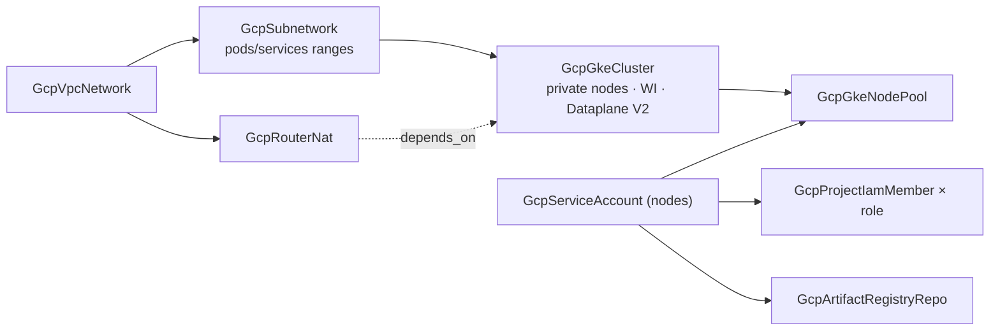
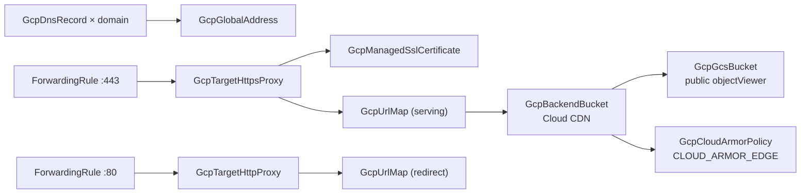

# GCP GKE Environment and Static Website CDN Charts

**Date**: July 10, 2026
**Type**: Feature
**Components**: GCP Provider, InfraCharts, Chart Authoring Standard

## Summary

Two new GCP infra-charts land the Kubernetes and web-edge tier of the catalog:
`gke-environment` deploys a production GKE environment (GKE-tailored network
with planned pod/service ranges, regional private-nodes cluster with Workload
Identity and Dataplane V2, least-privilege node identity, autoscaling node
pool, and the image registry) and `static-website-cdn` deploys a complete
global static site (public-read origin, Cloud CDN edge, managed TLS,
HTTP-to-HTTPS redirect on one stable IP, and the DNS records that make it
live). The chart authoring rule gains two composition teachings the work
surfaced: wildcard-annotated composition keys take literal values, and
selector-bound kinds are a weaker link than references.

## Problem Statement / Motivation

The chart catalog covered state backends, foundations, keyless CI/CD, and the
serverless tier — but not the two architectures teams ask about first when
they run containers or ship a website:

- **A GKE cluster is never just a cluster.** Standing one up properly means
  planning three address ranges that can never shrink, deciding node
  reachability, giving private nodes an egress path, resisting the
  over-privileged default node identity, and wiring the registry nodes pull
  from. Every one of those decisions is invisible when right and a rebuild
  when wrong.
- **Serving static HTML properly on GCP takes ~11 resources** discovered one
  error message at a time — including a certificate that only activates once
  DNS points at an IP that only exists after the load balancer deploys, and
  two URL maps because a map carries exactly one default target.

### Pain Points

- No composed path from "empty project" to "kubectl works, images pull,
  workloads get keyless GCP access".
- The bucket-behind-a-load-balancer chain (backend bucket, CDN policy, the
  redirect twin, edge-typed Cloud Armor) is reference plumbing users get
  wrong at deploy time, where the offline tools could not help them.

## Solution / What's New

### `charts/gcp/gke-environment` (10 resources everything-on)

- **Network**: custom-mode VPC + a GKE subnet with named `pods`/`services`
  secondary ranges (a /14 for pods — the range that disappears first and can
  never be resized). `useExistingNetwork` drops the cluster onto a
  landing-zone VPC by resource name (cross-chart reference); the chart still
  creates its own GKE subnet because secondary ranges are a cluster-level
  address-plan decision general-purpose subnets deliberately do not carry.
- **Egress**: Cloud NAT under `natEnabled`, with the cluster ordered on it
  via an explicit `depends_on` relationship — private nodes need egress the
  moment they boot, and no spec field consumes a NAT output.
- **Cluster**: regional, private nodes with a peering-based control-plane
  /28, public (optionally CIDR-restricted) API endpoint, Dataplane V2,
  Workload Identity and deletion protection on their default-true settings,
  nightly maintenance window, per-namespace cost allocation.
  `autopilotEnabled` flips the environment to Autopilot and drops the node
  pool, node SA, and grants — exactly the resources the spec's own CEL rules
  reject on Autopilot.
- **Node identity**: a dedicated service account plus one additive
  `GcpProjectIamMember` per role (log writer, metric writer,
  resource-metadata writer by default, extensible by list param). Workload
  permissions deliberately never land here — they belong to Workload
  Identity, and the README ships the full four-step keyless recipe.
- **Registry**: an Artifact Registry Docker repository with a
  repository-scoped `artifactregistry.reader` grant for the node account.
- **Addons are taught, not bundled**: Kubernetes-level components target the
  cluster by name selector from their own resources; the README teaches the
  pattern and points at GKE-native answers (Gateway API, Secret Manager CSI,
  managed Prometheus) the cluster spec already models first-class.

### `charts/gcp/static-website-cdn` (11 resources on defaults)

- **Origin**: uniform bucket-level access, `publicAccessPrevention:
  inherited` paired with a single additive `allUsers → objectViewer` grant
  (the exact pairing the kind's spec documents for public sites), website
  index/404 config, honest default-false `forceDestroy` behind a toggle.
- **Edge**: CDN-enabled backend bucket (CACHE_ALL_STATIC, one-hour edge/
  browser TTLs with a one-day cap, negative caching, serve-while-stale,
  request coalescing, automatic compression); optional Cloud Armor attached
  via `edge_security_policy` with the `CLOUD_ARMOR_EDGE` type — the variant
  that runs BEFORE the cache, since a plain backend policy only sees misses.
- **Front door**: the proven serving + redirect URL-map pair, managed
  certificate over a `domains` list, both proxies, one global address, and
  the 443/80 forwarding rules — with the two deliberately explicit
  references (`default_service` → backend bucket; the :80 rule's `target` →
  HTTP proxy) spelled kind + fieldPath.
- **DNS**: one A record per domain in a bring-your-own Cloud DNS zone, each
  record's value a reference to the address's `address` output — the records
  are also what activates the certificate.

### Chart authoring rule uplift

Two timeless composition teachings added to the `valueFrom` discipline:

- **Wildcard-annotated composition keys take literal values** — when an FK
  annotation points into a repeated output (`secondary_ranges.[*]
  .range_name`), pass literals driven by the same template values on both
  sides and let a sibling reference carry the ordering edge; never invent an
  indexed field path.
- **Selector-bound kinds are a weaker link than references** — kinds that
  bind to their host by a by-name selector (the Kubernetes workload/addon
  kinds' `target_cluster`) sit outside offline reference verification;
  infrastructure charts should teach the selector pattern rather than bundle
  selector-bound resources, and pair any bundled one with an explicit
  relationship edge.

## Implementation Details

- Both charts follow the established anatomy (documented typed params,
  spec-proto-bar template comments, five-section READMEs teaching the
  architecture, after-deploy loop, and day-2 posture).
- The cluster's private-control-plane shape uses the peering-based
  `masterIpv4CidrBlock` branch — the branch the kind's modules have proven
  live — rather than the PSC-based no-CIDR branch.
- Secondary-range names are chart-internal literal contracts (`pods` /
  `services`, the kinds' own proven convention); the cluster's `subnetwork`
  reference carries the ordering.

## Validation

- Offline chart gate (CLI built from the working tree) green on **15 runs**:
  `gke-environment` × 9 (defaults; autopilot; existing-network; NAT off;
  registry off; deletion-protection off; authorized-CIDR set;
  autopilot+existing-network+NAT-off; all-toggles-inverted) and
  `static-website-cdn` × 6 (defaults; DNS off; Cloud Armor on;
  force-destroy on; two-domain list; DNS-off+armor+force-destroy).
  The existing-network arms warn on the designed dangling reference only.
- Tree census (`charts/ make validate`): both new charts pass alongside all
  previously shipped GCP charts.
- Icon URLs verified resolving (200 × 2); scaffolding-leakage grep clean;
  site stats regenerated.
- Not validated (structural): server-side `planton chart build` and live
  InfraProject deploys — the control plane's protos stay pre-rebuild until
  the release. Every composed kind is already live dual-engine E2E-proven by
  its component work.

## Impact

A team can now go from an empty GCP project to a production Kubernetes
environment — private cluster, planned address space, least-privilege node
identity, working registry — in one deploy, and put a static site on a
global CDN with TLS and DNS closed in another. The chart catalog's
Kubernetes + web-edge tier is complete.

## Related Work

- Builds on the chart catalog rebuild opener (authoring standard + offline
  `chart validate` gate) and the serverless chart wave's front-door
  composition.
- The resource-scoped IAM grant kinds and the landing-zone foundation charts
  are the composition partners the READMEs reference.

---

**Status**: ✅ Production Ready
