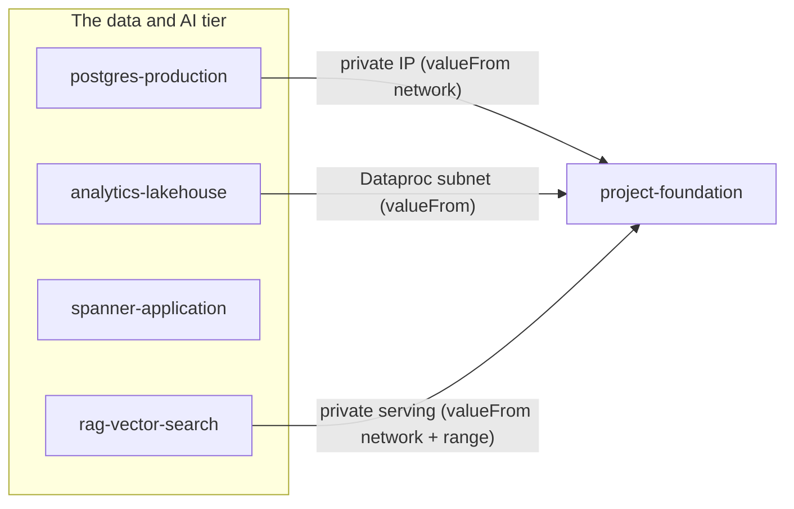

# GCP Data & AI Chart Wave: Postgres, Lakehouse, Spanner, and RAG Vector Search

**Date**: July 10, 2026
**Type**: Feature
**Components**: GCP Provider, Infra Charts, API Definitions

## Summary

Four new GCP infra charts complete the data and AI tier of the chart
catalog: `postgres-production` (HA Cloud SQL with passwordless IAM
authentication), `analytics-lakehouse` (BigQuery + GCS + zero-code
Pub/Sub streaming ingestion + optional autoscaling Dataproc),
`spanner-application` (instance + database + explicit backup schedule),
and `rag-vector-search` (the full Vertex AI Vector Search trio with an
optional VPC-private serving arm). The chart authoring rule gained two
small teachings surfaced by this wave, and the shipped
`cloud-run-service` chart gained a missing ordering edge.

## Problem Statement / Motivation

The GCP chart catalog covered state backends, foundations, and the
serverless tier, but the architectures data-centric teams deploy first —
a production relational database, an analytics platform, a
globally-consistent application database, and a vector-retrieval layer —
still had to be hand-wired from individual components. Each of these
compositions hides ordering and posture traps that cost a first-time
team real debugging hours:

- Cloud SQL HA legally requires backups; IAM database authentication
  requires a flag, an IAM-type user, and two separate grants to line up;
  and the private-IP attachment rides a peering the application must
  never create itself.
- A Pub/Sub → BigQuery sink is rejected at create time unless the
  Pub/Sub service agent already holds `bigquery.dataEditor` — a
  permission with no data flow to order on.
- Dataproc silently creates persistent regional staging buckets that
  accumulate per-creator ACL state unless the cluster is pointed at
  owned buckets.
- Spanner's instance-level AUTOMATIC backup default silently doubles up
  with any explicit backup schedule.
- Vertex AI Vector Search splits across three resources whose serving
  connectivity is immutable, whose deployed-index IDs forbid hyphens and
  are held project-wide, and whose private serving only works from
  reserved ranges already registered on the network's peering.

## Solution / What's New

### `charts/gcp/postgres-production`

REGIONAL (HA) Postgres 16, private IP only inside an existing VPC
(`ENCRYPTED_ONLY`), PITR backups with 30 retained dailies, Query
Insights, and all three delete guards. The passwordless identity arm
(default on) creates a service account that IS the database user
(`CLOUD_IAM_SERVICE_ACCOUNT`) plus the `cloudsql.client` and
`cloudsql.instanceUser` grants. A read-replica arm (default off) adds a
same- or cross-region replica via `masterInstanceName`. Availability is
a `string_enum` so the same chart deploys the ZONAL staging copy.

### `charts/gcp/analytics-lakehouse`

Always: a BigQuery warehouse dataset and an Autoclass-managed data lake
bucket. The streaming-ingestion arm (default on) adds a Pub/Sub topic, a
day-partitioned raw-events table (the durable event history — deletion
guard on, unlike a derived sink), the service-agent `dataEditor` grant,
and the BigQuery-sink subscription ordered after the grant by an
explicit `depends_on` edge. The Dataproc arm (default off) adds
chart-owned staging/temp buckets, a dedicated service account with
`roles/dataproc.worker` (cluster ordered after the grant), a reusable
autoscaling policy (on-demand base at weight 1, spot burst at weight 3),
and a private-IP-only autoscaling cluster with Component Gateway.

### `charts/gcp/spanner-application`

A provisioned instance (fixed `processingUnits`, or managed autoscaling
via the `autoscalingEnabled` toggle), a drop-protected database with a
3-day PITR window, and an explicit daily FULL backup schedule with
31-day retention. `defaultBackupScheduleType: NONE` is set deliberately
so the chart's explicit schedule is the only backup policy in force.

### `charts/gcp/rag-vector-search`

A STREAM_UPDATE tree-AH index (dimensions parameterized), the serving
endpoint (public by default), the deployed index with automatic replica
scaling, an embeddings bucket as the batch corpus of record, and a
dedicated query identity with `roles/aiplatform.user`. The private arm
flips the endpoint onto the VPC's private-services peering (consumed
from the landing zone by reference), optionally pins serving IPs to a
foundation-registered reserved range, and optionally requires JWTs
issued by the query identity. The deployed-index ID derives from the
corpus name with hyphens mapped to underscores (the ID class forbids
them).

## Implementation Details

- Every cross-resource edge is a `valueFrom` reference against the
  target kind's annotated composition key; landing-zone resources
  (network, subnet, reserved range) are consumed cross-chart by resource
  name and never created (singleton-per-network resources collide).
- Ordering edges with no data flow use explicit `metadata.relationships`
  `depends_on`: the BigQuery sink after its service-agent grant, the
  Dataproc cluster after its worker-role grant, and IAM-type Cloud SQL
  users after their service account (Cloud SQL validates the principal
  at create time, but the user name is an assembled email, not a
  reference).
- The same missing edge was closed in the shipped `cloud-run-service`
  chart's database template — its IAM user now carries the `depends_on`
  to the runtime account.
- Chart icons: the vector-search kinds have no published logo assets
  yet, so `rag-vector-search` carries the nearest resolving Vertex kind
  logo (all four icon URLs verified HTTP 200).

## Validation

- `planton chart validate` (CLI built from the working tree) green on
  all 18 toggle-arm runs: spanner ×3 (defaults, autoscaling, STANDARD +
  PG dialect), postgres ×5 (defaults, identity off, replica same/cross
  region, ZONAL everything-varied), lakehouse ×4 (all toggle
  combinations), rag ×6 (defaults, private, private+jwt,
  private+range+jwt, jwt-alone, replica bounds).
- Tree census `charts/ make validate`: all 13 GCP charts pass
  (failures elsewhere are other providers' pre-existing drift).
- Icon URLs verified resolving; scaffolding-leakage grep clean; site
  stats regenerated (53 charts).
- Live chart deploys and server-side `chart build` remain later gates
  by structure: every composed kind is already live dual-engine
  E2E-proven by its own component work.

## Impact

Data-centric teams now cover their first four architectures with
one-deploy charts whose failure paths and permission ordering are
already designed. The GCP chart catalog's planned build-out is complete
at 13 charts.

## Related Work

- `2026-07-10-033510-gcp-gke-environment-and-static-website-cdn-charts.md`
  (the Kubernetes + web-edge tier, shipped in parallel)
- `2026-07-10-024205-gcp-serverless-chart-wave-and-pubsub-push-endpoint-reference.md`
  (the serverless tier and the sink/consumer patterns this wave reuses)

---

**Status**: ✅ Production Ready
