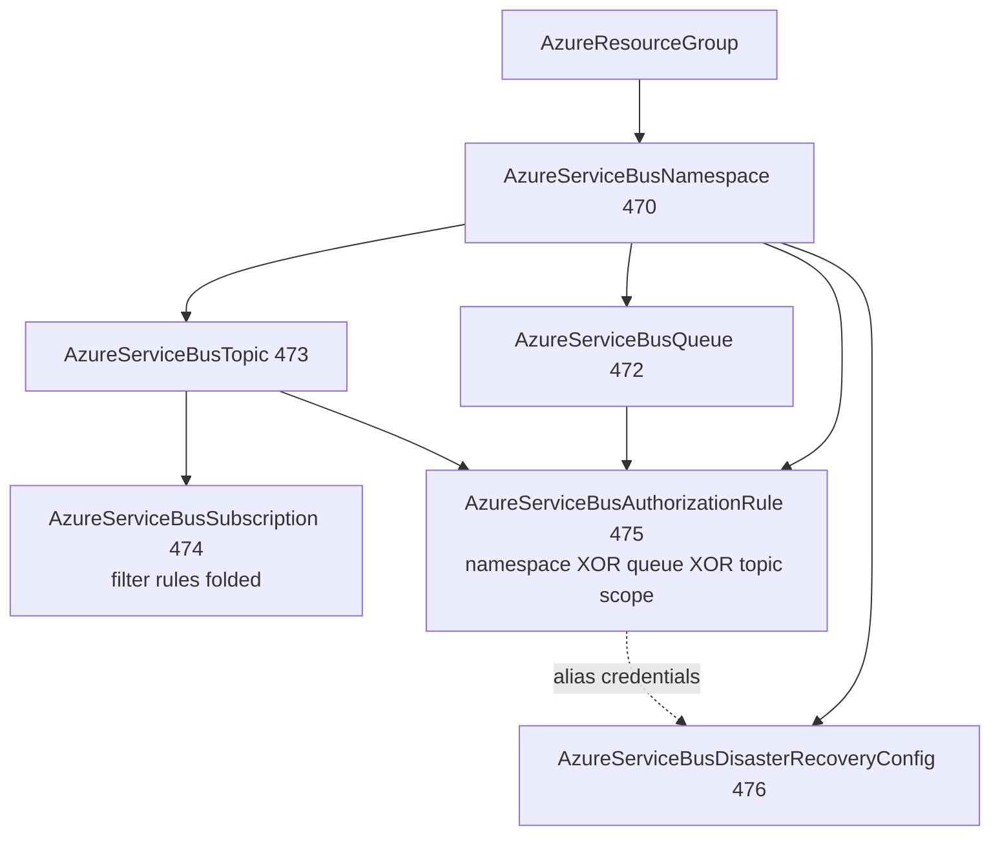

# Azure Service Bus Family: Namespace Depth Rework + Five-Kind Decomposition

**Date**: July 10, 2026
**Type**: Feature (with Breaking Change to AzureServiceBusNamespace)
**Components**: Azure Provider, API Definitions, Provider Framework, Testing Framework

## Summary

The complete Azure Service Bus family lands as six first-class components:
`AzureServiceBusNamespace` reworked breaking to the full azurerm v4.80
surface with its bundled queues/topics dissolved, and five new kinds --
`AzureServiceBusQueue` (472), `AzureServiceBusTopic` (473),
`AzureServiceBusSubscription` (474, filter rules folded),
`AzureServiceBusAuthorizationRule` (475, one polymorphic kind over Azure's
three identical SAS-rule ARM types), and
`AzureServiceBusDisasterRecoveryConfig` (476, the geo-DR alias pairing).
Both engines run at 100% behavioral parity on the shared Azure provider
builder, and 12 live dual-engine E2E lanes ran green with zero orphans.

## Problem Statement / Motivation

The namespace component bundled queues and topics as inline lists -- the
entities most teams own separately from the namespace could not be
referenced, granted, or lifecycled independently, and the spec covered a
fraction of the provider surface (no identity, no CMK, no network rules,
no keyless posture, no SAS credential story beyond the root key).

### Pain Points

- Queues/topics had no ARM identity of their own: no per-entity data-plane
  RBAC scopes, no queue-scoped SAS credentials, no subscriptions at all.
- Premium capabilities (dedicated capacity, VNet firewall, BYOK
  encryption, geo-DR) were unreachable.
- The namespace's Pulumi module inlined `NewProvider`, silently breaking
  keyless (OIDC web-identity) auth.
- Applications had exactly one credential: the root manage-everything key.

## Solution / What's New

- **Namespace (breaking rework)**: closed BASIC/STANDARD/PREMIUM enum;
  the provider's apply-time capacity {1,2,4,8,16} and partitions {1,2,4}
  Premium pairings front-loaded as validation rules in both directions;
  all three managed-identity models; folded customer-managed-key
  encryption (Premium-gated, `AzureKeyVaultKey` versionless reference,
  removal-forces-recreate documented); folded VNet firewall
  (Premium-gated, deny-requires-admitted-sources); `local_auth_enabled`
  for the keyless posture; user tags; the root SAS rule's four credential
  faces as sensitive outputs.
- **Queue/Topic**: parent-by-ARM-id children carrying the full v4.80
  dials -- size ladder, Premium large messages, ForceNew
  partitioning/dedup/sessions, lifecycle dials preserving Azure defaults,
  express with its dedup conflict enforced, forwarding as reference seams.
- **Subscription**: required `max_delivery_count` (azurerm's own
  contract), the client-scoped (JMS 2.0) block, and folded filter rules
  (SQL XOR correlation with the provider's contracts as validation
  rules). The service-created `$Default` catch-all is a reserved name --
  see Implementation Details.
- **Authorization rule**: one kind whose exactly-one-of scope
  (namespace/queue/topic) dispatches to the matching provider resource on
  both engines; rights contract (at-least-one; manage ⇒ listen+send)
  validated up front; six sensitive credential outputs;
  `authorization_rule_id` feeds the geo-DR pairing's alias credentials
  with zero translation.
- **Geo-DR config**: alias + primary/partner namespace references;
  Azure's pairing contracts (both Premium, different regions, empty
  partner) documented as apply-time checks; the provider's
  break-pair/name-release destroy choreography explained in both modules.

## Implementation Details

- **One polymorphic kind over three ARM types**: azurerm builds its three
  SAS-rule resources from ONE shared schema function and ONE shared
  CustomizeDiff -- the only difference is the parent scope. The Terraform
  module count-gates the three resources and coalesces outputs PER
  ATTRIBUTE (whole-object coalescing taints non-sensitive outputs like
  the id with the key attributes' sensitivity and fails the plan); the
  Pulumi module switches on the same discriminator with a shared export
  block.
- **Live-disproven design corrected in-session**: the subscription's
  filter rules originally allowed declaring a rule named `$Default` to
  "overwrite" Azure's service-created catch-all via ARM upsert. Both
  engines disproved this live -- the providers' create paths run an
  import-existence check and refuse to adopt an existing resource. The
  shipped design reserves `$Default` with a validation rule whose message
  teaches the alternative (declared rules are ADDITIVE; restrictive
  delivery removes the catch-all once via
  `az servicebus topic subscription rule delete --name '$Default'`).
- **Scenario-local E2E fixtures**: namespace names are globally unique
  with a post-delete hold, so every E2E scenario carries its own
  distinctly-named namespace fixture instead of a shared registry
  prerequisite.
- Both reworked/new Pulumi modules build their provider through the
  shared `pulumiazureprovider.Get` builder -- keyless auth works on the
  whole family.

## Benefits

- Entity teams own queues/topics/subscriptions independently of the
  namespace owner; every entity is a referenceable node with its own
  RBAC scope.
- Least-privilege connection strings replace the root-key-everywhere
  pattern; the keyless (Entra-only) posture is one dial away.
- Premium estates get first-class CMK, VNet isolation, and geo-DR with
  failover-stable alias credentials.

## Impact

- **Breaking**: `AzureServiceBusNamespaceSpec` renames `name` →
  `namespace_name`, drops the bundled `queues`/`topics` lists (and the
  `queue_ids`/`topic_ids` outputs), converts `sku` to a closed enum, and
  removes `zone_redundant`/`minimum_tls_version` (not in azurerm v4 / a
  one-value constant). Nobody consumes the system yet; no migration path
  is required.
- Validation: 144 spec tests across the family; audits ×6 at 100%
  PARITY/COVERAGE; live dual-engine E2E 12 lanes green (namespace, queue,
  topic, subscription with both filter families, and all three
  authorization-rule dispatch paths per engine); the geo-DR kind is
  offline-gated with its live window deferred by owner decision (two
  Premium namespaces exceed the pre-approved window); zero orphaned
  resources after the final sweep.

## Related Work

- Extends the per-component Pulumi shared-builder migration (54 of ~71
  Azure modules migrated).
- The E2E framework's binding profile-status behavior (deferred profiles
  skip with the recorded reason) worked as designed for the geo-DR kind.
- Durable guidance added: service-created default sub-resources cannot be
  adopted declaratively (`e2e/README.md`); dispatch-pattern outputs
  coalesce per attribute (forge flow rule 013).

---

**Status**: ✅ Production Ready
