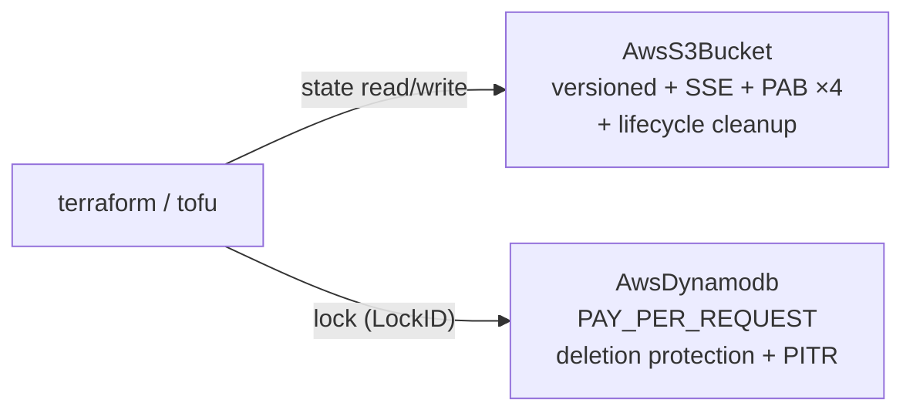

# AWS Infra-Chart Catalog Clean Slate: Authoring Bar, State-Backend Specials

**Date**: July 10, 2026
**Type**: Breaking Change
**Components**: Infra Charts, AWS Provider, Documentation, Authoring Rules

## Summary

The AWS infra-chart catalog starts over. All 12 legacy `charts/aws/*` charts —
authored against a much thinner component surface and carrying that era's
quality floor — are removed, and the catalog is being rebuilt as a curated
collection where every chart maps to a real-world architecture teams actually
want to deploy. This change lands the durable authoring bar
(`_rules/charts/forge-planton-infra-chart.mdc`) and the first two charts of the
new catalog: the get-started specials `aws/terraform-state-backend` and
`aws/pulumi-state-backend`.

## Problem Statement / Motivation

The legacy AWS charts were written when the AWS components they compose exposed
a fraction of today's surface. The gap showed everywhere:

- **Stale contracts**: the Terraform backend chart hardcoded a PROVISIONED 5/5
  DynamoDB lock table (billing for idle capacity around the clock on a table
  that sees a handful of requests per run) and its `values.yaml` described the
  bucket as a "Pulumi state backend."
- **Broken catalog surface**: every chart's `iconUrl` pointed at asset
  conventions that no longer resolve — the catalog rendered placeholders.
- **Thin documentation**: READMEs listed resources without teaching the
  architecture, the parameters, or what to do after deploying.
- **No authoring rule**: `_rules/charts/` covered building/fixing, publishing,
  and changelogs — but nothing defined what a GOOD chart is, so quality had no
  self-enforcing floor.

## Solution / What's New

### The authoring bar: `_rules/charts/forge-planton-infra-chart.mdc`

A new authoring rule defines the deliverable for every chart in the catalog,
for every provider:

- **Desirability as the entry test** — a chart earns its slot by mapping to a
  real architecture and invoking "I want this"; never a demo or filler.
- **Each provider's charts stand on their own merit** — chart composition,
  naming, defaults, and docs derive from that provider's component surface and
  that cloud's real architectures; never from another provider's charts.
- **Richly-commented templates** — inline YAML comments teach the WHY of every
  non-obvious choice, to the same bar as IaC module comments.
- **A verified icon** — `Chart.yaml` must carry a live `iconUrl` (checked with
  curl; the offline validator does not parse Chart.yaml, so a broken icon ships
  silently), using the most appropriate logo for the chart's identity.
- **Typed, documented values** — `string`/`number`/`bool`/`list` params with
  dense descriptions; bool toggles must render valid charts in BOTH branches
  independently (the offline validator flips each toggle once).
- **A component-docs-grade README** — architecture, resource table, parameter
  table, post-deploy wiring, day-2 guidance.
- **The offline gate** — the structure guard plus a working-tree-built
  `planton chart validate` before any commit.

### Removed: all 12 legacy AWS charts

`container-app`, `data-analytics`, `ecs-environment`, `eks-environment`,
`event-driven-pipeline`, `kafka-streaming`, `microservices-backend`,
`ml-workbench`, `pulumi-backend`, `serverless-api`, `static-website`,
`terraform-backend`. Replacement charts land as the catalog builds out; the
two state-backend specials ship in this change.

### New: `aws/terraform-state-backend`

The remote state backend most teams need on day one, hardened by default:

- Versioned, SSE-encrypted, public-access-blocked S3 bucket with
  noncurrent-version lifecycle cleanup (30 newest kept, older expired after 90
  days) and stale-multipart-upload abort.
- DynamoDB lock table behind `lock_table_enabled` (default true): on-demand
  billing, deletion protection, point-in-time recovery, and the S3 backend's
  exact `LockID` contract. The README teaches the Terraform/OpenTofu ≥ 1.10
  native S3 lockfile alternative honestly.
- README wires the bucket into Planton as a `StateBackend` (org default,
  per-resource pinning) and into a raw `backend "s3"` block.

### New: `aws/pulumi-state-backend`

The same hardened bucket posture for a self-managed Pulumi backend (Pulumi
locks natively in the bucket — no lock table). The README teaches the one thing
DIY Pulumi backends require that Pulumi Cloud hides: the client-side secrets
passphrase (`PULUMI_CONFIG_PASSPHRASE`), including its rotation semantics, plus
the `pulumi login s3://…` flow and the Planton `StateBackend` wiring.

## Implementation Details

- Both charts pass the full offline gate: `hack/guards/ensure_chart_structure.sh`
  and `planton chart validate` (defaults + flipped-toggle variants) built from
  this tree, plus live HTTP checks on both icon URLs.
- Template manifests are authored directly against the current
  `AwsS3Bucket`/`AwsDynamodb` specs (protojson field names; lifecycle,
  encryption, public-access block, PITR, deletion protection).
- `charts/README.md` now points authors at the forge rule as the catalog's bar.

## Impact

- **Breaking**: the 12 legacy AWS chart slugs are gone; platform catalog
  entries seeded from earlier bundles refer to charts that no longer exist in
  the tree and are cleaned up with the next platform integration pass.
- **Users** get two get-started charts that take them from an empty AWS account
  to a production-grade state backend — and a catalog whose every future entry
  is held to a written, enforced bar.

---

**Status**: ✅ Production Ready
