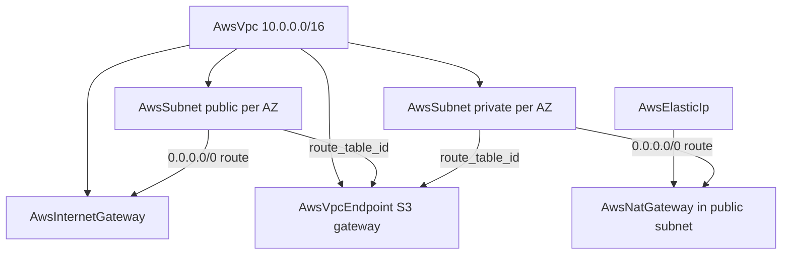

# AWS Infra-Chart Catalog: Network Foundation, Secure Static Website, and Aurora PostgreSQL

**Date**: July 10, 2026
**Type**: Feature
**Components**: Infra Charts, AWS Provider, Provider Framework

## Summary

Three new AWS infra-charts join the catalog: `network-foundation` (the VPC
baseline every workload builds on), `secure-static-website` (a private S3
origin behind CloudFront with Origin Access Control, ACM TLS, Route 53, and
an optional managed-rules WAF), and `aurora-postgres` (production Aurora
PostgreSQL with Serverless v2 capacity and a managed master password). Each
was composed first-principles from the current component specs, validates
offline across every toggle variant, and ships with richly-commented
templates and component-docs-grade READMEs. The chart forge rule gained a
renderer-mechanics section codifying the template patterns these charts
established.

## Problem Statement / Motivation

The AWS chart catalog's get-started specials (the two state-backend charts)
covered day zero, but the architectures teams actually deploy — a properly
tiered VPC, a production static site, a database worth pointing production
at — had no chart. Composing them by hand means learning each kind's
reference wiring, security posture, and AWS contract quirks (which regions
ACM certificates must live in, why a NAT gateway needs a first-class Elastic
IP, what Serverless v2 actually is) one validation error at a time.

## Solution / What's New

### `charts/aws/network-foundation`

The VPC shape everything else composes on:

- Public/private tiers are expressed the way the subnet kind was designed:
  inline `routes` with explicit `valueFrom` references into the internet
  gateway's / NAT gateway's outputs (the route target field is deliberately
  polymorphic, so the producing resource is always named explicitly).
- `nat_gateway_per_az` is the honest cost dial: one shared gateway (default)
  vs per-AZ isolation, with the hourly + per-GB cost model documented in the
  parameter descriptions and README.
- With `nat_gateway_enabled: false` the composition itself changes: private
  subnets stop owning route tables (they ride the VPC main table), so the S3
  gateway endpoint re-points its attachment at the public subnet tables plus
  the VPC's `main_route_table_id` output.
- Per-AZ striping uses list params zipped by position
  (`` +
  `values.public_subnet_cidrs[loop.index0]`) — verified against the offline
  renderer with both a passing and a deliberately-failing variant before the
  pattern was adopted.

### `charts/aws/secure-static-website`

The AWS-guidance static site with no public bucket anywhere:

- `AwsS3Bucket` stays fully private (all public-access guards on,
  `BucketOwnerEnforced`); the only grant is CloudFront's service principal,
  conditioned on `aws:SourceArn` scoped to the deploying account — closing
  the confused-deputy hole where a stranger's distribution is pointed at
  your bucket name. Struct-typed policy fields cannot carry `valueFrom`
  references (and the distribution ARN does not exist at render time), so
  the account id is a render-time parameter and the exact-ARN tightening is
  taught as day-2.
- `AwsCloudFront` uses the OAC fold (`s3Origin.createOriginAccessControl`),
  the managed CachingOptimized cache policy, `redirect-to-https`, dual-stack
  delivery, and a `price_class` dial.
- `AwsCertManagerCert` (DNS-validated through the zone) and the
  CLOUDFRONT-scope `AwsWafWebAcl` are both pinned to `us-east-1` — AWS's own
  contract, stated in comments rather than left to be discovered at deploy.
- `dns_zone_enabled` selects a chart-managed `AwsRoute53Zone` vs an existing
  zone id; A + AAAA alias records override their alias-target references to
  the distribution's `domain_name` / `hosted_zone_id` outputs.
- `spa_mode` maps the 403 that OAC-fronted S3 returns for unknown keys to
  `200 /index.html` for client-side routers.

### `charts/aws/aurora-postgres`

The database chart with the secure, recoverable posture as the starting
point:

- Serverless v2 by default — expressed correctly as provisioned mode + a
  `serverlessV2Scaling` block + `db.serverless` instances, with ACU
  floor/ceiling as number params (floor 0.5 always-warm; 0/auto-pause taught
  for dev). `serverless_enabled: false` switches every instance to a
  provisioned class.
- `manageMasterUserPassword` — the password never exists in the chart, in
  state, or in a repo; applications read the exported secret ARN.
- Create-time-only choices are hardcoded, not parameterized:
  `storageEncrypted: true` cannot be retrofitted, so it is not a knob.
- Backup honesty: 7-day PITR, `skipFinalSnapshot: false` with a rendered
  final-snapshot identifier, deletion protection default-on.
- A dedicated `AwsSecurityGroup` admits TCP 5432 from the application CIDR
  and nothing else, with deny-all egress; the README teaches the tighter
  SG-to-SG membership shape and the network-foundation composition recipe.

## Implementation Details

Every field name was derived from the kinds' current `spec.proto` (never
from older manifests), and every CEL cross-field contract the charts touch —
route-destination exactly-one, alias-target vs TTL exclusivity, the
final-snapshot pairing, the certificate creation-mode arms, the
CLOUDFRONT-scope region rule — is satisfied by construction and exercised by
the offline validator across the defaults variant plus one variant per
flipped bool (10 toggle variants across the three charts).

The forge rule (`_rules/charts/forge-planton-infra-chart.mdc`) gained a
"renderer mechanics" section codifying what these charts established:
list-param striping with index-matched companion lists, direct bool
interpolation (engines differ on `True`/`true` casing; both parse as YAML
booleans), explicit references for polymorphic foreign-key fields, the
Struct-composition limit, and the duty to design the else-branch of every
resource a toggle re-composes.

## Validation

- `hack/guards/ensure_chart_structure.sh` — pass.
- Working-tree CLI `planton chart validate` per chart (all toggle variants)
  and `--all charts/aws` — 5/5 charts pass.
- All three `Chart.yaml` icon URLs verified live (HTTP 200).

Charts are configuration artifacts — no cloud provisioning is involved; the
offline gate mirrors CI's chart lint exactly.

## Impact

The catalog now covers the first three architectures most teams need after
state backends: the network, the website, and the database. Downstream
charts (container services, Kubernetes platforms, the full web stack)
compose onto the network-foundation shape these charts established, and
chart authors inherit the codified renderer mechanics instead of
rediscovering them.

## Related Work

- The chart catalog clean-slate and the two state-backend specials
  (`2026-07-10-105115-aws-infra-chart-catalog-clean-slate-and-state-backend-specials.md`).
- The AWS component rebuilds these charts compose (VPC/subnet/NAT/endpoint,
  S3/CloudFront/ACM/Route 53/WAF, RDS cluster and security group
  changelogs throughout 2026-07).

---

**Status**: ✅ Production Ready
