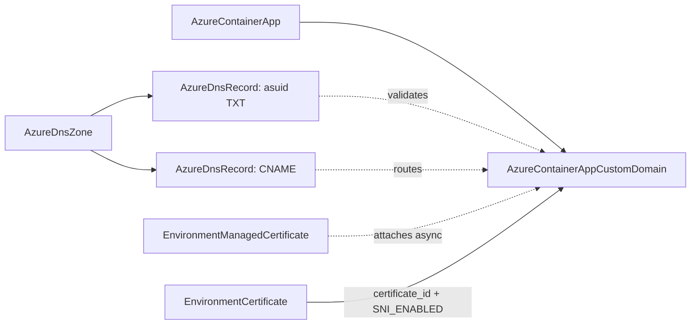

# Azure DNS Pair Rework + Container Apps TLS/Domain Family

**Date**: July 12, 2026
**Type**: Breaking Change | Feature
**Components**: Azure Provider, API Definitions, Pulumi CLI Integration, IAC Stack Runner, Testing Framework

## Summary

Reworked the last two shallow Azure kinds -- `AzureDnsZone` (404) and `AzureDnsRecord` (410) -- to the azurerm v4.80 floor, and forged the Container Apps TLS/domain family: `AzureContainerAppEnvironmentCertificate` (448), `AzureContainerAppEnvironmentManagedCertificate` (449), and `AzureContainerAppCustomDomain` (525). Together they close the web-domain story end to end: a zone hosts the records, the records prove domain ownership, and the certificate/domain kinds put an app behind a custom hostname with TLS. The record rework also removes a shipped misdeploy class -- the old modules hardcoded SRV, CAA, and MX field values that the spec claimed were configurable.

## Problem Statement / Motivation

The DNS pair was authored under the old 80/20 mandate and had never been revisited:

- **Both Pulumi modules inlined `azure.NewProvider`**, which ignores the keyless web-identity credential path and silently breaks OIDC-based deployments.
- **The zone bundled a `records` list** -- a black box that could not express per-record lifecycles and duplicated what the standalone record kind exists for.
- **The record kind's flat `values` list could not carry DNS's real shapes**, so the modules SYNTHESIZED the missing fields: every SRV record deployed with hardcoded `priority=10, weight=10, port=80`, every CAA record with `flags=0, tag="issue"`, and MX records collapsed to one shared preference. A user declaring `"0 issue letsencrypt.org"` got a record Azure served with different values than they wrote.
- **Container Apps custom domains had no surface at all** -- the app's ingress exposes custom domains read-only in azurerm v4; the standalone binding + the two certificate resources are the only management path, and none of the three was modeled.

## Solution / What's New

### AzureDnsZone (rework, breaking)

The zone-only kind: `zone_name`, `resource_group`, the folded `soa_record` (email with the provider's exact segment validator as a CEL, all six writable timers at Azure's defaults, the zone-name+email 253-character apply-time check front-loaded), and user tags. Outputs now carry the delegation handoff (`name_servers`), the record-addressing pair (`zone_name` + `resource_group_name`), `zone_id`, and `max_number_of_record_sets`. The bundled records list is dissolved.

### AzureDnsRecord (rework, breaking)

One polymorphic kind with **nine typed payloads** -- the record type IS whichever payload is present (exactly-one-of message CEL, no contradictable discriminator enum):

```yaml
spec:
  zoneName: { valueFrom: { name: example-com } }
  name: "@"
  mx:
    - preference: 10
      exchange: mail1.example.com
    - preference: 20
      exchange: mail2.example.com
```

- `a`/`aaaa`: address lists (format-validated) XOR an **alias `target_resource_id`** -- Azure's mechanism for tracking a Public IP / Traffic Manager / CDN / Front Door endpoint with no drift window, and the only way to point a zone APEX at a resource (DNS forbids apex CNAME).
- `cname`: single value XOR alias. `mx`: preference+exchange pairs. `srv`: priority/weight/port/target. `caa`: flags + the four-tag closed enum + value. `txt`: values to 4096 chars (the provider chunks to DNS's 254-char strings). `ns`, `ptr`: hostname lists.
- Terraform dispatches nine count-gated resources with per-attribute output coalescing; Pulumi switches on the payload. Both engines on the shared credential builder.

### Container Apps TLS/domain family (three forges)



- **`AzureContainerAppEnvironmentCertificate` (448)**: bring-your-own TLS on the environment -- inline PFX (blob + password, both sensitive) XOR a Key Vault versionless-secret reference that follows renewals; five read-back certificate facts as outputs.
- **`AzureContainerAppEnvironmentManagedCertificate` (449)**: Azure-issued, Azure-renewed, free -- one domain, CNAME/HTTP validation, and a create that BLOCKS until Azure validates ownership against public DNS (taught prominently everywhere).
- **`AzureContainerAppCustomDomain` (525)**: the binding, with a two-flow drift design. Azure attaches managed certificates asynchronously, so the managed flow needs the provider-documented ignore-changes lifecycle -- but applying it unconditionally would swallow a BYO user's legitimate certificate change. The Terraform module dispatches two count-gated variants (BYO with full drift detection, managed with the ignore); Pulumi applies `IgnoreChanges` conditionally. Identical behavior, engine-native mechanics.

## Implementation Details

- Registry: 448/449 fill the app-hosting sub-band; 525 opens the app-hosting continuation block (440-449 full). The zone gained `prerequisites: [AzureResourceGroup]`, the record `prerequisites: [AzureDnsZone]` (public zone names are not globally unique -- safe as a shared fixture).
- Validation front-loading verified by an apply-time validator source-diff per kind: the SOA email validator and 253-char combined check, the A/AAAA/CNAME records-XOR-target contracts, the CAA tag vocabulary, the certificate-name validator, the blob/key-vault ExactlyOneOf, and the certificate-id/binding-type RequiredWith. One deliberate non-mirror: the blob/password pairing allows a passwordless PFX (the provider's `RequiredWith` requires the password ARGUMENT, not a value -- azurerm's own acceptance fixtures include a no-password PFX), so both engines always send the possibly-empty password alongside the blob.
- E2E: five verifiers (the custom domain's is state-aware -- the binding has no ARM object, so it reads the parent app's ingress `customDomains`), a zone install profile, an ingress-enabled app install profile, six scenarios, and ten runner entrypoints.

## Validation

- Offline: 91 spec tests across the five kinds (every CEL error path); `pkg/outputs` conformance ×7 new cases; `secret-coverage --check`; `validate-refs --check`; `make build-go`; Bazel trees ×5; release-equivalent Pulumi builds ×5; `tofu validate` ×5 + full `planton tofu plan` on all five hack manifests (the CAA tag map, SniEnabled wire value, BYO-variant dispatch, SOA fold, and CNAME validation seams all verified rendered); 26 presets/scenarios/fixtures validated; audits ×5 at **100% Fully Complete, PARITY ✅ COVERAGE ✅** with apply-time validator source-diff sections.
- Live (test subscription, dual-engine): **10 lanes green** -- zone 136s/151s (SOA + tags), record MX-pair 179s/173s, SRV 164s/174s, alias-A through a fixture Public IP 232s/235s, environment certificate 698s/661s (a throwaway self-signed PFX uploaded, certificate facts verified, destroyed). **4 profile-bound skips with recorded reasons**: the managed certificate and custom domain both block on Azure validating domain ownership against PUBLIC DNS, which requires a registrar-delegated domain the test tenant does not own; their scenarios ship ready-to-run with the exact unblock path in each profile. Zero orphans (subscription fully clean after the sweep).
- One live-caught scenario defect fixed and re-proven: a bare polymorphic reference (the alias target carries no `default_kind`) needs an explicit `kind:` in scenario `valueFrom` -- the resolver leaves kind-less bare refs untouched. Both alias lanes green on the re-run.

## Impact

- **Keyless OIDC deployments**: the catalog's last two inline `NewProvider` modules among reworked kinds are gone (shared-builder migration now 62 of ~74).
- **Correctness**: SRV/CAA/MX records now deploy exactly what users declare -- the silent-hardcode class is structurally unexpressible.
- **The web-domain story is composable end to end**: zone → records → verification → binding → TLS, all first-class referenceable nodes.

## Related Work

Completes the last unreworked original kinds and the Container Apps family's deferred TLS/domain verdict. Remaining before the Phase-1 release: the Azure Firewall family, then the charts pass.

---

**Status**: ✅ Production Ready
