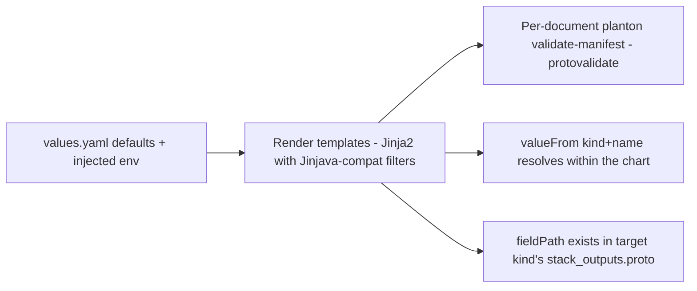

# Azure Infra-Chart Catalog Reset and Offline Chart Validation

**Date**: July 15, 2026
**Type**: Refactoring | Feature
**Components**: Infra Charts, Azure Provider, Build System, Developer Tooling

## Summary

The six Azure infra-charts were removed to make way for a redesigned Azure
chart catalog built from first principles on the reworked Azure component
surface (79 kinds). Alongside the reset, chart authoring gained the
infrastructure it was missing: an offline chart validation harness that
renders every chart with default values and proves the rendered manifests
against this repo's own proto contracts (no backend required), a dedicated
chart-authoring rule that encodes the design philosophy and documentation
standard, and upgraded catalog design principles in `charts/README.md`.

## Problem Statement / Motivation

The Azure component catalog was rebuilt end to end — kinds renamed, bundled
sub-resources dissolved into first-class composable kinds, specs deepened to
the full provider surface, and entire new families added (firewall, Front
Door, messaging, observability, data-plane RBAC). The existing Azure charts
predated all of it: they composed kinds that no longer exist in that shape
(`AzureVpc`), set fields that were renamed or removed (`secret_names`,
bundled node pools), and — more fundamentally — modeled thin slices rather
than the complete environments the enriched components now make possible.

Repairing them template-by-template would have preserved yesterday's design
on top of today's components. The honest move was a reset: design the catalog
again from the architectures Azure teams actually build, with the full
component surface as the palette.

### Pain Points

- Chart templates validated only through `planton chart build` — a Platform
  CLI command that renders and validates against a **running control
  plane's** schemas. Between releases, a chart authored against this repo's
  newer protos cannot be proven at all: the backend's schemas lag the tree.
- Broken `valueFrom` references (a typo'd resource name, an output field that
  was renamed) surfaced only at deploy time, mid-environment.
- No written authoring contract existed: chart quality, parameter naming, and
  documentation depth were whatever each author happened to do. The legacy
  charts mixed `snake_case` and `camelCase` parameter names in one file.
- The implicit `values.env` render context — injected by the platform,
  relied on by every template — was documented nowhere.

## Solution / What's New

### 1. Azure charts removed

All six Azure charts (`aks-environment`, `container-apps-environment`,
`database-stack`, `enterprise-network-foundation`, `function-app-environment`,
`web-app-environment`) are deleted. The replacement catalog lands as charts
are authored, each to the new standard. Other providers' charts are
untouched.

### 2. Offline chart validation (`make validate-offline`)

`hack/validate_charts_offline.py`, wired as a `validate-offline` target in
`charts/Makefile` (self-managed virtualenv; prefers a `planton` binary built
from this checkout so schemas match the tree). Four checks per chart:

- **Render** — every template renders with default values under
  `StrictUndefined` (an undeclared parameter is a defect, not an empty
  string), with the platform-injected `env` supplied and the Jinjava `bool`
  filter registered.
- **Schema** — every rendered document passes `planton validate-manifest`,
  i.e. protovalidate over the spec using the proto contracts compiled into
  the binary.
- **Reference resolution** — every `valueFrom` target (kind + name) must be
  defined by the same chart; charts are self-contained.
- **Output-field existence** — every `fieldPath` of the
  `status.outputs.<field>` form must name a real field in the referenced
  kind's `stack_outputs.proto`, catching renamed/nonexistent outputs offline
  instead of mid-deploy.

All four failure classes were exercised deliberately (undeclared parameter,
invalid spec, unresolved reference, nonexistent output field) and each fails
the gate with an attributed, per-file message. `planton chart build` remains
the authoritative proof when a control plane on matching schemas is
available; the offline gate exists precisely for when it is not.

### 3. The chart authoring contract (`_rules/charts/author-planton-infra-charts.mdc`)

A new action rule encoding, timelessly:

- **Design philosophy**: charts stand on their own merit (designed from the
  provider's own architectural grain, never mirrored from another chart);
  every chart must be a complete, production-shaped environment someone
  would want running; one chart, one architecture; composition by
  `valueFrom` is the product; secure-by-default posture.
- **Conventions**: snake_case parameter names matching proto field naming;
  every parameter described; defaults must render a valid environment; the
  implicit `values.env` context documented; the shared Jinjava/Jinja2
  template dialect; inline template comments held to the `spec.proto`
  field-comment bar.
- **README standard**: teach the architecture first (what/for whom, how the
  resources compose, what is on by default), then the handful of decisions a
  deployer actually makes.
- **Validation gate**: structure guard + `make validate-offline` green before
  any commit.

`build-and-fix-planton-infra-charts.mdc` now points authors at the new rule
and at the offline gate; `charts/README.md`'s design principles grew the
merit, admission, secure-by-default, and documentation principles alongside
the existing composability and no-hardcoded-provisioner rules.

## Impact

- **Chart authors** (human and agent) get a written contract and a local,
  backend-free validation loop; the silent-breakage class of broken
  `valueFrom` references is now caught before commit.
- **Azure catalog consumers**: the Azure chart slice is empty until the
  redesigned charts land; the release bundle ships whatever `charts/`
  contains, so no partial state escapes (charts publish on the repo's
  release cadence).
- **Other providers**: no behavior change; the authoring rule and offline
  validator apply to every provider's charts from now on.

## Related Work

- The Azure component rebuild changelogs (2026-07) — the enriched surface the
  new catalog composes.
- `hack/guards/ensure_chart_structure.sh` — the CI structure guard the
  offline validator complements.

---

**Status**: ✅ Production Ready
