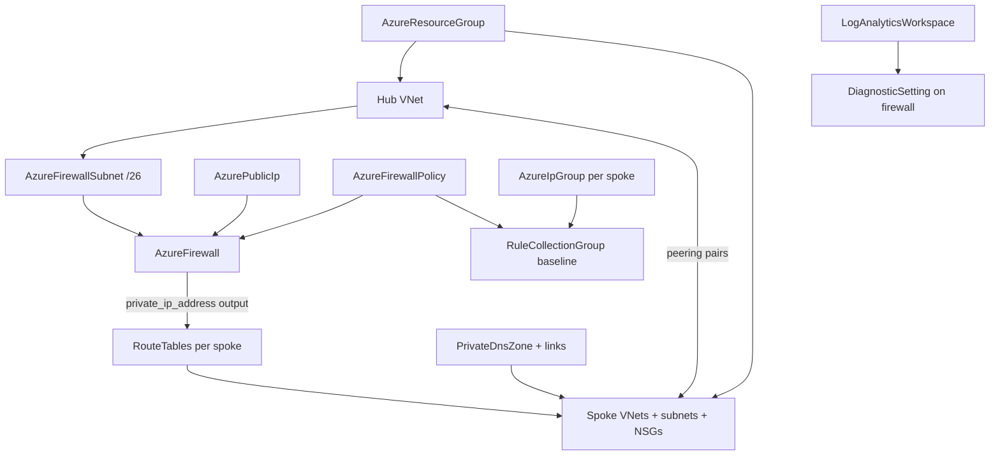

# Azure Hub-Spoke Network Foundation Chart + Route Table Forwarding-Address Reference

**Date**: July 15, 2026
**Type**: Feature
**Components**: Azure Provider, InfraCharts, API Definitions, Chart Validation

## Summary

The first chart of the rebuilt Azure catalog: `azure/hub-spoke-network-foundation`, the enterprise landing-zone network core — a hub VNet with a zone-redundant, policy-driven Azure Firewall enforcing deny-by-default egress, peered workload spokes whose route tables force every packet through the firewall, estate-wide private DNS, and firewall analytics in Log Analytics (28 composed resources at defaults). Building it surfaced and closed a composition gap: `AzureRouteTable`'s `next_hop_in_ip_address` was a plain string, so the chart's central seam — the firewall's private IP feeding spoke route tables — could not be wired by reference. The field is now a `StringValueOrRef` defaulting to `AzureFirewall.private_ip_address`, live-proven on both engines. The offline chart validator additionally now rejects the name-only `valueFrom` shorthand in charts, closing a hole where such references bypassed resolution and output-field checks entirely.

## Problem Statement / Motivation

The Azure chart catalog was reset and redesigned from first principles; the hub-spoke network foundation is its flagship — the architecture every Azure enterprise builds first, and the one that became composable only when the firewall family landed. It is deliberately the first chart built: its values conventions, template comment style, and README structure are the template subsequent charts copy.

### Pain Points

- No Azure charts existed after the catalog reset; the authoring contract and offline harness had never been exercised by a real chart.
- Wiring a hub-spoke topology by hand means getting routes, peering flags, SNAT behavior, and policy inheritance right across ~28 resources — days of work that this chart reduces to one deploy.
- The route-table forwarding address (`next_hop_in_ip_address`) was a plain string: the one seam the hub-spoke pattern depends on had to be hand-copied from the firewall after deployment.
- The offline validator's reference walker only inspected `valueFrom` blocks carrying a `kind` key, so a name-only reference passed the gate unverified.

## Solution / What's New

### The chart

- **Deny-by-default egress**: the baseline rule collection group allows Azure Monitor (service tag), NTP, and a curated FQDN allowlist (package mirrors); everything else drops and logs. Teams extend by deploying additional rule collection groups, never by editing the baseline.
- **Rules address spokes through IP Groups** — one per spoke — so an address-plan change lands in one place.
- **Secure-by-default posture**: implicit outbound access off on every workload/management subnet, BGP propagation off on forced-tunnel route tables, zone-redundant firewall + public IP, threat intelligence on (ALERT), policy analytics and full firewall logs into the foundation's workspace.
- **Two explicit spokes with a `spoke_2_enabled` toggle**; a third spoke is the same stamped pattern of first-class resources.
- **PREMIUM tier toggle** enables IDPS (alert mode); the DNS-proxy toggle configures the policy side, with the spoke-DNS pointing taught as the day-2 step (`spoke_dns_servers`).

### AzureRouteTable: the forwarding address is now a reference seam

`routes[].next_hop_in_ip_address` became a `StringValueOrRef` with `default_kind: AzureFirewall` / `default_kind_field_path: status.outputs.private_ip_address`. Spoke route tables now follow the firewall — no hand-copied address; a literal IP still serves third-party NVAs. The VIRTUAL_APPLIANCE pairing CEL moved from a `!= ''` check to a presence check (`has()`), since message-level CEL cannot dereference a reference's sub-fields. Both engines unchanged on the wire: the platform resolves references before modules run (Terraform receives the flattened literal; the Pulumi module reads `GetValue()`).

### Offline chart validator hardening

The reference walker now yields every `valueFrom` (not just those with a `kind` key) and rejects any that lack the explicit `{kind, name, fieldPath}` triple — the form the authoring contract mandates. Proven both ways: a scratch chart with a name-only reference fails with an attributed message; the new chart passes 4/4.

## Validation (what ran and passed)

- Route table retrofit: targeted builds + release-equivalent Pulumi build, 15/15 spec tests (new reference-form cases), `validate-refs`, `secret-coverage`, full `tofu plan` against the hack manifest, outputs conformance — all green.
- **Live dual-engine E2E green**: `TestAzureRouteTable_Pulumi/minimal` (131.9s) and `TestAzureRouteTable_Terraform/minimal` (200.4s), with the scenario extended to deploy a VIRTUAL_APPLIANCE route through the new field; zero orphans (route-table and resource-group sweeps clean).
- Chart: structure guard green; `make validate-offline chart=azure/hub-spoke-network-foundation` 4/4 green (28 documents; CLI rebuilt from this tree first so schemas include the retrofit); toggle-flipped variant (single spoke, PREMIUM, DNS proxy, no zones — 20 documents) manually re-run through render + reference + schema checks, all green.
- Pre-existing fix: an unused import in `azurefirewallpolicy/spec.proto` failed `buf lint` (would block `make protos`); removed, stubs regenerated for both touched proto directories with coverage verified via `git status`.

## Impact

Platform teams get the Azure landing-zone network as a one-deploy chart whose resource graph reads as the reference architecture diagram. Component consumers get a route-table kind whose central seam composes by reference. Chart authors get a validator that can no longer be bypassed by the shorthand reference form, and an authoring contract that now teaches the explicit-triple requirement, the toggle-path validation step, and the "a seam you cannot wire by reference is a component gap" principle.

## Related Work

- The Azure firewall family (policy, rule collection groups, firewall, IP groups) — the kinds this chart composes.
- The Azure chart catalog reset and offline validation harness — the contract and gate this chart is built against.

---

**Status**: ✅ Production Ready
