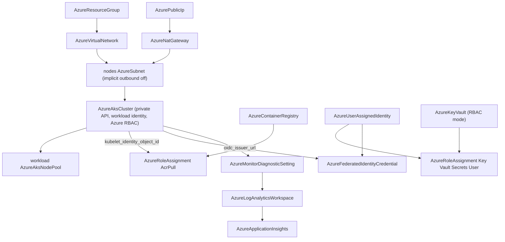

# Azure Private AKS Platform and Observability Foundation Charts, plus the Federated-Credential Issuer Reference

**Date**: July 15, 2026
**Type**: Feature
**Components**: Azure Provider, Infra Charts, API Definitions, Manifest Processing

## Summary

Two new Azure infra charts land in the catalog: `azure/private-aks-platform` (production Kubernetes with a private API server and the full keyless chain — workload identity federation, keyless AcrPull image pulls, NAT egress, control-plane logs into Log Analytics) and `azure/observability-foundation` (the day-2 monitoring pack — workspace + Application Insights, on-call and critical action groups, service-health and failed-admin-operation alerts, error/exception query alerts, and an optional outside-in availability probe). Building the AKS chart surfaced a composition gap and closed it at the component level: `AzureFederatedIdentityCredential.issuer` is now a literal-or-reference (`StringValueOrRef`) defaulting to an `AzureAksCluster`'s `oidc_issuer_url` output, so the workload-identity trust can be wired to the cluster it sits beside instead of hand-copying an issuer URL. The retrofit was proven live on both engines.

## Problem Statement / Motivation

The AKS chart's centerpiece is the keyless workload-identity chain: cluster OIDC issuer → federated credential on a user-assigned identity → RBAC grants. The federated credential's `issuer` field was a plain string, and the issuer URL of a cluster does not exist until the cluster deploys — so the chart could not wire its most important seam by reference. Charts wire cross-resource values with `valueFrom`, which only traverses `StringValueOrRef` fields; a plain-string seam would have forced a hand-copied URL and a two-step deploy.

Separately, the chart catalog needed its AKS flagship and its monitoring foundation: the private-cluster + workload-identity + keyless-pull posture is the AKS shape platform teams want and rarely wire correctly, and every other chart in the catalog routes telemetry somewhere — the observability chart is that somewhere.

### Pain Points

- `AzureFederatedIdentityCredential.issuer` could not reference the cluster output it exists to consume — the one seam the workload-identity composition depends on
- No chart delivered the private/keyless AKS posture end to end
- The alert pack teams postpone (service health, failed admin operations, error spikes, availability) had no one-deploy answer

## Solution / What's New

### The issuer reference

```protobuf
dev.planton.shared.foreignkey.v1.StringValueOrRef issuer = 3 [
  (buf.validate.field).required = true,
  (dev.planton.shared.foreignkey.v1.default_kind) = AzureAksCluster,
  (dev.planton.shared.foreignkey.v1.default_kind_field_path) = "status.outputs.oidc_issuer_url"
];
```

Literal issuers stay first-class (GitHub Actions, GitLab, any external OIDC provider — the `value:` form); the reference form serves the composition where the issuer is itself a resource in the environment. The former `string.uri` constraint cannot ride the wrapper (validation cannot dereference a reference's sub-fields), so the exact-`iss`-match contract lives in the field comment — the same trade the catalog's other literal-or-reference fields make.

### `azure/private-aks-platform` (17 resources at defaults)



Secure-by-default: private API server (AKS-managed private zone; both DNS-prefix fields deliberately unset), Entra authentication with Azure RBAC authorization, registry admin account off, vault in RBAC mode, `defaultOutboundAccessEnabled: false` with explicit NAT egress (`outbound_type: USER_ASSIGNED_NAT_GATEWAY`), NetworkPolicy enforcement on, system pool tainted `CriticalAddonsOnly` with a standing rotation stand-in. Toggles: public API + authorized ranges, spot workload pool, zones, local-account disable, purge protection.

### `azure/observability-foundation` (10 resources at defaults; 12 with the probe)

Workspace + workspace-based Application Insights; separate operations and critical action groups (a maintenance-window disable of routine noise can never silence a page); subscription-scoped activity-log alerts (service-health incidents/security advisories page; Error/Critical failed administrative operations notify); auto-resolving failed-request and exception query alerts (`skip_query_validation` — the App tables materialize once data flows); an optional five-continent availability web test paired with its severity-0 metric alert through the web-test criteria family.

## Implementation Details

- The retrofit touched the spec, the regenerated stub, the Pulumi module (`spec.Issuer.GetValue()`), the Terraform variables comment (tfvars flattening already delivers the resolved literal), spec tests (literal + reference forms), all three presets (the AKS preset now teaches the reference form), the hack manifest, the E2E scenario, and the kind's README/catalog/docs.
- Chart references are the explicit `valueFrom: {kind, name, fieldPath}` triple throughout; both charts carry inline comments to the spec.proto bar and 5-section READMEs.
- Subscription-scoped alert targets are an honest literal parameter (`subscription_id`): no resource outputs a subscription ARM id, so a described must-change parameter is the correct shape — now recorded in the authoring rule alongside the seam-gap principle it bounds.

## Validation

- Retrofit offline gate: targeted builds + release-equivalent Pulumi build, 16 spec tests green, `validate-refs` clean, `secret-coverage` green, `pkg/outputs` conformance green, full `tofu plan` against the hack manifest, all three presets + hack manifest through `validate-manifest`, CLI rebuilt from the tree.
- **Live dual-engine E2E green**: `TestAzureFederatedIdentityCredential` Pulumi 168.9s / Terraform 240.7s — all eight phases passed, fixtures torn down, subscription sweep clean (zero orphans).
- Chart gate: structure guard green; `make validate-offline` 4/4 for both charts; toggle-flipped variants (public-API + spot + no-zones + local-account-disabled + pinned-version + purge-protection AKS variant; probe-enabled + webhook observability variant) re-validated green; manual render review of all 25 documents against their spec.protos.

## Impact

The catalog's AKS flagship and monitoring foundation are deployable, and the workload-identity composition is now wireable by reference for every future chart and manifest. The `issuer` change is breaking for existing manifests (plain scalar → `value:`/`valueFrom:` wrapper), which is acceptable pre-adoption; every in-repo artifact was migrated in the same change.

## Related Work

- The hub-spoke network foundation chart and the route-table forwarding-address reference (the retrofit precedent)
- The Azure chart catalog reset and offline chart validation harness
- The federated identity credential kind and the identity/RBAC family it composes with

---

**Status**: ✅ Production Ready
