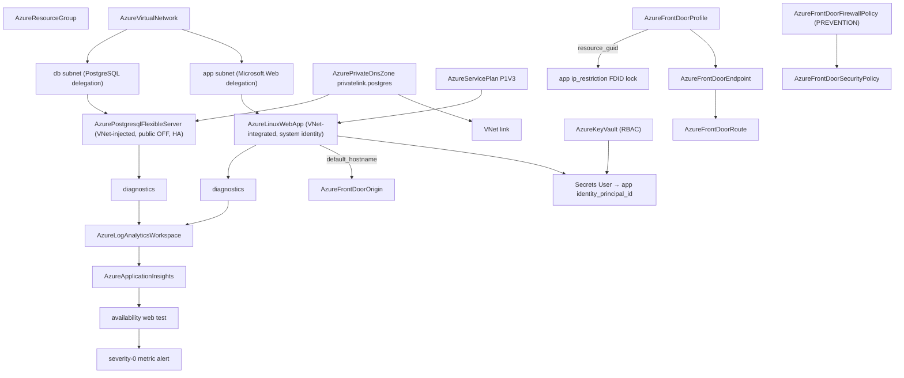

# Azure Production Web App and Global Static Website Charts: the Front Door Pair

**Date**: July 15, 2026
**Type**: Feature
**Components**: Azure Provider, Infra Charts, API Definitions

## Summary

Two new Azure infra charts land in the catalog — `azure/production-web-app`
(a customer-facing web application from edge to database: VNet-integrated
Linux App Service on PremiumV3, private VNet-injected PostgreSQL, RBAC-mode
Key Vault, WAF-fronted Azure Front Door with origin lockdown, diagnostics +
outside-in availability probe + paging alert, and an optional self-validating
custom domain) and `azure/global-static-website` (storage-to-TLS static
hosting: StorageV2 static website behind Front Door with edge caching and
compression, a default-on self-validating custom domain, and an optional WAF).

Designing the pair surfaced three component composition gaps, each closed at
the component level with the literal-or-reference (`StringValueOrRef`)
retrofit discipline and proven live on both engines:

1. **`AzureDnsRecord`**: TXT record values (`repeated string` →
   `repeated StringValueOrRef`) and the CNAME `value` (`string` →
   `StringValueOrRef`), both bare polymorphic (no default kind — no single
   kind dominates TXT/CNAME targets, the spec's own alias-target precedent).
   This is the seam that lets a chart publish a Front Door custom domain's
   deploy-time `validation_token` as the `_dnsauth.` TXT record — domain
   validation that completes itself — and point a routing CNAME at the
   endpoint's hash-suffixed `host_name`.
2. **`AzureFrontDoorOrigin`**: `host_name` + `origin_host_header` (`string`
   → `StringValueOrRef`, bare) so origins track the web app's
   `default_hostname` or the storage account's `primary_web_host` by
   reference instead of a hand-copied hostname.
3. **`AzureLinuxWebApp` + `AzureFunctionApp`**:
   `ip_restrictions[].headers.x_azure_fdid` (`repeated string` →
   `repeated StringValueOrRef`, default kind `AzureFrontDoorProfile` →
   `status.outputs.resource_guid`). Without this the production chart's WAF
   is decorative — anyone who discovers `{app}.azurewebsites.net` walks past
   Front Door entirely. Azure's documented lockdown filters the
   `AzureFrontDoor.Backend` service tag by the `X-Azure-FDID` header to one
   profile's GUID, which the profile already outputs; the header field just
   could not reference it. Both App Service siblings share the identical
   ip-restriction shape, so both moved together.

## Problem Statement / Motivation

The DD-006 catalog's web-workload flagship and its static-site companion both
compose Azure Front Door, and Front Door's composition seams are exactly
where deploy-time values live: the custom domain mints a validation token at
deploy, the endpoint hostname carries a random hash suffix, the app's default
hostname exists once the app does, and the profile's GUID is the only honest
origin-lockdown filter. Every one of those seams was a plain string in the
specs — writable only by hand-copying values that do not exist until deploy.

### Pain Points

- Domain validation could not self-complete: the TXT record could not
  reference the custom domain's `validation_token` output
- Origins could not track their backend's deploy-time hostname
- The Front Door origin-lockdown pattern (service tag + FDID header filter)
  could not reference the profile GUID it filters on, making a WAF-fronted
  App Service silently bypassable via its default hostname
- No chart delivered the edge-to-database web workload or the
  global-static-site posture end to end

## Solution / What's New

### `azure/production-web-app` (26 resources at defaults)

Secure-by-default: HTTPS-only, TLS 1.2 floor, FTPS disabled, the database
VNet-injected with public access off and zone-redundant HA on by default,
WAF in PREVENTION, and the **origin lockdown** — an ip-restriction allowing
only `AzureFrontDoor.Backend` traffic filtered to THIS profile's
`resource_guid` by reference, plus the `ApplicationInsightsAvailability`
service tag for the probe (verified live against Azure's service-tag
vocabulary), default DENY. The custom-domain block (toggle, off at defaults)
creates the DNS zone, the managed-TLS custom domain, the `_dnsauth.` TXT
record wired to `validation_token`, and the routing CNAME wired to the
endpoint's `host_name` — validation completes without a human touching DNS.
The Postgres administrator password is the honest must-change literal param
(nothing in the graph outputs it).

### `azure/global-static-website` (12 resources at defaults)

StorageV2 static website (`$web` container) whose `primary_web_host` output
feeds the Front Door origin by reference; edge caching (query strings
ignored) with compression for text types on both the default and
custom-domain routes; the same self-validating custom-domain wiring as the
production chart, on by default because minutes-to-TLS is this chart's
point; an optional apex alias A record (the DNS-correct naked-domain answer)
tracking the endpoint by ARM id; an optional STANDARD WAF pair.

### Chart-dialect hardening along the way

The Go chart gate caught two renderer-dialect defects while gating the pair:
`AzureDnsZone`'s name field is `zone_name` (not `name`), and the two-argument
`.replace(a, b)` string METHOD is a Python-ism the Jinjava dialect rejects
(its method form requires the `count` argument; the `| replace(a, b)` FILTER
is the portable spelling). The charts were redesigned to need no string
surgery at all — a `custom_domain_label` param composes
`{label}.{dns_zone_name}` instead of carving a zone out of an FQDN — and the
authoring rule now teaches the filter-over-method rule and the
reshape-the-parameter principle.

## Impact

- **Catalog**: the DD-006 roadmap's session-037 pair ships — the web-workload
  flagship and the highest-delight starter chart, 5 of 12 charts done.
- **Component surface**: four kinds' Front Door seams are now composable by
  reference; every future chart (and standalone manifest) inherits them.
- **Security**: the origin-lockdown pattern is now expressible correctly —
  the WAF-bypass-via-default-hostname class cannot ship from a chart.

## Validation

- Offline gate: spec tests for all four retrofitted kinds; targeted pulumi
  builds; `planton chart validate` green for BOTH charts (defaults + every
  bool toggle flipped) and for the full five-chart Azure catalog; chart
  structure guard; CLI rebuilt from the tree before gating.
- Live dual-engine E2E, sequential lanes (parallel lanes race on the shared
  fixture-RG dependency stack):
  - `AzureDnsRecord`: PASS Pulumi 1099.8s / Terraform 1106.6s — five
    scenarios each, including the new `txt-ref` (mixed reference + literal
    TXT set) and `cname-ref` (endpoint-hostname-class reference) forms
  - `AzureFrontDoorOrigin`: PASS Pulumi 1337.8s / Terraform 1345.5s — the
    profile-deletion tax dominating, exactly as the binding profile records
  - `AzureLinuxWebApp`: PASS Pulumi 294.1s (the FDID-lock scenario deployed
    and verified); the Terraform lane was stopped mid-run by owner directive
  - `AzureFunctionApp`: not run — owner directive (2026-07-15) ended live
    E2E for this project; the FDID retrofit is the same field-class change
    live-proven on the web-app sibling, and the reference-resolution depth
    is covered by the DNS-record lanes
  - Owner directive recorded: **no further live E2E in this project** — the
    remaining chart sessions close on the offline gate alone
  - Zero-orphan sweep after the stop: fixture resource group deleted,
    subscription verified clean
