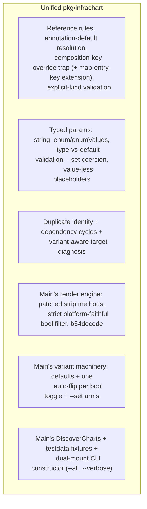

# Unify the GCP Catalog Branch with Main: One Chart Validator, One E2E Framework, Union of Three Catalogs

**Date**: July 16, 2026
**Type**: Refactoring
**Components**: Provider Framework, IAC Stack Runner, CLI Commands, API Definitions, Testing Framework, Build System

## Summary

Merged `main` (carrying the completed AWS and Azure catalog rebuilds) into the
GCP catalog-rebuild branch, resolving 100 conflicted files. The headline work is
unification rather than conflict resolution: the AWS rebuild and the GCP rebuild
had independently built an offline chart validator, extended the shared E2E
runner, and amended the same workflow rules — the merge folds each duplicated
surface into a single superset implementation instead of picking a side. The
unified chart gate now passes all 42 charts across the three rebuilt provider
catalogs, and the E2E framework carries every capability either rebuild needed.

## Problem Statement / Motivation

Three provider catalogs (AWS, Azure, GCP) were rebuilt to the 90/10 bar
concurrently on isolated branches. AWS merged to main first; Azure reconciled
against post-AWS main before merging; the GCP branch — forked before any of
that landed — absorbed fourteen days of main in one merge. Because the branches
were deliberately isolated, both AWS and GCP had solved the same framework
problems independently:

### Pain Points

- Two complete `pkg/infrachart` offline chart validators (add/add conflicts on
  every file), each encoding its catalog's authoring idioms: main's rejected
  the kind-less annotation-default references 84 of the GCP charts' 91
  `valueFrom` blocks use; ours lacked main's patched template-engine string
  methods, per-toggle auto-flip variants, and chart discovery.
- Two divergent evolutions of `e2e/framework/runner`: main added transitive
  prerequisite graphs and scenario annotations; ours added run-id token
  expansion and consumer-scoped prerequisite overrides — several GCP scenarios
  cannot rerun without the former's absence, several AWS scenarios rely on the
  latter's absence.
- Two chart authoring standards (`forge-planton-infra-chart.mdc` vs
  `author-planton-infra-chart.mdc`) teaching overlapping but different rules.
- The kind-registry enum, go.mod/MODULE.bazel, doctrine, and six forge-flow
  rules all carried textual conflicts; a duplicated `--stack-input` flag
  registration (both sides added the same fix) panicked the CLI at startup.
- The GCP branch predated main's labels→annotations platform-key breaking
  change, so its catalog pages taught `metadata.labels` for keys the engine no
  longer reads.

## Solution / What's New

### One chart validator, superset semantics

`pkg/infrachart` keeps the GCP branch's validation semantics as the base —
they are the strict superset — and adopts main's mechanics:

Two semantic disagreements were settled on evidence, not preference:

- **The `bool` template filter is strict AND platform-faithful**: booleans pass
  through, `"true"`/`"false"` parse, and every other string (`"1"`, `"yes"`)
  is a render error. Main's version accepted `"1"` as true — the platform's
  engine evaluates it false, so the offline gate would have validated charts
  that misbehave when published.
- **Unresolved reference targets warn with a variant-aware diagnosis** instead
  of erroring: a target another render variant defines gets "verify this is a
  bring-your-own arm, not toggle breakage" (the two are
  offline-indistinguishable — the GCP `gke-environment` chart's
  `useExistingNetwork` arm is a legitimate instance of the pattern an error
  would have false-failed); a target no variant defines is the designed
  cross-chart composition case.

### One E2E runner, superset capabilities

`e2e/framework/runner` keeps main's structural base (transitive prerequisite
graph, `planton.dev/e2e-prerequisites` scenario/install-manifest annotations,
multi-document install profiles, name-keyed `DependencyOutputs`,
error-aggregating teardown) and ports the GCP branch's capabilities into it:

- `${E2E_RUN_ID}` / `${E2E_RUN_ID_UNDERSCORE}` token expansion, applied to the
  scenario AND every prerequisite document — soft-delete-reserved identifiers
  (KMS rings, WIF pools, Vertex deployed-index IDs) cannot rerun without it.
- Consumer-scoped prerequisite overrides
  (`<consumer>/v1/e2e/prerequisites/<dep>.yaml`), resolved for every kind in
  the transitive chain against the component under test — the documented
  contract in `e2e/README.md`.
- Dependency-destroy retries (6 × 60s) folded into the error-aggregating
  teardown: asynchronous producer cleanups (the Cloud SQL → service networking
  connection class) no longer orphan chains, and failures still fail the run.

All five providers' `aa_e2e` harnesses compile against the merged framework;
its 51 unit tests pass.

### Catalog union and mechanical resolutions

- `cloud_resource_kind.proto`: union of the three rebuilt catalogs' kinds
  (verified zero duplicate enum numbers and zero duplicate id-prefixes);
  stubs and the crkreflect kind map regenerated, never hand-merged.
- ~70 one-side-wins files: the GCP branch's rebuilt catalog pages, site docs,
  and charts win over main's mechanical sweeps of their pre-rebuild versions;
  main's deletions of legacy AWS charts and stale audit artifacts stand;
  the GCP branch's deletions of retired kinds and legacy chart templates stand.
- The labels→annotations platform-key migration completed across the GCP
  surface: 48 metadata blocks across 14 files (7 catalog pages + their site
  copies) flipped; a repo-wide scan proves zero platform keys remain under
  `metadata.labels` in any provider's pages, manifests, presets, or charts.
- Both chart authoring standards folded into
  `_rules/charts/forge-planton-infra-chart.mdc` (the `forge-` grain), teaching
  the unified validator semantics; six forge-flow rules union-merged keeping
  both rebuilds' learn-once teachings, with the provider-pin bullet reconciled
  to "follow the provider's own repo-wide convention" (AWS pins floors, GCP
  pins the major it deliberately modeled).

## Implementation Details

Defects found and fixed during unification:

1. **CLI startup panic**: both branches registered the `--stack-input` flag on
   the tofu command group (the same missing-flag fix made twice); the textual
   auto-merge kept both registrations and pflag panics on redefinition — a
   runtime-only class no compile catches. Deduplicated.
2. **11 Azure charts declared `type: int` params** — not a `ParamType` the
   platform's `InfraChartParam` contract defines (string, number, bool, list,
   string_enum), so the platform's own parser would reject these charts at
   publish time. The AWS-built validator never checked param types; the
   unified gate caught it on first contact. Fixed to `type: number` (their
   templates interpolate the values as-is).
3. **The composition-key override trap needed the map-entry-key extension**:
   Azure's `zonal-web-tier-vmss` legitimately references
   `status.outputs.backend_pool_ids.web` — an entry key APPENDED to the
   annotated map path, which the platform resolves (per the Azure rebuild's
   own `pkg/refcheck` regression suite). The unified rule now permits paths
   that extend the annotated path with a key while still rejecting genuine
   overrides.
4. **Two project-scaffolding breadcrumbs** in a shared generator test's
   comments (from main) removed per the no-breadcrumbs standard.

## Validation

- `pkg/infrachart`: 75 unit tests green (both branches' suites merged; the
  broken-chart fixture now pins 4 error classes + 2 warning diagnoses).
- `e2e/framework/runner`: 51 unit tests green; `go vet` clean across all five
  providers' e2e and `aa_e2e` packages.
- `planton chart validate --all charts/gcp charts/aws charts/azure`:
  **42/42 charts pass** the unified gate.
- Full GCP spec-test sweep green; `planton validate-refs --check` and
  `planton secret-coverage --check` green on a working-tree build;
  `pkg/outputs`, `pkg/secretcoverage`, `pkg/refcheck`, and the tofu-generator
  suites green.
- Site stats regenerated (562 components, 64 charts, 17 providers); gazelle
  run; `go mod tidy` clean.
- A live dual-engine smoke (GcpServiceAccount create→verify→destroy) was
  attempted but blocked by an expired local ADC session (`invalid_grant`,
  reauth required) — the merged runner's behavior is covered by its unit
  suites; the live smoke should run after `gcloud auth application-default
  login` before the release PR merges.

## Impact

The three catalog rebuilds now share one framework story: a chart validated
offline behaves identically regardless of which provider tree it lives in, the
E2E runner supports every scenario class any rebuild produced, and the next
provider rebuild inherits the superset instead of forking it. The branch is
ready for the single release PR.

## Related Work

- `2026-07-09-220939-gcp-chart-catalog-rebuild-opener-and-offline-chart-validation.md` — the GCP branch's validator.
- The AWS rebuild's offline `chart validate` (#461) and the Azure rebuild's map-output resolver extension (#466) — the main-side halves of this unification.

---

**Status**: ✅ Production Ready
