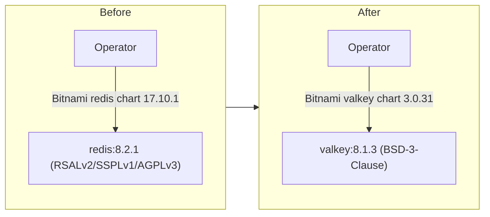

# Self-Hosted Cache Engine: Valkey Serves the Redis Role

**Date**: July 17, 2026
**Type**: Enhancement
**Components**: Self-Hosted Operator, Helm Charts, Licensing Posture

## Summary

The self-hosted platform's redis-protocol cache is now served by Valkey
(BSD-3-Clause) instead of Redis 8.x, whose tri-license
(RSALv2/SSPLv1/AGPLv3) is a family many enterprise legal teams cannot
accept. The operator's CRD schema, Secret/Service names, and configuration
surface are unchanged — the `redis` role name stays; only the engine behind
it changed. The `planton-operator` chart's CRDs and both helm READMEs are
updated to match.

## Problem Statement / Motivation

The desktop instance already ships Valkey specifically to avoid the
source-available licensing of recent Redis, but the self-hosted operator
still deployed a Redis 8.2.1 image. That inconsistency pointed self-hosted
customers — the exact audience with the strictest legal review — at the one
component in the stack with a licensing family (SSPL/RSAL, with AGPL as the
only open option) that enterprise legal departments routinely ban.

## Solution / What's New

- The operator renders the Bitnami **Valkey** chart 3.0.31 (app version
  8.1.3) for the cache component; the workload follows the chart's
  `-primary` naming (previously `-master`).
- **Role-vs-engine naming**: the `PlantonPlatform` CRD field
  (`spec.database.redis`), status key, credential Secret, and connection
  wiring keep the `redis` protocol-role name — Valkey speaks the redis wire
  protocol, so nothing consuming the cache changes. This mirrors the desktop
  instance, which supervises a `valkey-server` behind `REDIS_*`
  configuration.
- Chart CRDs under `helm/planton-operator/crds/` regenerated and synced;
  `helm/planton-operator` and `helm/planton` READMEs now name Valkey in the
  stack description.

## Impact

- **Self-hosted adopters**: the full deployed stack is now permissive or
  weak-copyleft end to end — nothing in the default install carries a
  source-available license. Fresh installs get Valkey automatically; the
  cache is ephemeral state, so no migration applies.
- **Existing installs**: the cache StatefulSet name changes
  (`-redis-master` → `-redis-primary`); the operator reconciles the new
  workload on upgrade and cached entries repopulate.

## Related Work

Part of the platform-wide licensing posture: the desktop instance's Valkey
choice, license notices traveling with re-hosted runtime dependencies, and
the documented rule that source-available software (SSPL/RSAL/BUSL) is never
distributed or auto-installed.

---

**Status**: ✅ Production Ready
