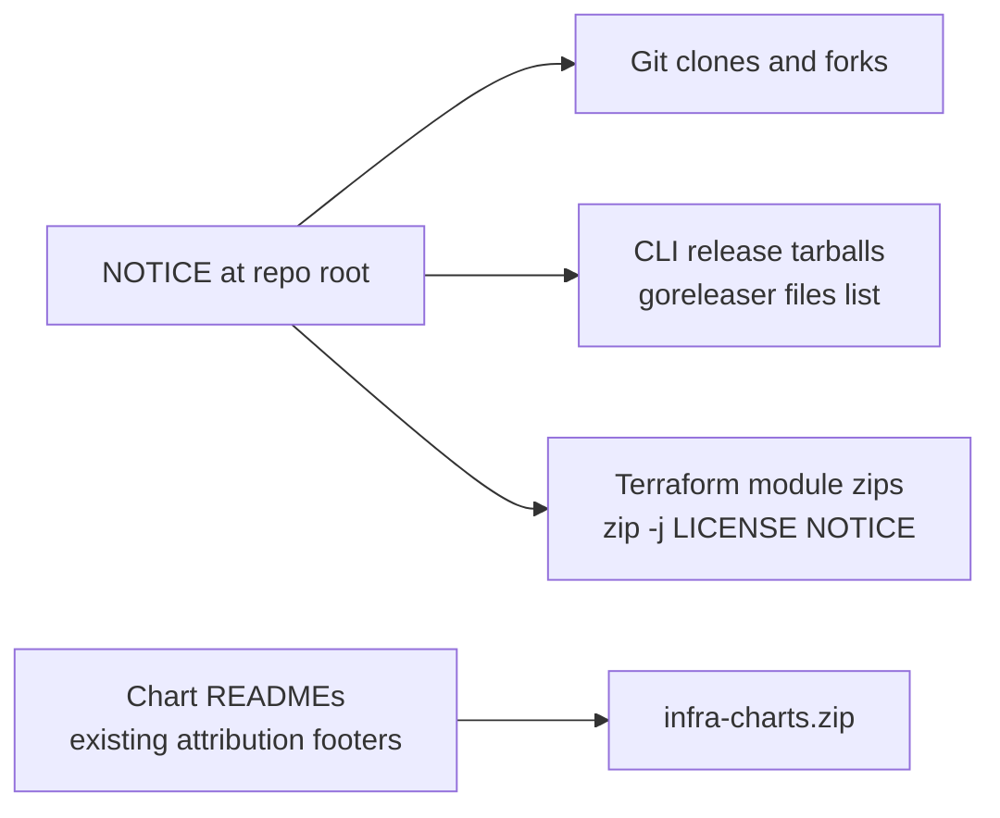

# Apache NOTICE with Traveling Attribution Across All Release Channels

**Date**: July 22, 2026
**Type**: Feature
**Components**: Build System, Release Workflows, Legal/Licensing

## Summary

The repository now carries an Apache-convention `NOTICE` file at the root, and
— the substantive part — that attribution now travels with every first-party
distribution channel: CLI release archives and per-component terraform module
zips both package `LICENSE` and `NOTICE` alongside the code they ship.
Previously, terraform module zips on downloads.planton.dev contained only
`.tf` files with no license statement at all.

## Problem Statement / Motivation

Apache-2.0 §4(d) obliges anyone redistributing this work to carry its NOTICE
file — but no NOTICE existed, so there was nothing for attribution to attach
to. Worse, the repository's own release channels did not hold themselves to
the standard the license expects of others:

- **CLI archives** (goreleaser) included `LICENSE` and `README` by default,
  but goreleaser's default file globs (`LICENSE*`, `README*`, `CHANGELOG`) do
  not cover `NOTICE` — a new NOTICE would silently not ship.
- **Terraform module zips** — the per-component artifacts on
  downloads.planton.dev, which are exactly the unit of the catalog someone is
  most likely to copy — were packaged from the module directory alone:
  **only `.tf` files, zero attribution, no license text**.

## Solution / What's New

1. **`NOTICE`** (new, repo root) — deliberately minimal, because every
   redistributor must reproduce it verbatim: product name,
   `Copyright 2024-2026 Planton Cloud, Inc.`, and a one-line attribution
   statement with the repo URL. No third-party inventory (third-party notices
   live with the artifacts that redistribute those components).
2. **`.goreleaser.yaml`** — an explicit `archives.files` list that mirrors
   goreleaser's defaults exactly and appends `NOTICE`. Current archive
   contents are unchanged; NOTICE is the only addition.
3. **`.github/workflows/release.terraform-modules.yaml`** — the packaging
   step now appends the repo-root `LICENSE` and `NOTICE` at each module zip's
   root (`zip -j`) after zipping the module directory. Terraform ignores
   non-`.tf` files, so `terraform init`/`plan` flows are unaffected.

The `infra-charts.zip` channel needed no change: it is a `git archive` of the
`charts/` tree, and chart READMEs already carry the repo's attribution
footers.

## Implementation Details

- The goreleaser default-files behavior was verified against goreleaser's
  documentation (defaults: `LICENSE*`, `README*`, `CHANGELOG` — an explicit
  `files:` key replaces the defaults, which is why the list restates them).
- The terraform zip change chains `zip -j` into the existing success
  condition, so a failure to attach the license files fails that module's
  packaging loudly instead of shipping a bare zip.
- Copyright years run from the work's first publication (the repository's
  first commit, 2024).

## Validation

- `actionlint` on the edited workflow: the two pre-existing shellcheck infos
  are unchanged; the edit introduces zero new findings.
- The exact packaging block (not a re-implementation) was replicated locally
  against a real module (`awsecsservice`): `unzip -l` shows all `.tf` files
  plus `LICENSE` and `NOTICE` at the zip root.
- `.goreleaser.yaml` parses cleanly and the `files:` list reads back
  correctly; the next tagged release exercises the config end to end.

## Impact

- **Adopters and redistributors** now receive an explicit license statement
  in every artifact they might build on — including the module zips that
  previously shipped with no terms at all.
- **The project's legal posture** gains its foundation: attribution that
  travels with the code at every granularity the code actually ships in.
- **No consumer-visible behavior change**: archives gain two small text
  files; terraform workflows are unaffected.

## Related Work

- Chart README attribution footers (the existing `© Planton. Licensed under
  Apache-2.0` convention) — the same principle at the per-component
  documentation level; a lint to enforce it across all component READMEs is
  planned follow-up work.
- Third-party notices for redistributed runtime dependencies (the desktop
  daemon's `third-party-notices` command and CDN license sidecars) — the
  inbound-direction counterpart of this outbound-attribution change.

---

**Status**: ✅ Production Ready
