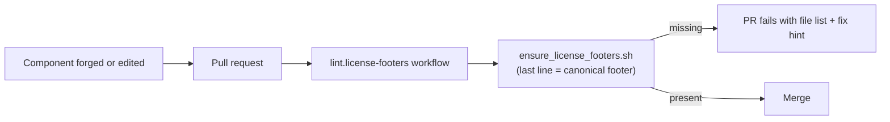

# License Footers on All Component READMEs, Enforced by CI

**Date**: July 22, 2026
**Type**: Feature
**Components**: Legal/Licensing, Documentation, CI Guards

## Summary

Every component README (all 560 under `apis/dev/planton/**/<component>/v1/`)
and every infra chart README (all 64 under `charts/`) now ends with the
canonical license footer, and a new guard in the `lint.*` CI family makes it
impossible for a future component to ship without one. The footer's LICENSE
link is now an absolute URL, so the attribution survives copying a component
directory out of the repository — the exact scenario it exists for.

## Problem Statement / Motivation

The realistic unit of copying for this catalog is one component directory —
its protos, docs, and IaC modules — not the whole repository. The repo-root
LICENSE does not travel with a copied directory; the component's README does.
A footer convention existed (16 of 64 chart READMEs carried
`© Planton. Licensed under [Apache-2.0](../../../LICENSE).`) but:

- **560 component READMEs had no footer at all** — the primary copy unit
  carried zero attribution.
- The relative link **dangles precisely when the footer matters**: in a copied
  directory, an extracted zip, or any context outside the repo tree, and at
  component depth it would be a seven-level `../` chain.
- Nothing enforced the convention, so coverage decayed to 25% even where it
  existed.

## Solution / What's New

1. **Canonical footer, one uniform string at every depth:**

   `© Planton. Licensed under [Apache-2.0](https://github.com/plantonhq/planton/blob/main/LICENSE).`

   Applied to 608 READMEs (560 component + 48 chart) and normalized on the 16
   that carried the relative form. The absolute URL survives copies, zips,
   and forks — and points back to the source repository, which is what
   traveling attribution is for.

2. **`hack/guards/ensure_license_footers.sh`** — check-only, find+awk, in the
   guard-family style: collects every violation, prints the list and a
   copy-pasteable fix. The scope is **path-shaped** (any README that is the
   direct child of a component `v1/` folder), so future API domains are
   covered without editing the guard. Deeper READMEs (`v1/docs/`,
   `v1/iac/**`) are deliberately out of scope: the artifacts that ship them
   already carry LICENSE and NOTICE files.

3. **`.github/workflows/lint.license-footers.yaml`** — mirrors the existing
   `lint.charts.yaml` structure: PR + main-push triggers with path filters,
   read-only permissions, one job running the guard.

Helm chart READMEs (`helm/planton`, `helm/planton-operator`) are a recorded
follow-up — they had unrelated in-flight changes at the time of this work;
the guard's scope extends to them in one line when they are footered.

## Validation

- Guard run over all 624 in-scope READMEs: green.
- Mutation test: removing one footer fails the guard naming exactly that
  file; restoring returns green.
- `actionlint` (workflow) and `shellcheck` (guard): zero findings.
- Spot-reads across all four change classes (appended component, appended
  chart, normalized chart, qa-domain component): placement is byte-identical
  to the pre-existing convention.

## Impact

- **Anyone copying a component** now receives an explicit license statement
  and a working pointer back to the license and the source.
- **Agents forging components** get an unmissable CI signal; attribution
  coverage can never silently decay again (it was at 2.5% of the full
  surface before this change).
- **No behavioral surface**: READMEs gained two lines; no tooling reads them.

## Related Work

- NOTICE + LICENSE now shipped inside CLI release archives and terraform
  module zips — the artifact-level counterpart of this README-level change.
- The trademark policy (TRADEMARKS.md) — the identity counterpart of this
  attribution work.

---

**Status**: ✅ Production Ready
