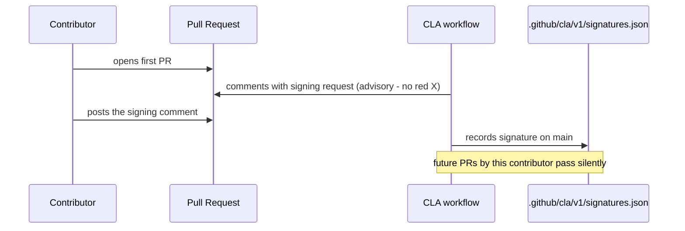

# Contributor License Agreement with Advisory Signing Gate

**Date**: July 22, 2026
**Type**: Feature
**Components**: Legal/Licensing, CI Workflows, Contributor Experience

## Summary

The repository now has a Contributor License Agreement (`CLA.md`, Version
1.0) and a repository-native signing gate (`.github/workflows/cla.yaml`)
running in advisory mode. External contributors sign once with a PR comment;
the signature is recorded in this repository's own history. Nothing blocks a
merge — the gate becomes enforcing only after the CLA text passes attorney
review.

## Problem Statement / Motivation

Contributions today are accepted under Apache-2.0's own inbound=outbound
clause (license §5), which certifies terms but grants the project no
relicensing rights. The window to fix that is *before* external PRs start
merging: once un-CLA'd contributions are in the tree, changing the project's
license terms would require hunting down every past contributor. The CLA
grants Planton Cloud, Inc. the rights needed to steward the project long
term — including relicensing future versions if that ever becomes necessary
— while contributors keep every right to their own work.

## Solution / What's New

1. **`CLA.md` (Version 1.0)** — derived from the Apache Software Foundation's
   Contributor License Agreements: copyright grant (perpetual, irrevocable,
   sublicensable), patent grant with defensive termination, contributor
   representations, third-party submission carve-out, no-support disclaimer.
   One document, two signing capacities (individual / entity-authorized).
   Grants no trademark rights (see TRADEMARKS.md).
2. **`.github/workflows/cla.yaml`** — the contributor-assistant action,
   pinned to the exact tag v2.6.1 (this workflow runs `pull_request_target`
   with write permissions, so it gets the tightest practical pin — a
   deliberate, commented divergence from the repo's major-tag convention).
   Checkout-free: no PR code is ever fetched or executed. Advisory via
   `continue-on-error` with the exact two-step flip to blocking documented
   in the header. Signature records are **versioned**
   (`.github/cla/v1/signatures.json`): a materially revised CLA becomes v2
   and contributors re-sign, with v1 records preserved.
3. **`CONTRIBUTING.md`** — one paragraph in the Licensing section explaining
   the one-time signature and what it means.

## Validation

- `actionlint` on the workflow: zero findings.
- Structural verification: no checkout step exists; the sign-comment string
  is identical in the trigger condition and the bot's requested comment;
  signature path, branch, and document URL are mutually consistent;
  permissions match the action's documented requirements exactly.
- Pinned tag verified to exist upstream (latest release).
- Verified a signature commit to main matches no other workflow's path
  filters — bot commits trigger no releases and no lint runs.
- Live signing intentionally unvalidated until a real external PR exists;
  the workflow structure is the verifiable surface today.

## Impact

- **External contributors**: a one-time comment on their first PR — no
  account creation, no external service, no blocked merge while the gate is
  advisory. The team and bots are allowlisted and never prompted.
- **The project**: every contribution from day one arrives with the grants
  that keep long-term stewardship options open.
- **Maintainers**: signatures live in the repo's own auditable history, not
  a third-party database.

## Related Work

- CONTRIBUTING's licensing section (inbound=outbound) — the CLA supplements
  it; the license terms of the code do not change.
- NOTICE + license footers + TRADEMARKS.md — the attribution and identity
  guardrails this CLA completes: all four protection mechanisms are now in
  the repository.

---

**Status**: ✅ Production Ready (advisory mode; enforcement pending counsel review)
