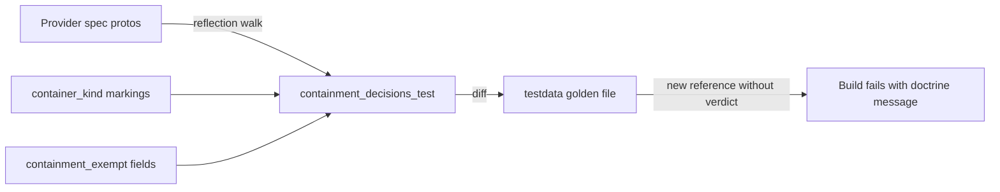

# Diagram Containment Audit and Edge-Label Options

**Date**: July 22, 2026
**Type**: Feature
**Components**: API Definitions, Protobuf Schemas, Resource Management

## Summary

Architecture diagrams rendered from these APIs can now nest resources inside the containers they are actually deployed into — across the whole catalog, not just VPCs and clusters. This change marks 42 additional kinds as container kinds (subnets on seven providers, database servers, messaging namespaces, DNS zones, storage accounts, key vaults, and other genuine service parents), introduces a field-level `containment_exempt` option that keeps access-style references (firewall rules, encryption-key sources, alert destinations) from being drawn as false containment, and introduces a `diagram_label` field option so consumer reference fields can carry human-authored edge labels. A reflection-driven registry test pins every one of the 615 container-targeting references to an explicit contained-or-exempt verdict.

## Problem Statement / Motivation

The `container_kind` flag on `CloudResourceKindMeta` drives visual containment in downstream architecture diagrams: a resource that references a container kind is drawn inside its boundary. Only 26 of 562 kinds were marked — VPCs, Kubernetes clusters, resource groups, projects — so diagrams rendered most infrastructure as a flat web of boxes. A subnet, the single most important boundary in any provider's own reference diagrams, was furniture rather than a room.

Marking more kinds naively would have produced false diagrams, because references into a container kind carry two opposite meanings:

- **Placement** — "deploy me into this": a NAT gateway referencing its subnet, a queue referencing its Service Bus namespace.
- **Access** — "admit traffic from / let me talk to": a storage account's network ACL referencing a subnet, a VM referencing a key vault for disk-encryption keys.

A kind-level flag alone cannot tell these apart. Field comments across the Azure specs (network rules, service endpoints) document admission semantics on exactly the same `subnet_id` shape used elsewhere for placement.

### Pain Points

- Diagrams could not draw subnets, database servers, or messaging namespaces as boundaries at all.
- Any attempt to mark them without per-field semantics would nest storage accounts inside subnets they merely admit traffic from.
- Edge labels on rendered diagrams derived only from raw field paths; there was no way to author "assumes cluster role" where the field path reads `cluster_role_arn`.
- Nothing forced a conscious containment decision when a new reference field was added.

## Solution / What's New

### 1. Rooms-vs-furniture doctrine on `container_kind`

The flag's documentation now records the marking criteria: a kind is a container only if it is a place/scope in the provider's own model and an engineer whiteboarding the system would draw it as a box around other resources. Compute capacity (node pools, autoscaling groups, VM scale sets, elastic pools) is never a container; flow-through hubs (load balancers, gateways, routers) are nodes with arrows, not boxes.

42 kinds gained `container_kind: true` (68 total now):

| Tier | Kinds |
|---|---|
| Subnets (7 providers) | AwsSubnet, AzureSubnet, GcpSubnetwork, OciSubnet, AliCloudVswitch, OpenStackSubnet, ScalewayPrivateNetwork |
| Service parents | AzureServiceBusNamespace, AzureServiceBusTopic, AzureEventHubNamespace, AzureEventHub, AzureCosmosdbAccount, AzureCosmosdbSqlDatabase, AzureCosmosdbMongoDatabase, AzureMssqlServer, AzureStorageAccount, AzureKeyVault, GcpSpannerInstance, GcpAlloydbCluster, GcpCloudSql, GcpBigQueryDataset, GcpBigtableInstance, GcpFirestoreDatabase, GcpCloudComposerEnvironment, GcpKmsKeyRing, GcpVertexAiIndexEndpoint, AwsCognitoUserPool, AwsEventBridgeBus, AwsFsxOntapFileSystem, AwsFsxOntapStorageVirtualMachine, OciKmsVault, OpenFgaStore |
| DNS zones | AwsRoute53Zone, AzureDnsZone, AzurePrivateDnsZone, GcpDnsZone, CloudflareDnsZone, DigitalOceanDnsZone, CivoDnsZone, OpenStackDnsZone, ScalewayDnsZone, OciDnsZone |

### 2. `containment_exempt` field option (foreign_key.proto, extension 200003)

Authored on reference fields that express access rather than placement. The dependency edge still exists and still renders as a relationship line; the exemption only prevents nesting. 106 fields carry it, covering:

- Network ACL / service-endpoint admission (storage accounts, key vaults, SQL servers, messaging namespaces referencing subnets)
- Serverless VPC attachment (Lambda, Cloud Run, function apps, SAE, Scaleway serverless — the workload lives in the provider's tenant; only an ENI/connector reaches into the network)
- GCP private-services-access peering (Cloud SQL, AlloyDB, Filestore, Memorystore, Redis)
- Encryption/unseal key sources (VM disk encryption via Key Vault, AKS etcd KMS)
- JWT authorizer / OIDC issuer trust (API Gateway, LB listeners, OpenSearch dashboards referencing Cognito; federated credentials reading cluster issuers)
- Alert/log/capture destinations (monitor action groups, diagnostic settings, Event Hub capture)
- DNS validation, alias records, and operator write access into zones
- DR partners, replication endpoints, watched scopes, routing config

### 3. `diagram_label` field option (options.proto, extension 60006)

Human-authored edge labels on consumer reference fields, starting with the AWS EKS story: `in vpc`, `attached to vpc`, `in subnet`, `elastic ip`, `spans subnets`, `assumes cluster role`, `secrets encrypted with`, `joins cluster`, `assumes node role`, `launched from template`. Clients fall back to automatic humanization of the referenced field path when no label is authored, so coverage is never required.

### 4. The registry gate

`apis/dev/planton/shared/cloudresourcekind/containment_decisions_test.go` walks every compiled-in provider spec via proto reflection and diffs all references-into-containers against a committed golden file (`testdata/containment_decisions.txt`, 509 contained + 106 exempt). Adding a field, kind, or container marking without recording a verdict fails the build with instructions. Companion tests pin the extension numbers and reject annotations authored on non-reference fields (where the platform's edge selector would never read them) or exemptions targeting non-container kinds (inert and misleading).

## Impact

No runtime behavior changes in this repository — the options are descriptor metadata. Downstream platforms that compute diagram containment from `container_kind` will nest resources into the newly marked containers on their next build, skipping exempt references; platforms that render edge labels can read `diagram_label` from the consuming field's descriptor.

## Known Limitations

- Kubernetes provider specs were deliberately left untouched (a concurrent effort owns that surface). Four access-style references from Kubernetes components into container kinds (external-dns and ingress-nginx into DNS zones/subnets, OpenBao into GCP KMS/project) are recorded as `contained` in the golden file for now and should gain `containment_exempt` when that surface reopens.
- Labels are authored only for the AWS EKS-story kinds in this change; other kinds rely on client-side humanization until authored.

## Related Work

- `container_kind` flag introduction (organization-graph containment).
- `default_kind` / `default_kind_field_path` foreign-key options that this builds beside.

---

**Status**: ✅ Production Ready
