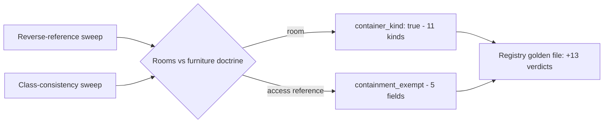

# Container Audit Second Pass: Eleven New Container Kinds

**Date**: July 22, 2026
**Type**: Enhancement
**Components**: API Definitions, Protobuf Schemas, Resource Management

## Summary

A second-opinion audit of the `container_kind` markings across the full 562-kind
catalog found eleven kinds that are "rooms" in their provider's own model but
were never marked as containers, including a cross-provider inconsistency where
DNS zones were marked on ten providers but missed on AliCloud and Hetzner. The
eleven kinds are now marked, five access-style references into the newly marked
kinds carry `containment_exempt`, and the containment-decision registry gains
thirteen consciously recorded verdicts.

## Problem Statement / Motivation

The original full-catalog containment audit walked every reference *into kinds
already marked as containers* and recorded a contained-vs-exempt verdict for
each. That direction of the audit is enforced by the registry gate
(`containment_decisions_test.go`) — but the gate never asks the inverse
question: is there a kind *receiving* references that should have been marked a
container and wasn't? A room that is never marked never nests anything, so
architecture diagrams silently draw its residents beside it instead of inside
it.

### Pain Points

- An identity-pool provider rendered beside the workload identity pool it is
  immutably created inside of, instead of within it.
- Redshift Serverless workgroups floated free of the namespace whose data plane
  they exist to serve.
- EFS access points — the direct analog of the already-contained FSx ONTAP
  storage virtual machines — did not nest in their file system.
- DNS zones were containers on ten providers but not on AliCloud (public and
  private) or Hetzner, a plain inconsistency in the catalog's own doctrine.

## Solution / What's New

Two sweeps, judged against the rooms-vs-furniture doctrine recorded on the
`container_kind` field:

1. **Reverse-reference sweep** — every `default_kind` reference in the catalog
   grouped by its TARGET kind, surfacing every unmarked kind that receives
   references. The heavy hitters (IAM roles, KMS keys, security groups,
   buckets, log groups) were confirmed correct furniture: every reference into
   them expresses access, not placement.
2. **Class-consistency sweep** — the full kind list checked for missed siblings
   of established container classes (DNS zones, networks, database servers with
   modeled children).

### New container kinds (11)

| Kind | The room it is | Placement reference |
|---|---|---|
| `GcpWorkloadIdentityPool` | pool that identity providers are created in | provider → pool (contained) |
| `AzureEventHubCluster` | dedicated cluster namespaces are placed on | namespace → cluster (contained) |
| `AwsRedshiftServerlessNamespace` | data plane workgroups deploy into | workgroup → namespace (contained) |
| `AwsElasticFileSystem` | file system access points enter | access point → file system (contained) |
| `AwsFsxLustreFileSystem` | file system data-repository associations attach to | association → file system (contained) |
| `GcpSpannerDatabase` | database backup schedules belong to | schedule → database (contained) |
| `AzureFrontDoorEndpoint` | endpoint routes are children of | route → endpoint (contained) |
| `CloudflareZeroTrustTunnelVirtualNetwork` | virtual network tunnel routes belong to | route → virtual network (contained) |
| `AliCloudDnsZone`, `AliCloudPrivateDnsZone`, `HetznerCloudDnsZone` | DNS zone class consistency | none yet (inert until referenced) |

### New exemptions (5)

Access-style references into the newly marked kinds, annotated so the diagram
never nests a resource inside something it merely connects to:

- SageMaker domain, ECS task definition, and Batch job definition EFS volume
  mounts (`file_system_id`) — mounting is access, not placement.
- EFS replication `destination_file_system_id` — a DR partner, not a resident.
- Front Door security policy `domain_ids` — a WAF applied to endpoints, not
  placed inside one.

### Deliberately NOT marked

- **MSK, Redis/ElastiCache, OpenSearch, Dataproc**: nothing in the catalog
  places into them; every reference is access.
- **Load-balancer pools and Front Door origin groups**: flow-through machinery
  — arrows, not boxes, per the doctrine.
- **Storage containers, buckets, log groups/workspaces**: all references are
  data-destination access.
- **Database servers without modeled children** (PostgreSQL/MySQL flexible
  servers, RDS/Neptune/Redshift clusters): their only references are
  replication/DR self-references; marked siblings (Cloud SQL, MSSQL Server,
  Cosmos DB) all have child kinds that place into them.
- **Node pools / node groups on all seven providers**: re-verified unmarked —
  compute capacity is never a container.
- **Kubernetes provider kinds**: untouched; an active branch owns those specs.

## Implementation Details

- `container_kind: true` added to the eleven kinds' `(kind_meta)` blocks in
  `apis/dev/planton/shared/cloudresourcekind/cloud_resource_kind.proto`.
- `(dev.planton.shared.foreignkey.v1.containment_exempt) = true` authored on
  the five access-style reference fields.
- Golden registry regenerated:
  `go test ./apis/dev/planton/shared/cloudresourcekind/... -run TestContainmentDecisions -update`
  — now 517 contained + 111 exempt verdicts (628 total, up from 615).

## Benefits

- Architecture diagrams on the platform draw the eight newly contained
  relationships as true nesting the next time these kinds appear together in an
  environment — no client-side changes required; the containment resolver
  already honors the markings.
- The DNS-zone class is now consistent across all twelve providers that model
  zones.
- Every future reference into the eleven kinds trips the registry gate and
  forces a conscious contained-vs-exempt verdict.

## Impact

Purely additive metadata. No wire-format change, no behavioral change for any
existing consumer that does not read `container_kind`. Diagrams that render
containment pick up the new nesting automatically after upgrading to this
release.

## Related Work

- The original full-catalog containment audit and the `containment_exempt` /
  `diagram_label` field options
  (`2026-07-22-144418-diagram-containment-audit-and-edge-label-options.md`).

---

**Status**: ✅ Production Ready
