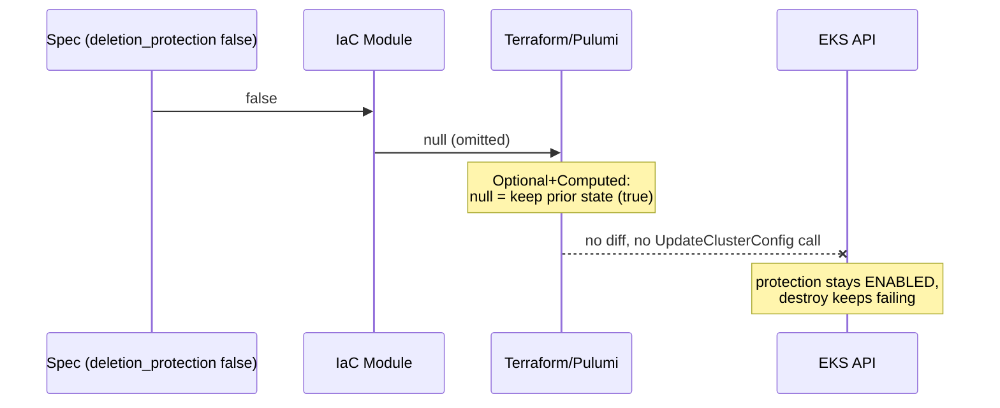

# Fix Delete Protection That Could Never Be Turned Off (AwsEksCluster, OciApplicationLoadBalancer)

**Date**: July 26, 2026
**Type**: Bug Fix
**Components**: AWS Provider, OCI Provider, API Definitions, IAC Stack Runner

## Summary

Setting `deletion_protection: false` on an AwsEksCluster (and
`is_delete_protection_enabled: false` on an OciApplicationLoadBalancer) was
silently ignored by both IaC engines. Once protection was enabled, it could
never be disabled through the platform, so destroys stayed blocked forever.
Both modules now always send the explicit boolean to the provider instead of
omitting it when false.

## Problem Statement / Motivation

A user enabled `deletion_protection` on an EKS cluster, later set it to
`false`, ran an update (reported success), and then tried to destroy the
cluster. AWS rejected the destroy: deletion protection was still enabled.
Repeating the update/destroy cycle changed nothing.

### Root Cause

Both engines mapped the spec field with the "omit when false" idiom:

```hcl
# iac/tf/main.tf (before)
deletion_protection = var.spec.deletion_protection ? true : null
```

```go
// iac/pulumi/module/main.go (before)
if spec.DeletionProtection {
    clusterArgs.DeletionProtection = pulumi.BoolPtr(true)
}
```

The trap: the provider attribute is **Optional + Computed** (verified in
terraform-provider-aws v6.9.0, `internal/service/eks/cluster.go` — no schema
default). For Optional+Computed attributes, a null/omitted config value means
"keep whatever value the resource currently has", not "reset to default".



So the true-to-false transition produced an empty plan, no API call was ever
made, and the guard rail became permanent.

### Scope Audit

Audited the entire `apis/` tree for the same failure mode:

- The `? true : null` idiom appears ~90 times across ~40 modules, but most
  occurrences are harmless: attributes with explicit provider defaults resolve
  null to false, and the ~50 Helm-values usages in kubernetes* modules
  correctly revert to chart defaults when a key is omitted.
- Every other delete-protection mapping (GKE, Cloud SQL, Spanner, ALB/NLB,
  Hetzner, AliCloud, Cognito, EC2) already passes the boolean straight
  through — the convention was right; these two modules diverged from it.
- Exactly two modules used the broken idiom for a delete guard, in both
  engines: **AwsEksCluster** and **OciApplicationLoadBalancer** (OCI provider
  attributes are conventionally Optional+Computed, same symptom).
- This is NOT a variables.tf generation problem — the generated contract
  delivers the concrete `false` correctly; the bug was in the hand-written
  spec-to-resource mapping.

## Solution

Always send the explicit boolean. Four one-line fixes (plus explanatory
comments so the idiom doesn't get "cleaned up" back in):

| File | Before | After |
|---|---|---|
| `apis/dev/planton/provider/aws/awsekscluster/v1/iac/tf/main.tf` | `var.spec.deletion_protection ? true : null` | `var.spec.deletion_protection` |
| `apis/dev/planton/provider/aws/awsekscluster/v1/iac/pulumi/module/main.go` | `if spec.DeletionProtection { ... BoolPtr(true) }` | `pulumi.BoolPtr(spec.DeletionProtection)` unconditionally |
| `apis/dev/planton/provider/oci/ociapplicationloadbalancer/v1/iac/tf/main.tf` | `var.spec.is_delete_protection_enabled ? true : null` | `var.spec.is_delete_protection_enabled` |
| `apis/dev/planton/provider/oci/ociapplicationloadbalancer/v1/iac/pulumi/module/load_balancer.go` | `if spec.IsDeleteProtectionEnabled { ... Bool(true) }` | `pulumi.Bool(spec.IsDeleteProtectionEnabled)` unconditionally |

Sending an explicit `false` is safe in every case: it matches the AWS/OCI
default for new resources, and on a true-to-false transition it produces a
real diff that triggers the `UpdateClusterConfig` (EKS) / update (OCI) call.

## Benefits

- Delete protection is now a working two-way switch: enable to guard
  production, disable to allow a planned teardown.
- Stuck resources are unblocked with the normal flow: set the spec field to
  false, run update (real diff this time), then destroy.
- The proto contract (`spec.proto` field 18: "Blocks cluster deletion at the
  EKS API until explicitly disabled") is now honored by both engines.

## Impact

- Any AwsEksCluster or OciApplicationLoadBalancer that ever had protection
  enabled and then disabled in the spec: the next update after this fix will
  show a deletion-protection change and actually apply it.
- No behavior change for resources that never touched the field (false was
  and remains the effective default).

## Verification

- `terraform validate` passes on both Terraform modules.
- `go build` compiles both Pulumi modules.
- Not yet verified live: the true-to-false transition on the originally
  affected cluster (pending the next update/destroy run through the pipeline).

## Related Work

- Follow-up (separate effort): audit the remaining non-Helm `? true : null`
  occurrences against each provider's schema for Optional+Computed mutable
  attributes; candidates include `awslaunchtemplate`
  (`disable_api_stop`/`disable_api_termination`) and `awsrdscluster` write
  forwarding flags, though none of those block destroys.

---

**Status**: ✅ Production Ready
