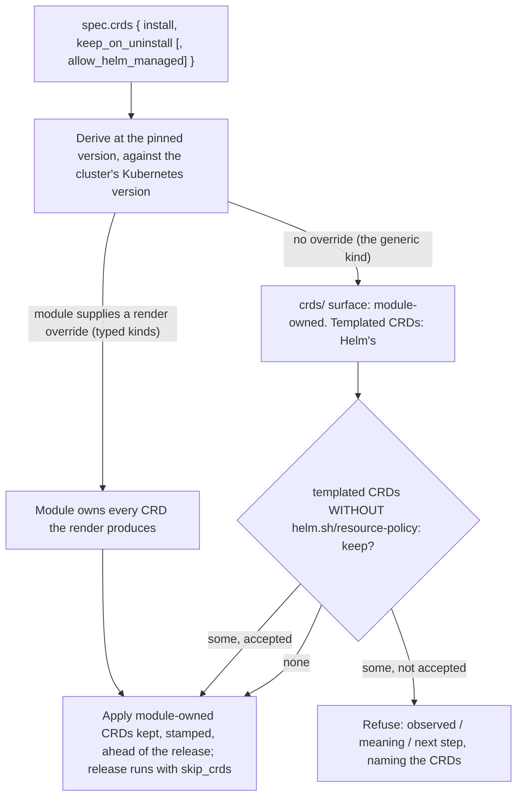

# Every CRD-carrying kind is on the Helm/CRD primitive, and the generic Helm release owns its chart's CRDs -- Solr, OpenSearch, and KubernetesHelmRelease join OpenTelemetry

**Date**: September 3, 2026
**Type**: Feature
**Components**: Kubernetes Provider, Provider Framework, Terraform Modules, Pulumi Modules, API Definitions, Testing Framework, Error Handling

## Summary

The three catalog kinds that still vendored a CRD copy beside their module -- the Apache Solr operator, the OpenSearch operator, and the generic `KubernetesHelmRelease` -- now derive their CRDs from the pinned chart through the shared primitive the OpenTelemetry operator proved. With them, every Helm-installing kind whose chart carries CRDs installs from a published module, upgrades its schema with the version, keeps it on uninstall, re-adopts it on reinstall, and refuses a downgrade or an unpublished version with a message that says what was observed, what it means, and what to do. The primitive grew a second version to make the generic kind honest: it tells Helm's two CRD surfaces apart, refuses charts that would let Helm delete CRDs with the release, renders against the cluster's real Kubernetes version, and reads private repositories with the release's own credentials. Forty lanes are green on Kind across the four kinds and both engines.

## Problem Statement / Motivation

The decision tree became forge law and the primitive landed earlier today, proven on one kind. Three kinds still read `../crds`, a directory no published module carries, so none of them had ever installed from a release. The generic Helm kind offered only Helm's own contract behind a `skip_crds` switch: the CRDs in a chart's `crds/` directory installed once and were never upgraded or removed, and a chart that templated its CRDs would delete them, and every custom resource built on them, on uninstall, silently.

### Pain Points

- Solr, OpenSearch, and the generic Helm kind were in the self-containment guard's shrink table and the anatomy baseline; the catalog still had two answers to one question.
- The primitive assumed a typed kind: it knew the chart's CRD switch, expected CRDs, and treated every rendered CRD as the module's. An arbitrary chart breaks all three assumptions.
- A client-side render assumed Helm's built-in Kubernetes version (1.20.0), so a chart declaring `kubeVersion: >= 1.22.0-0` refused to render even though the install would succeed (found live on Solr).
- The e2e verifier logic for the CRD lifecycle lived in one kind's file; three more kinds would have copied it.

## Solution / What's New

### The primitive's second version (both engines, once)

- **The ownership rule.** `helmcrds.Derive` now returns `Derived{Owned, HelmManaged}`. With a `CRDOverride` the module owns every CRD the render produces (a typed kind turned the chart's switch on for the render and pinned it off for the release). Without one, the render is the release's own render: CRDs from the chart's `crds/` directory (`chart.CRDObjects()`) are the module's; CRDs the chart templates stay Helm's. Templated CRDs carrying `helm.sh/resource-policy: keep` are the chart owning its lifecycle and need nothing. Templated CRDs without the mark are `HelmManaged`. The Terraform block reads the same two surfaces (`self.crds` versus `self.manifests`) and applies the same rule.
- **`helmcrds.Policy`.** `ExpectCRDs` (a typed kind's render that yields none is a failure; the generic kind's chart may carry none) and `AllowHelmManaged` (accept Helm-managed CRDs, or refuse them). `keptcrds.Args` carries a `Policy`; the Terraform contract carries `expect_crds` and `allow_helm_managed`.
- **A new failure, `HelmManagedCRDsFailure`.** Observed: the chart, the version, how many CRDs and which, templated without the keep annotation. Meaning: Helm owns them and deletes them with the release along with every custom resource built on them; `keep_on_uninstall` cannot reach resources Helm owns. Next step: the typed catalog kind if one exists; the chart's own keep switch; or `spec.crds.allow_helm_managed`. Both engines produce the same three lines.
- **The render sees the cluster's Kubernetes version.** Terraform reads `data "kubernetes_server_version"` and passes `kube_version`; Pulumi reads the server version through a discovery client on the same connection the never-downgrade read uses. `.Capabilities.KubeVersion` is the install's, not Helm's default.
- **Private repositories.** `Source.Username`/`Password` reach Helm's chart locator; the Terraform block passes `repository_username`/`repository_password` and skips the index read for authenticated repositories rather than put a credential in a request header. An offline test serves a chart behind basic auth and proves the credentials flow and their absence fails.
- **The Terraform contract is one object.** `local.helm_crds_args` mirrors `keptcrds.Args` key for key (`install`, `keep_on_uninstall`, `expect_crds`, `allow_helm_managed`, `render_override`, `api_versions`, `bundle_url`, `repository_username`, `repository_password`, `set`, `set_sensitive`), beside `helm_release_values` and the chart identity locals every Helm kind already has. The generated `helm_crds.tf` was regenerated into every module that carries it; the drift test holds them identical. A CRD the provider exposes on both surfaces yields one resource (grouping comprehension, first wins), as the Go side always did.

### Solr and OpenSearch on the render branch

Solr's chart turned out to ship three of its four CRDs in `crds/`; the fourth is templated by the bundled zookeeper-operator subchart behind `zookeeper-operator.crd.create`. Rendered with that switch on, the four are spec-identical to the Apache bundle at 0.9.0 and 0.9.1, so Solr is on the render branch with no upstream URL (the bundle branch stays in the primitive, unused today). OpenSearch renders with `installCRDs: true`; its chart carries 9 CRDs at 2.7.0 and 10 at 2.8.0, so its upgrade lane proves a chart bump adds a CRD. Both specs gained `<Kind>Crds crds { install, keep_on_uninstall }` (fields 16 and 17); both twins re-pin the chart's switch off after the `helm_values` merge; `iac/crds/` is gone; both kinds left the anatomy baseline and the self-containment guard's table, which now holds only the Planton operator kind's two modules.

### The generic `KubernetesHelmRelease`

`bool skip_crds = 18` is `reserved 18;`. `KubernetesHelmReleaseCrds crds = 29` carries `install`, `keep_on_uninstall`, and `allow_helm_managed` (default false). The chart identity comes from the spec; the render sees `values_yaml` plus the `set`, `set_string`, and `set_sensitive` layers exactly as the release does, with the release's credentials. The release always installs with `skip_crds = true`: the module owns the `crds/` surface (derived, kept, stamped, moved with `version`, re-adopted, never downgraded), and a chart without CRDs renders nothing. CRDs the chart templates stay Helm's, refused unless the chart keeps them itself or the spec accepts them.

### The e2e harness

- **One shared verifier helper, `verify.helmCRDLifecycle`**, holds the assertions every kind on the primitive shares: CRDs Established and stamped with the pinned version and the chart's label; kept or deleted on destroy as the manifest declared; a refusal pinned to its three parts for `chart-version-not-published`, `crd-schema-downgrade`, and `helm-managed-crds`. The OpenTelemetry, Solr, OpenSearch, and Helm-release verifiers compose it and add their own workload checks. It reads scenario keys in either proto-JSON case; the catalog's scenarios are written in both.
- **`planton.dev/e2e-expect-crds`** names the CRDs a generic-kind scenario expects the module to own (or a refusal to name), since the chart is arbitrary.
- **Five lane shapes per kind** (keep and re-adopt on reinstall; cleanup with keep off; upgrade with a second manifest; downgrade refused; version not published), plus the generic kind's `helm-managed-crds-refused` on the OpenSearch operator chart with `installCRDs: true`. Flagger (three CRDs in `crds/`, no templated ones) is the generic kind's CRD-bearing fixture.
- **The shared-cluster rule, tightened.** Kept CRDs outlive their lane, so the one lane that keeps them pins the LOWEST version any lane of that kind installs; otherwise a later lane's install is a refused downgrade depending on alphabetical order. Found on the generic kind's upgrade lane after Solr and OpenSearch had passed by ordering luck.
- **`e2e-kubernetes.yaml` runs its Kind matrix on the host runner.** A container job cannot reach a kind cluster (the API server is published on the host's loopback); the tools the toolchain image carries are installed on the runner at the same pins.

### The forge rule

The CRD section carries the ownership rule, the generic kind's dial, why a post-render hook is not the design (the pinned Pulumi SDK's post-render takes a bare command; the runner ships no helper binary), the `expect_crds` policy, and two more rows in the anticipated failure set.

## Verified live (Kind, both engines)

| Kind | Lanes | Terraform | Pulumi |
|---|---|---|---|
| OpenTelemetry operator (regression on the second-version block) | minimal, full-surface, upgrade, version-not-published, downgrade-refused | 5/5 | 5/5 |
| Solr operator | minimal (+reinstall), tuned-full (keep off), upgrade 0.9.0 to 0.9.1, version-not-published, downgrade-refused | 5/5 | 5/5 |
| OpenSearch operator | minimal (+reinstall), tuned-full (keep off), upgrade 2.7.0 to 2.8.0 (adds a CRD), version-not-published, downgrade-refused | 5/5 | 5/5 |
| KubernetesHelmRelease | minimal, oci-registry, values-override, crds-minimal (+reinstall), crds-cleanup, crds-upgrade 1.44.0 to 1.45.0, crds-downgrade-refused, version-not-published, helm-managed-crds-refused | 9/9 | 9/9 |

Offline: `go test` for `helmcrds` (the two-surface split, the keep-mark acceptance, the refusal text, credentials over basic auth), `keptcrds`, `pkg/iac/tofu/generators` (drift and stamp-key tests), `pkg/anatomy`, `pkg/explain`, `pkg/protodocs`, `pkg/catalogpage`, `pkg/iac/permissions`, `pkg/iac/importmap`, `e2e/framework/runner`, the three kinds' spec tests; `tofu fmt -check` and `tofu validate` on all four modules; the self-containment, provider-pin, and e2e-tier-wiring guards; `make e2e-matrix`.

## What comes next

A catalog release carrying the four kinds, and each kind installed on Kind from the published `module.zip` and the published Pulumi binary; the platform pin and the console packages for the OpenTelemetry and Helm-release kinds, which still model the retired `skipCrds`; the wiki article that carries the tree and the failure matrix.
