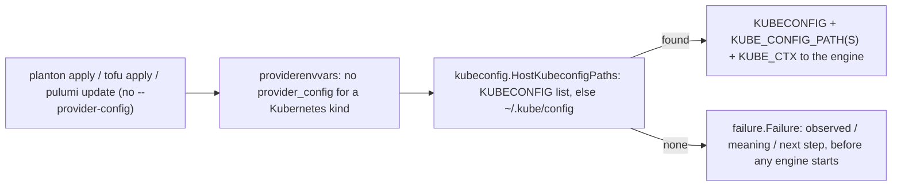

# The CLI stops failing silently, and a laptop deploy finds its kubeconfig -- every engine command resolves its module, every refusal speaks in three parts

**Date**: September 3, 2026
**Type**: Bug Fix
**Components**: CLI, Terraform Modules, Pulumi Modules, Kubernetes Provider, Error Handling, Testing Framework

## Summary

Three defects in the command line, all of the same family: a failure that did not explain itself. `planton tofu apply` and `planton init` run without `--module-dir` exited with no output at all, although their help said the flag defaulted. A Kubernetes deploy through OpenTofu on a laptop, with only `KUBECONFIG` set, died inside Terraform with a connection refused to localhost. And behind both, every logrus line the CLI ever wrote had been swallowed since the day the chart renderer was linked in. After this change every engine command resolves its module the way `planton apply` does (the current directory, then the published module for this release); a Kubernetes deploy with no Planton connection uses the machine's kubeconfig exactly as kubectl does, and refuses in three plain parts when there is none; every refusal the CLI makes on its own account prints what was observed, what it means, and the next step, in the same three labels the IaC primitives and the repository guards already use; and `planton modules-version` names the release the binary downloads modules from.

## Problem Statement / Motivation

- `pkg/infrachart` silenced gonja's template logging by calling `gonja.SetLoggerOutput(io.Discard)`, which gonja implements as `logrus.SetOutput` on the process-wide standard logger. Every binary that links the package (the standalone CLI, and the platform CLI through the chart-validate command) lost every logrus line, including the `log.Fatalf` the flag layer used to refuse a missing `--module-dir`. Exit 1, nothing printed.
- The flag layer refused an empty `--module-dir` at 18 engine commands even though both module runtimes already resolve an empty value (probe the current directory, then download the published module for the pinned release). Root `apply`, `destroy`, `plan`, and `refresh` were already correct; `init` and every `tofu`, `terraform`, and `pulumi` subcommand were not. The CLI's own developer README taught the refusal as the pattern.
- The Terraform kubernetes and helm providers never read `KUBECONFIG`; they read `KUBE_CONFIG_PATH` (or `KUBE_CONFIG_PATHS`) and `KUBE_CTX`. The platform runner rendered a kubeconfig for a connection and set both names; the e2e harness forwarded its own `KUBECONFIG` to `KUBE_CONFIG_PATH`; the CLI's Terraform runner set only `KUBE_CTX`. Every lane passed while a laptop failed.
- `--kube-context` was read by every `tofu` and `terraform` handler but registered only on the `pulumi` group and the root lifecycle commands, so on those groups the flag was silently ignored.
- `modules-version` reported the git staging clone's version and said nothing about the release the binary actually downloads modules from.

## Solution / What's New

- **One seam for the host kubeconfig.** `pkg/kubernetes/kubeconfig.HostKubeconfigPaths` resolves the operator's kubeconfig the way kubectl does. `providerenvvars` gains a Kubernetes ambient branch beside the AWS one (the one other provider that already handled "no provider config, use what the machine has") and an `Options.KubeContext` that it exports as `KUBE_CTX`. The Terraform runner's `KUBE_CTX` bolt-on, the Pulumi spawner's literal, and the e2e harness's private forwarding all collapse onto it; the harness now runs exactly what a laptop runs.
- **`pkg/failure`** is the repository-wide three-part error shape; `helmcrds.Failure` is an alias of it. `ui.Failure` renders it in the CLI, `ui.EngineFailure` recognises one anywhere in an engine error's chain and prints the explanation instead of the generic title, and skips the "check the engine's output above" footer when no engine ran.
- **Every `log.Fatalf` on the engine commands is gone** (28 sites), each replaced by a `ui.Failure` whose text names the value, the cause, and the fix. `flag.HandleFlagErrAndValue` is deleted; the seven flags that genuinely have no other source use `flag.Require`, which refuses with a copyable example. The CLI README teaches the contract.
- **`pkg/infrachart`** silences gonja through gonja's own switch (`logging.SetEnabled(false)`), never through the process logger; a test holds the standard logger's output away from `io.Discard`.
- **`--kube-context`** is declared once in `iacflags` and registered on every engine group; a contract test walks the tree for it and for an optional `--module-dir` on every command that runs a module.
- **`planton modules-version`** opens with the release the binary downloads modules from.

## Verified live (Kind, the standalone CLI built at v0.5.26)

- `planton tofu apply --manifest <file> --auto-approve` from an empty directory: downloads the published module and runs (previously exit 1, silent). `planton init --manifest <file> --stack ... --backend-url file://...`: reaches Pulumi (previously exit 1, silent).
- `planton apply -f <flagger manifest>` with only `KUBECONFIG` set, provisioner `tofu`: namespace, three kept CRDs stamped `1.44.0`, release Available; `planton destroy` removed the workload and kept the CRDs. The same through `pulumi` (13 resources; the same CRDs re-adopted).
- With neither `KUBECONFIG` nor `~/.kube/config`: the three-part refusal names both places and the two remedies, before OpenTofu starts; no footer about engine output.
- `go test` for `cmd/planton/root`, `internal/cli/...`, `pkg/failure`, `pkg/kubernetes/kubeconfig`, `pkg/kubernetes/helmcrds`, `pkg/iac/stackinput/providerenvvars`, `pkg/iac/tofu/tofumodule`, `pkg/iac/pulumi/pulumistack`, `pkg/infrachart`, `e2e/framework/runner`; `bazel build` of every changed target and `//:planton`; the `KubernetesHelmRelease` Terraform lane on Kind with the harness forwarding removed.

## What comes next

`planton init` for the Pulumi provisioner creates its stack in a project the later `planton apply` does not look in (the file backend keeps stacks per project); the two commands should agree on the project name. Recorded as the next failure row to close.
