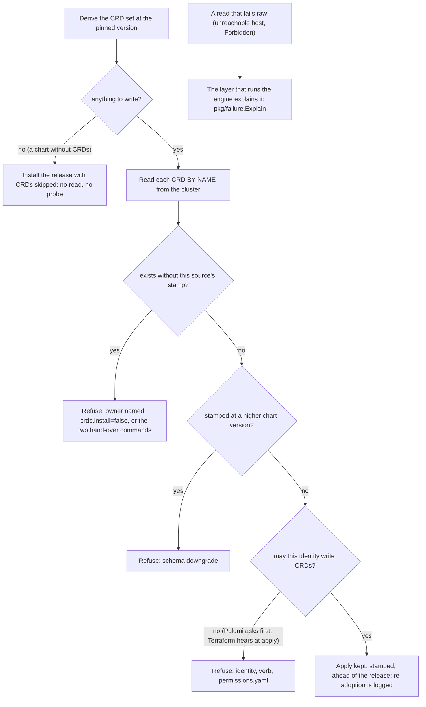

# The Helm/CRD failure matrix is codified -- a foreign owner is refused with its name, a denied right is named before it bites, and both engines speak one vocabulary

**Date**: September 3, 2026
**Type**: Feature
**Components**: Kubernetes Provider, Provider Framework, Terraform Modules, Pulumi Modules, CLI, Testing Framework, Error Handling

## Summary

Every Helm-installing kind whose chart carries CRDs already refused an unpublished version, a schema downgrade, a chart that would let Helm delete its CRDs, and a render that produced none, each with a message that says what was observed, what it means, and what to do. This change completes the set. A CRD that already exists on the cluster and was not put there by the module (a hand-run `helm install`, a colleague's `kubectl apply`, another tool, another Planton module deriving the same name from a different chart) is refused before anything is written, with its owner named and two honest ways forward, where server-side apply used to take it over without a word. A deploy identity that may not write CRDs is told which identity lacks which verb, why the module needs cluster-scoped CRD rights at all, and where the module lists every right it needs; Pulumi asks the API server first and refuses at preview, Terraform hears it at the first apply, and both say the same words. A chart repository that cannot be reached, and a laptop whose Helm repository cache is stale, are explained in the CLI's output instead of being left as the provider's raw text. The words live once, in a leaf package both engines, the CLI, and the e2e harness read from; the harness can now run a lane as a least-privilege identity built from the kind's own permissions file; and every refusal the block phrases itself has a direct proof that needs no kind around it.

## Problem Statement / Motivation

Two of the anticipated failures had no answer at all, and the second was hiding a defect. Server-side apply with force is what lets a module re-adopt the CRDs it kept across an uninstall, and it adopts a CRD nobody stamped with exactly the same silence. Because the never-downgrade check could only order versions the module itself had stamped, a newer schema someone else installed could be lowered by a pinned older chart without a word. And in Terraform, some failures happen inside a read the module cannot inspect afterwards: a repository host that does not resolve kills the `http` and `helm_template` data sources before any postcondition runs, and an API server answering Forbidden kills the `kubectl_manifest` apply. Nothing in HCL can rephrase those, so the user saw Helm's "no such host" and Kubernetes' "is forbidden" with no next step, while the Pulumi twin explained the same facts in three parts.

### Pain Points

- Installing an operator through Planton onto a cluster where the same CRDs were installed by hand took them over silently, in both engines, with a possible schema downgrade the version check could not see.
- A namespace-admin identity deploying a derive-branch kind met `customresourcedefinitions.apiextensions.k8s.io "x" is forbidden` from the API server, with no word about why the module needs cluster-scoped CRD rights or what to grant.
- The Terraform engine could not phrase an unreachable repository or a denied right in the module's own words; the two engines diverged exactly where a failure was raw.
- The harness could only run lanes as the cluster's administrator, so no lane could prove what a least-privilege identity sees.
- The bundle branch and several block-level refusals had no proof outside a kind's lane, and the bundle branch has no consumer kind.

## Solution / What's New

### One read answers two questions (both engines)

The never-downgrade check used to list CRDs by the module's own label, so a CRD nobody stamped was invisible to it. Every CRD about to be written is now read by its own name first, in `keptcrds` through a dynamic `Get` per CRD and in the generated `helm_crds.tf` through a `field_selector`ed `kubernetes_resources` read per name, and that one read serves both checks: `helmcrds.CheckOwnership` refuses a CRD present without this source's `planton.ai/crd-source` label, and `helmcrds.CheckNoDowngrade` orders the versions of the CRDs that are ours. The label-selected list and `LabelSelector` are gone; the label stays as the stamp. Ownership is checked first, so a CRD another source stamped at a higher version is refused as someone else's, never as a downgrade. The owner sentence is composed from the most telling mark present, in the same order in both engines: Helm's `meta.helm.sh/release-*` annotations, a Planton stamp from a different source, the field managers in `managedFields`, or "it carries no ownership marks". The refusal offers `crds.install: false` (the release still installs and uses the definitions) or the two printed `kubectl label` and `kubectl annotate` commands that hand the CRD to the module once it is known to match the pinned version; for a Helm-owned CRD the hand-over first says to free it from that release, because Helm would otherwise delete it later. Each Terraform precondition is scoped to its own CRD resource, so one foreign CRD is one message.

### A denied right is named before it bites

`keptcrds` asks the API server, through a `SelfSubjectAccessReview` per verb (`get`, `create`, `patch`, and `delete` when `keep_on_uninstall` is false), whether the deploy's identity may write CRDs at the cluster scope, and refuses at preview with the identity from `SelfSubjectReview`, the verb, why the module needs cluster-scoped CRD rights (it applies the chart's CRDs itself, outside the Helm release), and the two ways forward: grant the rules in the module's `iac/permissions.yaml`, or set `crds.install: false` and have a cluster administrator apply the CRDs (`helm template --include-crds` renders them). Both review APIs are open to every authenticated identity, so the probe itself can never be the thing that is forbidden. The probe and the by-name read run only when the render produced something to write, so a chart with no CRDs is never refused for a right it does not need.

### The vocabulary is a leaf, and the engine's raw text is explained once

`pkg/failure` (the repository-wide three-part shape) gained the Helm and Kubernetes constructors the words live in (`HelmVersionNotPublished`, `HelmOCIVersionNotPublished`, `HelmRepositoryUnreachable`, `HelmStaleRepositoryCache`, `KubernetesForbidden`), `Explain(engineOutput)` which recognizes the raw texts an engine prints when a read itself fails and returns their explanations (one per root cause, silent when the module already spoke in three parts, matched on whitespace-collapsed text with the engines' box-drawing removed), and `Annotate(err, output)`, an error that unwraps to the engine's error and to each explanation so `errors.As` finds them. `helmcrds.classifyLocateError` delegates to the same constructors, so the Pulumi twin's in-process refusal and the Terraform twin's explained raw text are the same words by construction. `tofumodule.RunOperation` keeps the engine's stderr as it streams it and returns an annotated error; `pulumistack.Run` does the same when its output is not a terminal (in a terminal Pulumi's interactive view is left untouched, because a pipe would silently downgrade every laptop run to the plain log). The CLI's `ui.EngineFailure` already renders the first three-part failure in an engine error's chain, so the handlers print the explanation with no change of their own. The e2e runner passes every expected-failure deploy error through `failure.AnnotateError` before the verifier sees it, so lanes assert the exact text a CLI user reads. The rule is layered, not either-or: a module still refuses in place wherever HCL can see the fact, so an ejected module run with plain `tofu` explains itself as far as HCL allows.

### The harness runs a lane as an identity it builds from the permissions file

`planton.dev/e2e-identity: declared` runs a scenario as a ServiceAccount bound, through one ClusterRole, to exactly the rules the component's `iac/permissions.yaml` declares; `declared-minus:<apiGroup>/<resource>:<verb>,<verb>` withholds named verbs. The Kubernetes harness implements the provider-neutral `provider.IdentityProvisioner`: it applies the ServiceAccount, ClusterRole, and binding in a harness-owned namespace, mints a short-lived token, derives a kubeconfig from the harness's own, and hands the lane a `self_managed` provider configuration, which reaches both engines through the same stack-input path a console deploy uses (Pulumi through the stack input; Terraform as `KUBECONFIG` and `KUBE_CONFIG_PATH`, now written into the lane's working directory so the path is absolute). The identity applies to the component under test only; fixtures keep the harness's posture. A withhold that a wildcard rule would grant anyway is refused up front: the generic Helm kind honestly declares `*` for the arbitrary chart it installs, so a denied lane lives on a typed kind.

### The lanes and the direct proofs

Three new scenarios, each green on Kind under both engines: `kuberneteshelmrelease/crds-owned-elsewhere` (a `KubernetesManifest` fixture plants a stub of one metacontroller CRD by hand, a chart no other lane keeps; the deploy is refused naming the field manager; the CRD gains no stamp; the fixture chain deletes it), `kubernetesopensearchoperator/crds-apply-denied` (declared rules minus every CRD write; refused at preview on Pulumi and at the first apply on Terraform, naming the ServiceAccount, the verb, and the permissions file; no CRD stamped at the lane's version), and `kuberneteshelmrelease/repo-unreachable` (an unresolvable host; explained in-process on Pulumi and by the runner layer on Terraform). The verifier's failure classes gained `crd-owned-elsewhere`, `crd-apply-denied`, and `chart-repository-unreachable`. `TestHelmCRDsTFRefusals` (gated by `HELM_CRDS_TF_LIVE=1`) drives the generated block with no kind around it, one scratch module per case, and asserts the three parts of five refusals the block phrases itself: an unpublished version, a typed kind's empty render, Helm-managed CRDs without the dial, a bundle URL answering 404, and a bundle serving no CRD. `TestHelmCRDsTFDrift` regenerates every committed copy with `PLANTON_REGEN_HELM_CRDS_TF=1`, the same convention as the anatomy baseline. `keptcrds` re-adopts kept CRDs with an `Info` line naming them and their stamped version; the READMEs say plainly that Terraform's plan shows `create` for a CRD the apply adopts.

### Found by running as the least-privilege identity

Every Kubernetes kind's permissions file was `derived` by reading the module source, and the first lane to run under one found a gap the source cannot show: the Pulumi provider awaits a namespace's deletion with a watch, and without `list` and `watch` on namespaces a destroy under the exact declared identity stalled for 875 seconds before it was stopped; with them it took 27. The four CRD kinds' permissions files now declare both verbs on namespaces with the reason written in. Every other Kubernetes kind's file has the same gap for the same reason; running each kind's lanes under `declared` is how the files earn `proven`.

## Verified live (Kind v1.31, both engines)

- Terraform: `crds-owned-elsewhere` 34 s, `crds-apply-denied` 2 m 49 s, `repo-unreachable` 1 s (refused at plan). Pulumi: `crds-owned-elsewhere` 1 m 11 s, `repo-unreachable` 40 s, `crds-apply-denied` 44 s (after the namespace verbs; 15 m 7 s stalled before them).
- The five block-level refusals through `TestHelmCRDsTFRefusals`, 98 s for the set.
- The gate before the code: the takeover, recorded (a hand-applied CRD gained the module's stamp and its field manager on the first apply; the plan had said `create`); the per-name read's shape; the raw texts of the `http`, `helm_template`, and `kubectl_manifest` failures, kept verbatim in `pkg/failure`'s tests; the printed hand-over commands, run verbatim, unblocking the plan.
- Regression of the existing refusal and keep-and-re-adopt lanes on the regenerated block, both engines (see the project record for the table).
- `go test` for `failure`, `helmcrds`, `keptcrds`, `generators`, `permissions`, the e2e runner, `aa_e2e`; `tofu fmt -check` and `tofu validate` on the four modules; the self-containment, provider-pin, e2e-tier-wiring, Pulumi-entrypoint, and license-footer guards; `bazel build` of every changed Go target.

## What comes next

- The platform runner consumes the tofu JSON diagnostics stream; attaching `failure.Explain` to that path gives the console's stack-job errors the same explanations.
- Running every Kubernetes kind's lanes under `planton.dev/e2e-identity: declared` promotes its permissions file from `derived` to `proven`; the namespace-watch gap found here is the first of what that will find.
- A permissions preflight for every Kubernetes Pulumi module, driven by its own `permissions.yaml` (the CRD probe here is its first instance).
