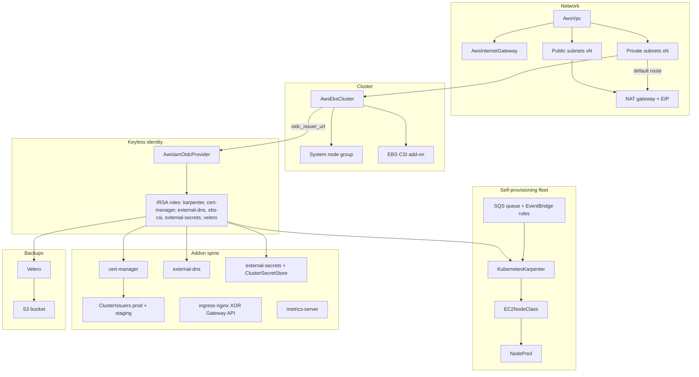

# AWS EKS Baseline

A production EKS cluster that provisions its own machines, consolidates them
away when idle, and backs itself up on a schedule — with TLS, DNS, and
ingress already wired. One apply creates the network, the control plane, the
IAM identities, and every in-cluster addon a production platform needs; when
it finishes, deploying an application gets you a running workload with a DNS
name and a browser-trusted certificate, on nodes that appeared because your
pods needed them.

This is a ONE-RUN composition: the cluster and the workloads that run on it
deploy in the same apply. The cluster publishes its Kubernetes connection
under a chart-controlled name and every Kubernetes resource consumes it —
one values parameter (`cluster_connection_name`) drives both sides. Deploy
this chart at most once per environment: it owns cluster-wide singletons
(cert-manager, external-secrets, metrics-server, the default IngressClass).

## What it deploys

| Resource | Kind | Purpose | Conditional on |
|---|---|---|---|
| `<env>-eks-vpc` | AwsVpc | The cluster's network (DNS support + hostnames on, as EKS requires) | — |
| `<env>-eks-igw` | AwsInternetGateway | Internet door for the public subnets | — |
| `<env>-eks-public-<az>` ×N | AwsSubnet | Public edge subnets (NAT, load balancers), default route → IGW | — |
| `<env>-eks-nat-eip` | AwsElasticIp | Stable egress IP for the platform | — |
| `<env>-eks-nat` | AwsNatGateway | Single NAT gateway (cost-conscious default; see Day-2) | — |
| `<env>-eks-private-<az>` ×N | AwsSubnet | Node subnets (system group + fleet), default route → NAT, Karpenter discovery tag | — |
| `<env>-eks-cluster-role` | AwsIamRole | EKS control-plane role | — |
| `<env>-eks` | AwsEksCluster | The control plane; publishes the Kubernetes connection | — |
| `<env>-eks-node-role` | AwsIamRole | ONE node role for the system group and the Karpenter fleet | — |
| `<env>-eks-system` | AwsEksNodeGroup | Fixed On-Demand floor for cluster-critical pods, auto-repair on | — |
| `<env>-eks-ebs-csi-irsa` + `<env>-eks-ebs-csi` | AwsIamRole + AwsEksAddon | EBS CSI driver — PersistentVolumeClaims work | — |
| `<env>-eks-oidc` | AwsIamOidcProvider | The trust anchor every keyless identity below rides | — |
| `<env>-eks-karpenter-irsa` | AwsIamRole | Karpenter controller role (upstream's scoped permission set) | — |
| `<env>-eks` (queue) + 5 rules | AwsSqsQueue + AwsEventBridgeRule | Interruption plumbing: Spot warnings reach Karpenter minutes early | `karpenter_interruption_handling_enabled` |
| `<env>-karpenter` | KubernetesKarpenter | The self-provisioning controller (kube-system, on the system pool) | — |
| `<env>-default` | KubernetesKarpenterEc2NodeClass | The fleet's machine template (AMI policy, subnet/SG discovery, node role) | — |
| `<env>-default` | KubernetesKarpenterNodePool | Provisioning policy: general-purpose envelope, consolidation, CPU cap | — |
| `<env>-metrics-server` | KubernetesMetricsServer | `kubectl top` + CPU/memory HPA (not built into EKS) | — |
| `<env>-eks-cert-manager-irsa` + `<env>-cert-manager` | AwsIamRole + KubernetesCertManager | Certificate machinery with keyless Route 53 DNS-01 | — |
| `<env>-letsencrypt-prod` / `-staging` | KubernetesClusterIssuer ×2 | Let's Encrypt issuers (staging first — see After deployment) | — |
| `<env>-eks-external-dns-irsa` + `<env>-external-dns` | AwsIamRole + KubernetesExternalDns | Kubernetes exposure → real Route 53 records | — |
| `<env>-ingress-nginx` | KubernetesIngressNginx | Default IngressClass + one cloud NLB (the default exposure arm) | `use_gateway_api` = false |
| Gateway API CRDs, class, namespace, Gateway | 4 kinds | The modern exposure arm (bring your own implementation) | `use_gateway_api` = true |
| `<env>-eks-external-secrets-irsa`, `<env>-external-secrets`, `<env>-secret-store` | AwsIamRole + 2 kinds | AWS Secrets Manager → native Kubernetes Secrets, keylessly | `external_secrets_enabled` |
| Bucket, role, snapshot-controller, VolumeSnapshotClass, `<env>-velero` | 5 resources | Scheduled cluster backups to S3 with CSI volume snapshots | `velero_enabled` |

## Architecture

Deployment layers the platform's dependency graph derives from the
references: network → cluster role → cluster → (node group, OIDC provider,
add-ons) → IRSA roles → Kubernetes workloads. Every Kubernetes resource
carries a `runs_on` relationship to the cluster and consumes its published
connection, so nothing races the control plane.

## Parameters

| Parameter | Default | When to change |
|---|---|---|
| `cluster_connection_name` | `eks-baseline` | Always review: the name the cluster's connection publishes under — unique per cluster |
| `aws_account_id` | `123456789012` | **Must change.** Anchors the scoped IAM policies and bucket name |
| `region` | `us-west-2` | Your region; keep availability_zones and subnets consistent |
| `vpc_cidr` | `10.0.0.0/16` | Only if it overlaps networks you will peer with |
| `availability_zones` | 2 zones in us-west-2 | Entry N pairs with entry N of both subnet lists |
| `public_subnet_cidrs` | 2 × /20 | Rarely — the public edge is small |
| `private_subnet_cidrs` | 2 × /18 | Keep big: every pod consumes a VPC IP |
| `kubernetes_version` | (AWS default) | Pin for controlled upgrades; EKS never downgrades |
| `public_access_cidrs` | open (IAM-authed) | Scope to office/VPN ranges — the cheapest hardening step |
| `cluster_log_types` | audit, authenticator | Add api/controllerManager/scheduler when debugging, mind CloudWatch cost |
| `system_node_*` | m6i.large ×2 (max 4) | Bigger clusters may want 3 system nodes or larger types |
| `karpenter_ami_alias` | `al2023@latest` | Pin (`al2023@v…`) when byte-identical fleets beat automatic patching |
| `karpenter_capacity_types` | on-demand, spot | Remove spot for interruption-intolerant platforms |
| `karpenter_cpu_limit` | `100` | The fleet-wide vCPU spend cap — raise as the platform grows |
| `karpenter_consolidate_after` | `1m` | Longer dampens churn; `Never` disables consolidation |
| `karpenter_interruption_handling_enabled` | `true` | Keep on whenever spot is enabled |
| `use_gateway_api` | `false` | `true` swaps ingress-nginx for Gateway API standard resources |
| `ingress_replicas` | `2` | The entry-point HA floor (ingress arm only) |
| `gateway_controller_name` | NGINX Gateway Fabric's | Must match your Gateway API implementation (gateway arm only) |
| `dns_zone_names` | `my-dns-zone` | **Must change**: your AwsRoute53Zone resource names |
| `dns_domains` | `example.com` | **Must change**: the domain suffixes external-dns may manage |
| `dns_txt_owner_id` | `eks-baseline` | Distinct per cluster sharing a zone |
| `acme_email` | placeholder | **Must change**: Let's Encrypt rejects example.com addresses |
| `acme_http01_enabled` | `false` | Add the opt-in HTTP-01 solver for zones outside Route 53 |
| `external_secrets_enabled` | `true` | Off if secrets sync lives elsewhere |
| `velero_enabled` | `true` | Off only if disaster recovery lives elsewhere |
| `velero_schedule` / `velero_backup_ttl` | daily 01:00 UTC / 30 days | Align with your low-traffic window and retention policy |

## After deployment

1. **Verify the fleet loop** — deploy any workload requesting more CPU than
   the system pool has free, and watch nodes appear:
   `kubectl get nodeclaims -w`. Scale it down and watch consolidation
   reclaim them.
2. **Issue the first certificate** — create a `Certificate` referencing
   `<env>-letsencrypt-staging`, confirm it reaches `Ready`, then switch the
   `issuerRef` name to `<env>-letsencrypt-prod`. Staging first protects the
   production rate limit.
3. **Expose the first service** — with the default arm, create an Ingress
   (no class needed — nginx is the cluster default); external-dns publishes
   the record for its host into your Route 53 zone within a minute. With
   the gateway arm, install your Gateway API implementation, then attach an
   HTTPRoute to `<env>-gateway`.
4. **Sync the first secret** — create an `ExternalSecret` referencing the
   `<env>-secret-store` ClusterSecretStore and a Secrets Manager key; a
   native Kubernetes Secret appears.
5. **Prove restore before you need it** — take a manual backup
   (`velero backup create drill`), delete a test namespace, and
   `velero restore create --from-backup drill`. A backup you have never
   restored is a hope, not a strategy.

## Day-2 notes

- **Safe in place**: Karpenter limits/consolidation window, system node
  scaling bounds, log types, backup schedule/TTL, `public_access_cidrs`,
  adding zones to `dns_zone_names`.
- **Rolls or replaces**: `kubernetes_version` (control plane first, node
  groups follow), `karpenter_ami_alias` pin bumps (Karpenter drifts nodes
  gradually), system instance types (node group replacement).
- **One-way doors**: VPC/subnet CIDRs and the cluster name replace the
  world; `gateway_controller_name` requires recreating the GatewayClass.
- **Cost levers**: the single NAT gateway (an always-on charge plus data
  processing) is the deliberate default — add per-zone NAT gateways for
  zone-independent egress. Spot in `karpenter_capacity_types` is the
  biggest saving; the interruption queue costs next to nothing and keeps
  it graceful.
- **Second node pool**: GPU or arm64 workloads get their own
  KubernetesKarpenterEc2NodeClass + NodePool (taint them; don't widen the
  default pool's envelope).
- **Storage classes**: the EBS CSI driver is installed but this chart ships
  no StorageClass — EKS's bundled `gp2` remains the cluster default. Create
  a `gp3` KubernetesStorageClass (cheaper, faster baseline IOPS) and mark it
  default when you are ready to own that choice.
- **Tighten the wildcard IAM resources**: cert-manager's and external-dns's
  Route 53 policies ship with `hostedzone/*` scope because zone IDs are not
  known at render time; once deployed, pin their `Resource` entries to your
  exact zone ARNs. Same for external-secrets: narrow `Resource` to your
  secret-name prefix.

---

© Planton. Licensed under [Apache-2.0](https://github.com/plantonhq/planton/blob/main/LICENSE).
