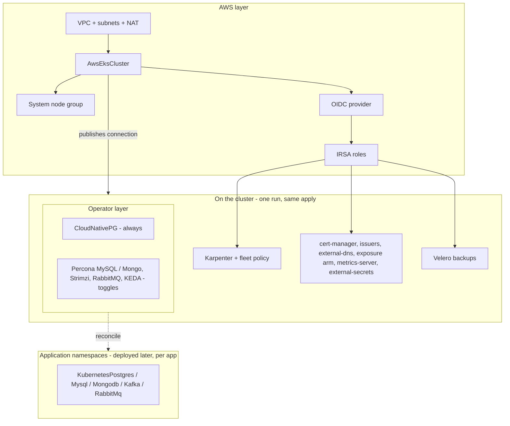

# AWS EKS Full Stack Platform

The EKS cluster your full-stack applications land on — operators included.
Everything in the AWS EKS Baseline (a production cluster that provisions its
own machines, consolidates them when idle, and backs itself up, with TLS,
DNS, and ingress wired), plus the cluster-resident operator layer that
application data services ride: PostgreSQL unconditionally, with MySQL,
MongoDB, Kafka, RabbitMQ, and KEDA one toggle away each.

**The operator-aware doctrine this chart teaches:** the CLUSTER carries the
operators — one per engine, watching every namespace; APPLICATIONS declare
their own databases, caches, brokers, and topics in their own namespaces
(directly, or through the app-data-services chart), against this cluster's
connection. Operators install once; data services multiply per app. That
split is why this chart and its sibling baseline exist as a pair: "minimal
cluster" vs "app-ready cluster" is how platform teams actually decide.

This is a ONE-RUN composition: the cluster publishes its Kubernetes
connection under `cluster_connection_name` and every Kubernetes resource in
the chart consumes it. Deploy at most once per environment — it owns
cluster-wide singletons (cert-manager, external-secrets, metrics-server, the
default IngressClass, and every operator here).

## What it deploys

Everything in the baseline:

| Layer | Resources |
|---|---|
| Network | AwsVpc, AwsInternetGateway, public + private AwsSubnets per zone, AwsElasticIp + AwsNatGateway (single NAT — the cost-conscious default) |
| Cluster | AwsIamRole (control plane), AwsEksCluster (publishes the connection), AwsIamRole (nodes), AwsEksNodeGroup (fixed On-Demand system pool, auto-repair on), EBS CSI add-on + IRSA role |
| Keyless identity | AwsIamOidcProvider + narrowly-scoped IRSA AwsIamRoles for Karpenter, cert-manager, external-dns, external-secrets, Velero |
| Fleet | KubernetesKarpenter (kube-system), EC2NodeClass + NodePool (general-purpose envelope, consolidation, CPU cap), SQS interruption queue + 5 EventBridge rules (toggle) |
| Addon spine | metrics-server, cert-manager + Let's Encrypt prod/staging ClusterIssuers (keyless Route 53 DNS-01), external-dns (Route 53), ingress-nginx XOR Gateway API resources, external-secrets + AWS Secrets Manager ClusterSecretStore (toggle) |
| Backups | S3 bucket (versioned), IRSA role, snapshot-controller add-on, the Velero VolumeSnapshotClass, Velero with a daily schedule (toggle) |

Plus the operator layer:

| Resource | Kind | Purpose | Conditional on |
|---|---|---|---|
| `<env>-cnpg` | KubernetesCloudNativePgOperator | PostgreSQL databases in any namespace (cluster-wide watch) | — (Postgres is the standard) |
| `<env>-percona-mysql` | KubernetesPerconaMysqlOperator | Galera-replicated MySQL per app (cluster-wide watch) | `mysql_operator_enabled` |
| `<env>-percona-mongo` | KubernetesPerconaMongoOperator | MongoDB replica sets per app (cluster-wide watch) | `mongodb_operator_enabled` |
| `<env>-strimzi` | KubernetesStrimziKafkaOperator | Kafka clusters/topics/users per app (any-namespace watch) | `kafka_operator_enabled` |
| `<env>-rabbitmq-operator` | KubernetesRabbitMqOperator | RabbitMQ brokers per app (watches all namespaces by default) | `rabbitmq_operator_enabled` |
| `<env>-keda` | KubernetesKeda | Event-driven autoscaling, including to/from zero | `keda_enabled` |

## Architecture

## Parameters

The baseline's parameters apply unchanged (identity, network, cluster,
Karpenter, exposure, DNS, certificates, secrets, backups — see each
parameter's description in `values.yaml`; `aws_account_id`,
`dns_zone_names`, `dns_domains`, and `acme_email` MUST be changed). The
operator layer adds:

| Parameter | Default | When to change |
|---|---|---|
| `mysql_operator_enabled` | `false` | First app that needs MySQL |
| `mongodb_operator_enabled` | `false` | First app that needs MongoDB |
| `kafka_operator_enabled` | `false` | First app that needs Kafka |
| `rabbitmq_operator_enabled` | `false` | First app that needs RabbitMQ |
| `keda_enabled` | `false` | First workload that scales on events |

CloudNativePG has no toggle — a full-stack platform without Postgres is not
one.

## After deployment

1. **Deploy the first data service where the app lives** — declare a
   `KubernetesPostgres` in an application's namespace (or deploy the
   app-data-services chart per app): the resident CNPG operator reconciles
   it there. No per-database operator installs, ever.
2. **Verify the fleet loop** — scale a workload beyond the system pool's
   free capacity and watch `kubectl get nodeclaims -w`; scale down and
   watch consolidation reclaim the nodes.
3. **Issue the first certificate against staging**, then flip the
   `issuerRef` to `<env>-letsencrypt-prod` — staging first protects the
   production rate limit.
4. **Expose the first service** — an Ingress with no class lands on the
   default nginx class; external-dns publishes its DNS record within a
   minute (gateway arm: attach an HTTPRoute to `<env>-gateway` after
   installing your implementation).
5. **Prove restore before you need it** — `velero backup create drill`,
   delete a test namespace, `velero restore create --from-backup drill`.

## Day-2 notes

- **Turning an operator toggle ON later is a plain redeploy** — the layer is
  additive. Turning one OFF removes the operator (its CRDs follow each
  kind's documented keep posture); do it only after the last data service
  using that engine is gone.
- Everything in the baseline's day-2 notes applies unchanged: single-NAT
  cost posture, `gp3` StorageClass ownership, second node pools for
  GPU/arm64, pinning the wildcard IAM resources to exact zone ARNs and
  secret-name prefixes.
- **Sizing note**: each enabled operator is a small controller (the system
  pool absorbs them), but the data services they reconcile land on
  Karpenter-provisioned capacity — raise `karpenter_cpu_limit` as the data
  layer grows.

---

© Planton. Licensed under [Apache-2.0](https://github.com/plantonhq/planton/blob/main/LICENSE).
