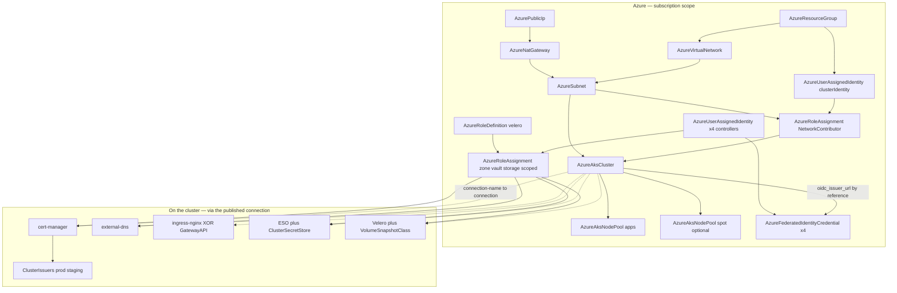

# Azure AKS Baseline

A production AKS cluster that scales itself between the bounds you set and
backs itself up on a schedule — private nodes behind one NAT gateway,
keyless workload identity for every controller, TLS, DNS, and ingress
already wired. One apply creates the network, the cluster, its cloud
identities and permission grants, and every in-cluster addon; no key,
password, or connection string is stored anywhere in the result.

This is the lean baseline. Its sibling, `aks-full-stack-platform`, is the
same platform plus the application-dependency operators (PostgreSQL, MySQL,
MongoDB, Kafka, RabbitMQ, KEDA) for clusters that full-stack applications
land on.

## What AKS ships that this chart deliberately does not install

AKS is a batteries-included product, and this chart composes only what the
managed cluster does NOT provide. Each of these is part of the cluster
itself, so installing them again would be a second copy:

| Capability | How AKS provides it |
|---|---|
| metrics-server | Runs with the cluster's system pods on every AKS cluster |
| Cluster autoscaler | Built into the managed control plane; engaged per pool via `autoScalingEnabled` |
| Disk/File CSI drivers + snapshot controller | Storage-profile defaults — on for every cluster |
| NetworkPolicy enforcement | The Cilium dataplane this chart selects enforces policies natively |
| Managed KEDA / VPA / Prometheus / NGINX ingress / Istio | Available as opt-in AKS add-ons — the day-2 section weighs them against the self-managed pieces this chart installs |

## What it deploys

| Resource | Kind | Purpose | Conditional |
|---|---|---|---|
| `<env>-aks-rg` | AzureResourceGroup | The platform's home: one blast-radius and cost boundary | — |
| `<env>-aks-vnet` / `<env>-aks-nodes-subnet` | AzureVirtualNetwork / AzureSubnet | The chart-owned network; nodes only (pods ride the overlay) | — |
| `<env>-aks-nat-ip` / `<env>-aks-nat` | AzurePublicIp / AzureNatGateway | One static egress IP; ends SNAT-port exhaustion | — |
| `<env>-aks-cluster-identity` (+ subnet grant) | AzureUserAssignedIdentity / AzureRoleAssignment | Control-plane identity with the pre-existing Network Contributor grant Azure's BYO-subnet contract demands | — |
| `<env>-aks` | AzureAksCluster | Regional STANDARD-tier control plane, OIDC issuer + workload identity, Azure CNI overlay on the Cilium dataplane, tainted system pool | — |
| `apps` pool | AzureAksNodePool | The autoscaled capacity workloads run on | — |
| `spot` pool | AzureAksNodePool | Scale-to-zero discounted capacity, Azure-tainted | `spot_pool_enabled` |
| cert-manager + identity trio | KubernetesCertManager + AzureUserAssignedIdentity / AzureFederatedIdentityCredential / AzureRoleAssignment | Certificates platform-wide; keyless DNS-01 through zone-scoped grants | — |
| `letsencrypt-prod` / `letsencrypt-staging` | KubernetesClusterIssuer | The public-CA front-ends; staging first, prod when proven | — |
| external-dns + identity trio | KubernetesExternalDns + the same trio shape | Services/routes become real DNS records in your zones | — |
| ingress-nginx | KubernetesIngressNginx | The default IngressClass and single traffic entry point | `use_gateway_api` = false |
| Gateway API CRDs + class + shared Gateway | KubernetesGatewayApiCrds / KubernetesGatewayClass / KubernetesNamespace / KubernetesGateway | The modern exposure arm for an implementation you run | `use_gateway_api` = true |
| External Secrets Operator + store + identity trio | KubernetesExternalSecretsOperator / KubernetesClusterSecretStore + the trio | Key Vault secrets become native Kubernetes Secrets, keylessly | `external_secrets_enabled` |
| Backup arm | AzureStorageAccount / AzureStorageContainer + identity trio + AzureRoleDefinition + KubernetesManifest (VolumeSnapshotClass) + KubernetesVelero | Scheduled full-cluster backups with CSI disk snapshots | `velero_enabled` |

## Architecture

Deployment layers: the resource group, identities, and the NAT IP deploy in
parallel first; the network chain (VNet → subnet, gated on the NAT gateway)
and the Network Contributor grant deploy next; the cluster waits on the
grant and the subnet; pools, federated credentials (which consume the
cluster's OIDC issuer), and the zone/vault/storage grants follow; every
Kubernetes resource deploys last, onto the connection the cluster
published, ordered by its `runs_on` edge.

**The one-run identity contract.** Every controller that talks to Azure
gets the same three-part treatment: a user-assigned managed identity, a
federated identity credential binding the controller's Kubernetes
ServiceAccount to it (anchored on the cluster's OIDC issuer — consumed by
reference, since the issuer URL only exists once the cluster does), and the
narrowest RBAC grants Azure offers (zone-scoped for DNS, vault-scoped for
secrets, account- and node-resource-group-scoped for backups). The
`azure.workload.identity` pod machinery is wired by each component's
module; no secret exists at any point.

## Parameters

| Parameter | Meaning | Default | Change when |
|---|---|---|---|
| `cluster_connection_name` | The published/consumed connection name (the one-run contract) | `aks-baseline` | Always per environment |
| `subscription_id`, `azure_tenant_id` | The subscription/tenant coordinates — honest literals | placeholders | **Must change** |
| `region` | Azure region for everything | `eastus2` | Per platform |
| `vnet_cidr`, `nodes_subnet_cidr`, `pod_cidr`, `service_cidr` | The address plan (nodes in the VNet; pods/services private) | 10.30/16, 10.30.0/20, 10.244/14, 10.0/16 | When peering constrains space |
| `kubernetes_version` | Control-plane version; empty = AKS-recommended GA | `""` | Pin for production |
| `api_authorized_cidrs` | Public API endpoint allowlist | `[]` (open, credential-gated) | Set your office/VPN ranges |
| `availability_zones` | Zone spread for the pools | `["1","2","3"]` | Empty for zoneless regions |
| `system_node_vm_size`, `system_nodes_min/max` | The always-on floor | `Standard_D4s_v5`, 3–5 | Rarely |
| `apps_node_vm_size`, `apps_nodes_min/max` | The self-scaling capacity and its cost brake | `Standard_D4s_v5`, 1–10 | As the platform grows |
| `spot_pool_enabled`, `spot_node_vm_size`, `spot_nodes_max` | Scale-to-zero discounted capacity | off | Batch/fault-tolerant workloads |
| `use_gateway_api`, `ingress_replicas`, `gateway_controller_name` | The exposure arm | ingress-nginx, 2 replicas | Gateway API platforms |
| `dns_zone_names`, `dns_zone_resource_group`, `dns_domains`, `dns_txt_owner_id` | The zones (by resource name — IDs flow by reference), their resource group, the domain guardrail, the per-cluster TXT owner | placeholders | **Must change** |
| `acme_email`, `acme_http01_enabled` | The ACME account and the opt-in HTTP-01 solver | placeholder, off | **Email must change** |
| `external_secrets_enabled`, `key_vault_name` | The secrets arm and the RBAC-mode vault it reads (by resource name) | on, placeholder | **Vault name must change** |
| `velero_enabled`, `velero_storage_suffix`, `velero_schedule`, `velero_backup_ttl` | The backup arm, the account-name uniqueness suffix, cadence, retention | on, `001`, 01:00 UTC, 30 days | Per DR policy |

**Naming budgets.** The backup storage account is the tightest name in the
chart: Azure storage account names allow only lowercase letters and digits,
24 characters at most, globally unique. The chart composes
`<env stripped of hyphens>aksvlr<suffix>`, so the env name (hyphens
removed) must stay within 15 characters at the default 3-character suffix.
Every other composed name tolerates ordinary env names comfortably.

## After deployment

1. **Confirm the connection.** The cluster published a Kubernetes provider
   connection under `cluster_connection_name`; every in-chart addon
   deployed onto it. Point `kubectl` at the cluster (`az aks
   get-credentials -g <env>-aks-rg -n <env>-aks`) and watch the platform
   settle: `kubectl get pods -A`.
2. **Delegate DNS.** The zones in `dns_zone_names` must be delegated at
   your registrar (their `name_servers` outputs list the four hosts).
   external-dns then publishes records for every exposed Service.
3. **Issue the first certificate against staging.** Create a Certificate
   naming `<env>-letsencrypt-staging`; when it reaches Ready, flip the
   issuer name to `<env>-letsencrypt-prod`. The staging-first habit is what
   protects Let's Encrypt's production rate limits.
4. **Sync the first secret.** With the secrets arm on, create an
   ExternalSecret referencing `<env>-secret-store` and a secret name in
   your vault; a native Kubernetes Secret appears without any credential
   touching a manifest.
5. **Exercise the backup loop before you need it.** `velero backup create
   drill --wait`, delete a test namespace, `velero restore create
   --from-backup drill`. A backup you have never restored is a hope, not a
   plan.

## Day-2 notes

- **Safe in place:** pool bounds and VM sizes (pools rotate), the API
  allowlist, ACME email, backup schedule/TTL, adding DNS zones (new grants
  compose per zone), `apps_nodes_max` as the platform grows.
- **Replaces the cluster:** the network plan (VNet/subnet/pod/service
  CIDRs), the region, private-cluster mode, and the network dataplane —
  decide those before production, not after.
- **Version pinning:** set `kubernetes_version` once workloads land;
  upgrades then happen when you run them. AKS moves one minor at a time.
- **The exposure arms are exclusive.** Flipping `use_gateway_api` swaps
  ingress-nginx for the Gateway API set on the NEXT apply — plan the
  traffic migration first. AKS's managed alternatives (the web application
  routing add-on's NGINX, Application Gateway for Containers) are cluster
  add-ons this chart deliberately leaves off: one entry point, one mental
  model.
- **Managed add-ons.** KEDA, VPA, managed Prometheus, and managed Istio are
  AKS add-on toggles on the cluster kind — enable them there rather than
  installing self-managed copies of the same controllers.
- **Entra-integrated access.** The baseline keeps Kubernetes local accounts
  (the kubeconfig the platform's connection uses). For human access through
  Microsoft Entra ID groups, configure the cluster kind's Entra RBAC block
  and disable local accounts as a deliberate second step.
- **Backup storage hardening.** The storage account keeps shared-key access
  at Azure's default (on) because ARM tooling commonly manages containers
  through it; Velero itself authenticates with Entra workload identity.
  Disabling shared keys account-wide is a legitimate second step once
  nothing key-based touches the account.
- **Teardown order.** Velero backups live in the storage account —
  `velero_enabled=false` removes Velero and the account (backups included);
  export anything you owe compliance first. The cluster and its node
  resource group go together; the NAT IP releases last.

---

© Planton. Licensed under [Apache-2.0](https://github.com/plantonhq/planton/blob/main/LICENSE).
