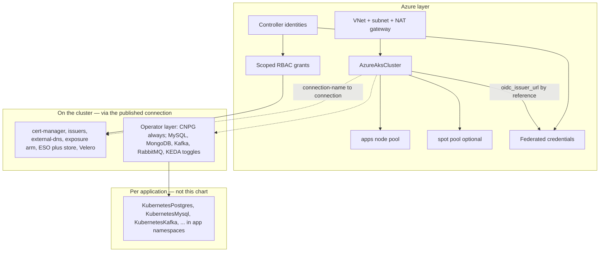

# Azure AKS Full-Stack Platform

The AKS cluster your full-stack applications land on — operators included.
Everything in the Azure AKS Baseline (a production zone-spread cluster that
scales itself between the bounds you set and backs itself up, with private
nodes behind one NAT gateway and TLS, DNS, ingress, and secrets syncing
wired keylessly), plus the cluster-resident operator layer that application
data services ride: PostgreSQL unconditionally, with MySQL, MongoDB, Kafka,
RabbitMQ, and KEDA one toggle away each.

**The operator-aware doctrine this chart teaches:** the CLUSTER carries the
operators — one per engine, watching every namespace; APPLICATIONS declare
their own databases, caches, brokers, and topics in their own namespaces
(directly, or through the app-data-services chart), against this cluster's
connection. Operators install once; data services multiply per app. That
split is why this chart and its sibling baseline exist as a pair: "minimal
cluster" vs "app-ready cluster" is how platform teams actually decide.

This is a ONE-RUN composition: the cluster publishes its Kubernetes
connection under `cluster_connection_name` and every Kubernetes resource in
the chart consumes it. Deploy at most once per environment — it owns
cluster-wide singletons (cert-manager, external-secrets, the default
IngressClass, and every operator here).

## What it deploys

Everything in the baseline:

| Layer | Resources |
|---|---|
| Network | AzureResourceGroup (the platform's home), AzureVirtualNetwork + AzureSubnet (nodes only — pods ride the CNI overlay), AzurePublicIp + AzureNatGateway (one static egress IP) |
| Cluster | AzureUserAssignedIdentity (control plane) + the subnet's Network Contributor grant, AzureAksCluster (STANDARD tier, OIDC issuer + workload identity, Azure CNI overlay on the Cilium dataplane, tainted system pool; publishes the connection), the autoscaled `apps` AzureAksNodePool, a scale-to-zero Spot pool (toggle) |
| Keyless identity | An AzureUserAssignedIdentity + AzureFederatedIdentityCredential pair per controller — cert-manager, external-dns, external-secrets, Velero — each trust rule anchored on the cluster's OIDC issuer BY REFERENCE, with the narrowest RBAC grants Azure offers (zone-, vault-, account-, and node-resource-group-scoped) |
| Addon spine | cert-manager + Let's Encrypt prod/staging ClusterIssuers (keyless Azure DNS DNS-01), external-dns (Azure DNS), ingress-nginx XOR the Gateway API arm, external-secrets + Azure Key Vault ClusterSecretStore (toggle) |
| Backups | Zone-redundant AzureStorageAccount + container (versioned, nothing public), Velero's documented custom role + its two scoped grants, the Velero VolumeSnapshotClass, Velero with a daily schedule (toggle) |

(AKS itself provides metrics-server, the cluster autoscaler, the disk/file
CSI drivers and snapshot controller, and NetworkPolicy enforcement through
the Cilium dataplane; the baseline README's opening section explains each.)

Plus the operator layer:

| Resource | Kind | Purpose | Conditional on |
|---|---|---|---|
| `<env>-cnpg` | KubernetesCloudNativePgOperator | PostgreSQL databases in any namespace (cluster-wide watch) | — (Postgres is the standard) |
| `<env>-percona-mysql` | KubernetesPerconaMysqlOperator | Galera-replicated MySQL per app (cluster-wide watch) | `mysql_operator_enabled` |
| `<env>-percona-mongo` | KubernetesPerconaMongoOperator | MongoDB replica sets per app (cluster-wide watch) | `mongodb_operator_enabled` |
| `<env>-strimzi` | KubernetesStrimziKafkaOperator | Kafka clusters/topics/users per app (any-namespace watch) | `kafka_operator_enabled` |
| `<env>-rabbitmq-operator` | KubernetesRabbitMqOperator | RabbitMQ brokers per app (watches all namespaces by default) | `rabbitmq_operator_enabled` |
| `<env>-keda` | KubernetesKeda | Event-driven autoscaling, including to/from zero | `keda_enabled` |

## Architecture

## Parameters

The baseline's entire parameter surface applies unchanged — see the
[Azure AKS Baseline README](../aks-baseline/README.md) for the full table,
the naming budgets, and the must-change literals (`subscription_id`,
`azure_tenant_id`, the DNS zone and Key Vault names, `acme_email`). This
chart adds only the operator toggles:

| Parameter | Meaning | Default |
|---|---|---|
| `mysql_operator_enabled` | Percona XtraDB Cluster operator | `false` |
| `mongodb_operator_enabled` | Percona Server for MongoDB operator | `false` |
| `kafka_operator_enabled` | Strimzi Kafka operator | `false` |
| `rabbitmq_operator_enabled` | RabbitMQ cluster operator | `false` |
| `keda_enabled` | KEDA event-driven autoscaling | `false` |

CloudNativePG has no toggle by design: Postgres is the platform standard,
and a full-stack cluster without a database story is not full-stack.

## After deployment

The baseline's after-deployment loop applies first (confirm the connection,
delegate DNS, staging-then-prod certificate, first synced secret, backup
drill). Then close the operator loop:

1. **Declare the first database.** Create a `KubernetesPostgres` resource
   in an application namespace against this cluster's connection — the
   resident CNPG operator reconciles it there; no per-app operator install
   ever happens.
2. **Compose per-app data layers.** The `app-data-services` chart deploys a
   per-application Postgres + Valkey pair onto exactly this kind of
   operator-ready cluster — one manifest per app.
3. **Flip toggles on demand.** The first Kafka-hungry application flips
   `kafka_operator_enabled` — an in-place chart update; existing workloads
   are untouched.

## Day-2 notes

Everything in the baseline's day-2 section applies unchanged. Operator-layer
specifics:

- **Operators update in place.** Toggling an operator off removes the
  OPERATOR, not the data services it manages — those keep running but stop
  reconciling (and their CRDs, kept by design, pin each operator's
  namespace). Drain an engine's data services before retiring its operator.
- **One KEDA per cluster.** Kubernetes allows exactly one external-metrics
  provider: never enable `keda_enabled` here AND the cluster kind's
  managed-KEDA add-on together.
- **Strimzi's namespace contract.** A namespace must exist before a Kafka
  cluster is declared in it — application namespaces created by app
  deployments satisfy this naturally.
- **RabbitMQ needs cert-manager.** Already unconditional in this chart's
  baseline — the operator's webhook certificates ride it.

---

© Planton. Licensed under [Apache-2.0](https://github.com/plantonhq/planton/blob/main/LICENSE).
