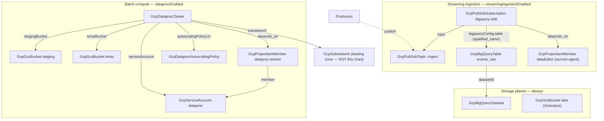

# GCP Analytics Lakehouse

Analytics platforms usually assemble themselves backwards: a dataset
appears when the first dashboard needs it, events get wired into it
through a pipeline someone has to operate, files pile up in a bucket
nobody lifecycle-manages, and the Spark cluster — when it arrives —
runs as the default Compute Engine account with a public IP. This chart
deploys the foundation in the right order from day one: a BigQuery
warehouse dataset, an Autoclass-managed data lake bucket, and zero-code
streaming ingestion where every event published to Pub/Sub lands as a
day-partitioned BigQuery row within seconds. When scheduled Spark jobs
become real, one toggle adds an autoscaling Dataproc cluster with
chart-owned staging buckets, a least-privilege identity, and no public
IP on any node.

## What it deploys

| Resource | Kind | Purpose | Condition |
|----------|------|---------|-----------|
| Warehouse dataset | `GcpBigQueryDataset` | The queryable plane — raw history and derived tables | always |
| Data lake bucket | `GcpGcsBucket` | Files, exports, Spark I/O; Autoclass manages storage classes | always |
| Ingestion topic | `GcpPubSubTopic` | The channel producers publish events to | `streamingIngestionEnabled` |
| Raw events table | `GcpBigQueryTable` | Day-partitioned event history (the durable copy) | `streamingIngestionEnabled` |
| BigQuery write grant | `GcpProjectIamMember` | `bigquery.dataEditor` for Pub/Sub's service agent | `streamingIngestionEnabled` |
| Sink subscription | `GcpPubSubSubscription` | Streams every message into the table | `streamingIngestionEnabled` |
| Staging + temp buckets | `GcpGcsBucket` × 2 | Chart-owned Dataproc buckets (never the implicit regional singletons) | `dataprocEnabled` |
| Cluster identity | `GcpServiceAccount` | Least-privilege account the nodes run as | `dataprocEnabled` |
| Worker grant | `GcpProjectIamMember` | `roles/dataproc.worker` for the cluster identity | `dataprocEnabled` |
| Autoscaling policy | `GcpDataprocAutoscalingPolicy` | Reusable scaling bounds: on-demand base + spot burst | `dataprocEnabled` |
| Dataproc cluster | `GcpDataprocCluster` | Autoscaling Spark, private-IP-only, Component Gateway UIs | `dataprocEnabled` |

## Architecture

Ordering falls out of the references: the dataset before the table, the
table before the sink subscription, the buckets and policy before the
cluster. Two permissions have no data flow to ride, so they carry
explicit `depends_on` edges: the BigQuery write grant before the sink
subscription (Pub/Sub validates it at create time) and the worker grant
before the cluster. The subnet is consumed from the landing zone by
reference — an application chart never creates shared network
foundations.

## Parameters

| Parameter | Default | When to change |
|-----------|---------|----------------|
| `gcp_project_id` | `my-gcp-project` | Always — the project everything lives in. |
| `gcp_project_number` | `123456789012` | Always (with ingestion on) — the service-agent email is built from it. |
| `region` | `us-central1` | Places the buckets and the Dataproc tier. |
| `lakehouse_name` | `analytics` | Names the dataset, topic, and cluster. |
| `bigquery_location` | `US` | Immutable — where every table a query joins must live. |
| `lake_bucket_name` | `my-analytics-lake` | Always — bucket names are globally unique. |
| `streamingIngestionEnabled` | `true` | Off when data arrives only by batch loads. |
| `dataprocEnabled` | `false` | On when scheduled Spark/Hadoop jobs actually exist (runs VMs 24/7). |
| `subnetwork_resource_name` | `app-network-us-central1` | The landing zone's subnet (needs Private Google Access). |
| `dataproc_worker_machine_type` | `n2-standard-4` | Highmem variants for memory-heavy Spark. |
| `dataproc_max_workers` | `10` | The cost ceiling; spot burst can add the same again. |

## After deployment

1. **Publish a test event** to `<name>-ingest`
   (`gcloud pubsub topics publish <name>-ingest --message='{"hello":"lakehouse"}'`)
   and query it seconds later:
   `SELECT data FROM <name>.events_raw WHERE DATE(publish_time) = CURRENT_DATE()`.
   JSON payloads query naturally with `JSON_VALUE(data, '$.field')`.
2. **Point producers at the topic.** Anything that can publish to
   Pub/Sub — services, Cloud Run jobs, other charts' event pipelines —
   now feeds the warehouse with no further wiring.
3. **Build curated tables beside the raw one.** `events_raw` is the
   immutable source; scheduled queries, dbt, or Dataform own the
   derived layer inside the same dataset.
4. **Load the lake.** `gs://<lake_bucket_name>/` is the home for files,
   exports, and Spark I/O — Autoclass moves cold objects to cheaper
   storage automatically, so no lifecycle babysitting.
5. **With the Dataproc arm on**, submit jobs with
   `gcloud dataproc jobs submit spark --cluster=<name>-dataproc
   --region=<region> ...`, and open the Spark/YARN UIs through Component
   Gateway (console → cluster → Web Interfaces) — no SSH tunnels. Grant
   the cluster identity the BigQuery/GCS roles your jobs' data access
   needs.

## Day-2 notes

- **Safe in place:** autoscaling bounds and factors (retunes the running
  cluster), worker machine sizing on the next cluster rebuild, backup
  and expiration knobs, adding either arm later.
- **Immutable by GCP:** the dataset's location, the table's partitioning
  scheme, the cluster's region and subnet.
- **The raw events table is the durable copy** — messages expire from
  Pub/Sub, so `events_raw` carries the deletion guard. The dataset also
  refuses destroy while it holds tables, and the lake refuses destroy
  while it holds objects. The Dataproc staging/temp buckets are the
  deliberate exception: disposable by design (`forceDestroy: true`),
  they never wedge a teardown.
- **The sink is schema-agnostic on purpose:** producers evolve payloads
  freely and history keeps accruing; the JSON stays queryable. If you
  need typed columns at ingest, front the topic with a schema (the
  event-driven-pipeline chart models that contract-first shape).
- **Spot burst economics:** the policy weights secondary (spot) workers
  3:1 for new capacity — burst compute at spot prices, released within
  one cooldown of the queue draining, with an hour of graceful
  decommission so running tasks finish first.
- **The service-agent grant is project-scoped** (`bigquery.dataEditor`
  for Pub/Sub's own agent) — inside a single-purpose analytics project
  this bounds cleanly; per-dataset scoping would need resource-scoped
  BigQuery IAM, which the catalog deliberately does not model today.

---

© Planton. Licensed under [Apache-2.0](https://github.com/plantonhq/planton/blob/main/LICENSE).
