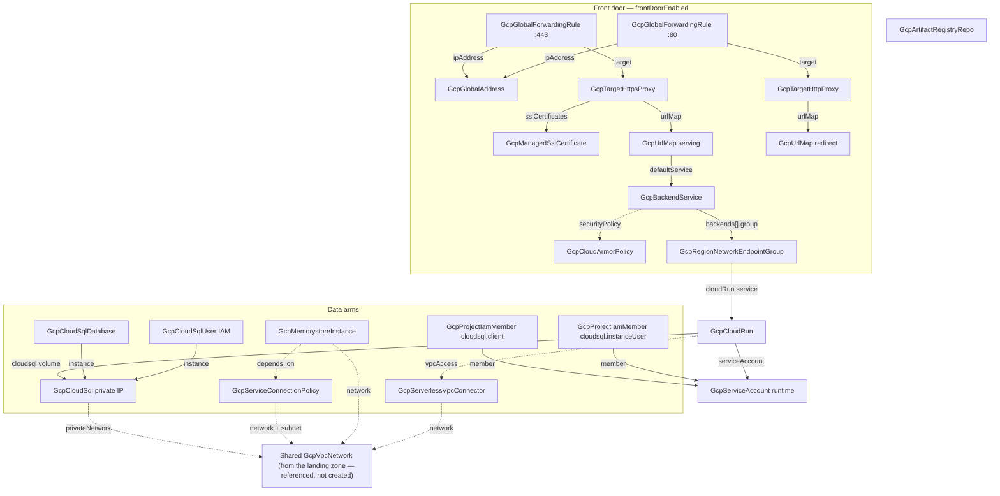

# GCP Cloud Run Service

A production Cloud Run deployment is never just the service. It is the
registry the images live in, the identity the code runs as, the database
it talks to, the cache in front of the database, the private path between
them, and the domain the world reaches it on — each one a resource with
its own wiring, ordering, and posture decisions. This chart deploys the
whole application as one unit: the defaults give you a public hello
service in a single deploy, and every production concern is a toggle that
composes in cleanly when the architecture calls for it.

Two decisions define its character. First, **passwordless by design**:
the database arm uses IAM authentication — the runtime service account IS
the database user, so no password exists in the chart, the manifests, or
any state file. Second, **it consumes the landing zone, it never rebuilds
it**: the private arms attach to the environment's existing VPC (such as
the one `project-foundation` deploys) by reference, because networks,
private-services-access peering, and address space are shared foundations
that application charts must not duplicate or collide with.

## What it deploys

| Resource | Kind | Purpose | Condition |
|----------|------|---------|-----------|
| The service | `GcpCloudRun` | The application itself (Gen 2, dedicated identity) | always |
| Runtime identity | `GcpServiceAccount` | Least-privilege account the service runs as | always |
| Image repository | `GcpArtifactRegistryRepo` | Docker repository for the service's images | `registryEnabled` |
| Postgres instance | `GcpCloudSql` | Private-IP Cloud SQL Postgres with IAM auth enabled | `cloudSqlEnabled` |
| Application database | `GcpCloudSqlDatabase` | The database the app owns | `cloudSqlEnabled` |
| IAM database user | `GcpCloudSqlUser` | The runtime identity as a passwordless database user | `cloudSqlEnabled` |
| SQL grants | `GcpProjectIamMember` × 2 | `cloudsql.client` + `cloudsql.instanceUser` for the runtime identity | `cloudSqlEnabled` |
| Connection policy | `GcpServiceConnectionPolicy` | Authorizes Memorystore PSC endpoints on the shared network | `memorystoreEnabled` + `serviceConnectionPolicyEnabled` |
| Valkey cache | `GcpMemorystoreInstance` | Standalone Memorystore for Valkey over PSC | `memorystoreEnabled` |
| VPC connector | `GcpServerlessVpcConnector` | Private egress from the service into the shared network | `vpcConnectorEnabled` |
| Serverless NEG | `GcpRegionNetworkEndpointGroup` | Adapts the service into a load-balancer backend | `frontDoorEnabled` |
| Backend service | `GcpBackendService` | Routing target with logging (and Cloud Armor attachment) | `frontDoorEnabled` |
| URL maps | `GcpUrlMap` × 2 | Serving map + HTTP-to-HTTPS redirect map | `frontDoorEnabled` |
| Managed certificate | `GcpManagedSslCertificate` | Google-managed TLS for your domain | `frontDoorEnabled` |
| Proxies | `GcpTargetHttpsProxy` + `GcpTargetHttpProxy` | TLS termination + the port-80 redirect twin | `frontDoorEnabled` |
| Global address | `GcpGlobalAddress` | The one stable IP DNS points at | `frontDoorEnabled` |
| Forwarding rules | `GcpGlobalForwardingRule` × 2 | The 443 and 80 VIPs on the shared address | `frontDoorEnabled` |
| Edge policy | `GcpCloudArmorPolicy` | WAF/rate-limit attachment point (ships allow-all) | `frontDoorEnabled` + `cloudArmorEnabled` |

## Architecture

Deployment order falls out of the references: the runtime identity, the
registry, and the database instance deploy in parallel; the service waits
for the identity and (when the arm is on) the database and connector; the
front door assembles VIP-last (NEG after the service, backend after the
NEG, and so on up to the forwarding rules). The cache carries an explicit
`depends_on` relationship on the connection policy because no spec field
references it — GCP discovers the policy by network, class, and region,
but creation fails if it does not exist yet.

## Parameters

| Parameter | Default | When to change |
|-----------|---------|----------------|
| `gcp_project_id` | `my-gcp-project` | Always — the project everything lands in. |
| `region` | `us-central1` | Put the service where its users (or its data) are. |
| `service_name` | `my-app` | Always — also prefixes every derived resource name. |
| `image` | Google's public hello image | Replace with your image once CI pushes it. |
| `container_port` | `8080` | Match what the app binds to. |
| `cpu` / `memory` | `1` / `512Mi` | Latency knob / footprint knob; either change rolls a revision. |
| `min_instances` | `0` | Raise to `1`+ when cold starts are user-visible. |
| `max_instances` | `20` | The cost/overload circuit breaker. |
| `allowUnauthenticated` | `true` | Off for IAM-authenticated service-to-service backends. |
| `registryEnabled` | `true` | Off when images live in an existing repository. |
| `registry_repository_id` | `app-images` | Immutable; part of every image path. |
| `network_resource_name` | `app-network` | The landing zone's VPC resource name (private arms only). |
| `subnet_resource_name` | `app-network-us-central1` | The landing zone's subnet resource name (cache arm only). |
| `cloudSqlEnabled` | `false` | On for the private, passwordless Postgres arm. |
| `db_version` / `db_tier` / `db_disk_size_gb` | `POSTGRES_16` / `db-custom-2-7680` / `20` | Size for the workload; disk auto-grows, never shrinks. |
| `db_availability_type` | `ZONAL` | `REGIONAL` when database downtime costs more than ~2× instance price. |
| `db_name` | `app` | The application database's name. |
| `memorystoreEnabled` | `false` | On for the Valkey cache arm. |
| `cache_node_type` | `SHARED_CORE_NANO` | Scale up for production working sets. |
| `serviceConnectionPolicyEnabled` | `true` | Off when the network already carries a `gcp-memorystore` policy in this region. |
| `vpcConnectorEnabled` | `false` | On when the service must reach private IPs (the cache, internal services). |
| `connector_cidr` | `10.8.0.0/28` | Any unused /28 in the shared network. |
| `frontDoorEnabled` | `false` | On when a custom domain, WAF, or multi-service routing calls for the LB. |
| `domain` | `app.example.com` | The real domain you will point at the reserved IP. |
| `cloudArmorEnabled` | `false` | On to get the WAF/rate-limit attachment point at the edge. |

## After deployment

1. **Push your first image.** With the registry arm on, tag and push to
   `<region>-docker.pkg.dev/<project>/<repository>/<image>:<tag>`, set the
   `image` parameter to it, and redeploy — the hello image is a
   placeholder, not a promise.
2. **Wire the database connection.** With the SQL arm on, the app reads
   `INSTANCE_CONNECTION_NAME` and `DB_NAME` from its environment and
   connects through the Unix socket `/cloudsql/$INSTANCE_CONNECTION_NAME`
   using IAM authentication (most Postgres drivers take the socket
   directory as `host`, with the runtime identity's stored user name and
   no password — Cloud SQL connectors and language-native IAM auth
   libraries handle the token exchange).
3. **Read the cache endpoint.** With the cache arm on, the instance's
   discovery address appears in its outputs after deploy — feed it to the
   app as configuration. Reaching it by private IP requires the connector
   arm.
4. **Cut DNS for the front door.** With the front door on, point the
   domain's A record at the chart's reserved global IP (the
   `GcpGlobalAddress` output). The managed certificate sits in
   PROVISIONING until the record resolves, then activates on its own —
   typically within the hour.

## Day-2 notes

- **Safe in place:** image, cpu/memory, scaling bounds, concurrency
  (each rolls a new revision with zero downtime); database tier (short
  restart); Cloud Armor rules; URL map routing; backend logging.
- **Recreates the resource:** the connector's CIDR or instance band
  (shrinking replaces it), the registry's location or ID, the database's
  region, the NEG's region.
- **Deliberately guarded:** the database refuses destroy until both
  deletion-protection flags are lifted, and keeps final backups on
  delete. The Cloud Run service's own deletion protection is on by the
  kind's default.
- **The front door's IP is the stable contract** — proxies, certificates,
  URL maps, and backends can all be swapped behind it without touching
  DNS.
- **One connection policy per (network, class, region):** deploying this
  chart twice into the same network and region needs
  `serviceConnectionPolicyEnabled=false` on the second deployment.

---

© Planton. Licensed under [Apache-2.0](https://github.com/plantonhq/planton/blob/main/LICENSE).
