# GCP Event-Driven Pipeline

Event-driven architecture on GCP is easy to start and easy to get subtly
wrong: a topic without a schema drifts into undocumented message shapes, a
consumer without a dead-letter queue hot-loops on the first poison
message, and a dead-letter topic without a subscription silently discards
exactly the messages it was supposed to keep. This chart deploys one
message stream with the failure paths already thought through — a
schema-validated topic, a pull subscription with a dedicated worker
identity, and a dead-letter queue with a parking subscription — plus two
optional consumption arms: a zero-code BigQuery sink that gives analysts
the full event history in SQL, and a Cloud Run push consumer that receives
messages as authenticated HTTP requests and scales to zero between them.

## What it deploys

| Resource | Kind | Purpose | Condition |
|----------|------|---------|-----------|
| Message schema | `GcpPubSubSchema` | The publish-time contract (example AVRO record to replace) | `schemaEnabled` |
| Stream topic | `GcpPubSubTopic` | The channel producers publish to | always |
| Worker identity | `GcpServiceAccount` | Account the pull consumer runs as | always |
| Subscriber grant | `GcpProjectIamMember` | `pubsub.subscriber` for the worker | always |
| Worker subscription | `GcpPubSubSubscription` | Pull consumption with retry backoff (+ dead-letter policy) | always |
| Dead-letter topic | `GcpPubSubTopic` | Where poison messages divert | `deadLetterEnabled` |
| Parking subscription | `GcpPubSubSubscription` | Retains dead letters for inspection and replay | `deadLetterEnabled` |
| Forwarding grants | `GcpProjectIamMember` × 2 | `pubsub.publisher` + `pubsub.subscriber` for Pub/Sub's service agent | `deadLetterEnabled` |
| Sink dataset + table | `GcpBigQueryDataset` + `GcpBigQueryTable` | Day-partitioned raw event history | `bigQuerySinkEnabled` |
| BigQuery write grant | `GcpProjectIamMember` | `bigquery.dataEditor` for Pub/Sub's service agent | `bigQuerySinkEnabled` |
| Sink subscription | `GcpPubSubSubscription` | Streams every message into the table | `bigQuerySinkEnabled` |
| Consumer service | `GcpCloudRun` | Receives push deliveries; internal-only ingress | `pushConsumerEnabled` |
| Push identity | `GcpServiceAccount` | Account Pub/Sub signs OIDC tokens as | `pushConsumerEnabled` |
| Invoker grant | `GcpProjectIamMember` | `run.invoker` for the push identity | `pushConsumerEnabled` |
| Push subscription | `GcpPubSubSubscription` | OIDC-authenticated push to the service's URL | `pushConsumerEnabled` |

## Architecture

```mermaid
flowchart TB
    Producer[Producers]
    Schema[GcpPubSubSchema]
    Topic["GcpPubSubTopic <name>-events"]
    subgraph pull [Pull path — always]
        WorkerSub["GcpPubSubSubscription worker"]
        WorkerSA[GcpServiceAccount worker]
        SubGrant["GcpProjectIamMember subscriber"]
    end
    subgraph dlq [Dead letter — deadLetterEnabled]
        DLTopic["GcpPubSubTopic <name>-dlq"]
        Parking["GcpPubSubSubscription parking"]
        AgentGrants["GcpProjectIamMember × 2 (Pub/Sub service agent)"]
    end
    subgraph sink [Analytics — bigQuerySinkEnabled]
        DS[GcpBigQueryDataset]
        Table["GcpBigQueryTable events_raw"]
        SinkGrant["GcpProjectIamMember dataEditor (service agent)"]
        SinkSub["GcpPubSubSubscription bigquery-sink"]
    end
    subgraph push [Push consumer — pushConsumerEnabled]
        Consumer[GcpCloudRun consumer]
        PushSA[GcpServiceAccount push]
        Invoker["GcpProjectIamMember run.invoker"]
        PushSub["GcpPubSubSubscription push"]
    end

    Producer -.->|"publish (schema-validated)"| Topic
    Topic -->|schemaSettings.schema| Schema
    WorkerSub -->|topic| Topic
    SubGrant -->|member| WorkerSA
    WorkerSub -->|deadLetterTopic| DLTopic
    Parking -->|topic| DLTopic
    SinkSub -->|topic| Topic
    SinkSub -->|"bigqueryConfig.table (qualified_name)"| Table
    Table -->|datasetId| DS
    SinkSub -->|depends_on| SinkGrant
    PushSub -->|topic| Topic
    PushSub -->|"pushEndpoint (service url)"| Consumer
    PushSub -->|"oidcToken (email)"| PushSA
    PushSub -->|depends_on| Invoker
    Invoker -->|member| PushSA
    PushSub -->|deadLetterTopic| DLTopic
```

Ordering falls out of the references: the schema before the topic, the
topic before every subscription, the sink table before the sink
subscription, and the consumer service before the push subscription (its
URL is an output — it cannot be known earlier). Two permissions have no
data flow to ride, so they carry explicit `depends_on` edges instead: the
BigQuery write grant before the sink subscription and the invoker grant
before the push subscription — Pub/Sub validates both at create time.

## Parameters

| Parameter | Default | When to change |
|-----------|---------|----------------|
| `gcp_project_id` | `my-gcp-project` | Always — the project the stream lives in. |
| `gcp_project_number` | `123456789012` | Always — Pub/Sub's service agent email is built from it. |
| `region` | `us-central1` | Only places the push consumer; Pub/Sub is global. |
| `pipeline_name` | `orders` | Always — names the topic and everything beside it. |
| `schemaEnabled` | `true` | Off only for streams that genuinely carry free-form payloads. |
| `deadLetterEnabled` | `true` | Off only for streams where losing poison messages is acceptable. |
| `max_delivery_attempts` | `10` | Lower diverts faster; higher tolerates longer consumer outages. |
| `bigQuerySinkEnabled` | `false` | On to get the full event history in SQL with zero pipeline code. |
| `bigquery_location` | `US` | Immutable — put it where your analytics stack runs. |
| `pushConsumerEnabled` | `false` | On for HTTP-push consumption instead of (or beside) the pull worker. |
| `consumer_image` | Google's public hello image | Replace with your handler; the hello image acks everything. |

## After deployment

1. **Replace the example schema.** The AVRO record in the schema resource
   is a starting shape. Edit its fields to your event's real contract —
   schema changes commit as in-place revisions, and publishers get
   `INVALID_ARGUMENT` for anything non-conforming.
2. **Point your producer at the topic** (`<pipeline>-events`) and your
   worker at the pull subscription (`<pipeline>-worker`), running as the
   worker service account — it already holds subscriber.
3. **Query the sink.** With the sink arm on, every message lands in
   `<pipeline>_analytics.events_raw` within seconds: payload in `data`,
   metadata beside it, day-partitioned on `publish_time`. JSON payloads
   query naturally with `JSON_VALUE(data, '$.field')`.
4. **Ship the real consumer.** With the push arm on, replace
   `consumer_image` with your handler: it receives Pub/Sub's standard push
   envelope as POST requests, and any 2xx acks the message. The default
   hello image returns 200 — it will ack (and thereby consume) messages,
   which is fine for wiring tests and wrong for production.
5. **Watch the parking lot.** Dead letters accumulate in
   `<pipeline>-dlq-parking`. An empty parking lot is health; a growing one
   is your earliest signal of a poison-message class or a consumer bug —
   inspect, fix, and republish from there.

## Day-2 notes

- **Safe in place:** retry backoff, ack deadlines, `max_delivery_attempts`,
  Cloud Armor-style consumer scaling bounds, adding more subscriptions
  (fan-out never disturbs existing consumers).
- **Immutable by GCP:** the topic's schema attachment (decide at creation),
  each subscription's topic, the dataset's location.
- **Schema evolution** happens as revisions on the schema resource within
  Pub/Sub's compatibility rules; the BigQuery sink is deliberately
  schema-agnostic, so evolution never breaks the history table.
- **The service-agent grants are project-scoped** (`pubsub.publisher`,
  `pubsub.subscriber`, `bigquery.dataEditor` for Pub/Sub's own service
  agent) — inside a single-purpose project this bounds cleanly. Tighter
  per-topic scoping would require resource-scoped Pub/Sub IAM, which the
  catalog deliberately does not model today.
- **Deleting the stream deletes its backlog.** Messages live in
  subscriptions; the BigQuery sink (when on) is the only durable copy.

---

© Planton. Licensed under [Apache-2.0](https://github.com/plantonhq/planton/blob/main/LICENSE).
