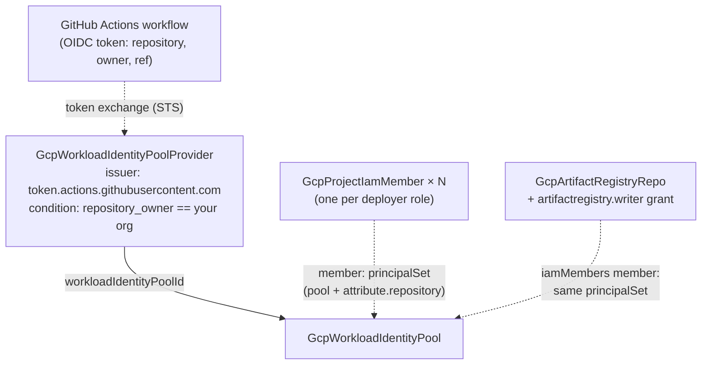

# GCP GitHub Actions Keyless Deployer

The traditional way to let GitHub Actions deploy to GCP is to export a
service-account key and paste it into a repository secret — a long-lived,
copyable credential that every security incident post-mortem wishes had
never existed. This chart deploys the keyless alternative: Workload
Identity Federation. Your workflows authenticate with their GitHub-issued
OIDC token, Google's Security Token Service verifies it against a provider
locked to your organization, and the workflow receives a short-lived
credential holding exactly the roles you granted. Nothing is stored,
nothing can leak, nothing needs rotation.

Out of the box it grants one repository's workflows the roles to deploy
Cloud Run and push images to an Artifact Registry repository it also
creates. Both are parameters: swap the roles for GKE or infrastructure
pipelines, widen the grants to the whole organization, or drop the
registry if images live elsewhere.

## What it deploys

| Resource | Kind | Purpose | Condition |
|----------|------|---------|-----------|
| Federation pool | `GcpWorkloadIdentityPool` | The trust container IAM principals are built from | always |
| GitHub OIDC provider | `GcpWorkloadIdentityPoolProvider` | Trusts GitHub's issuer, locked to your org by attribute condition | always |
| Deploy grants | `GcpProjectIamMember` (one per role) | Additive project roles for the GitHub principal | always |
| Image repository | `GcpArtifactRegistryRepo` | Docker repository with repo-scoped push access for the same principal | `registryEnabled` |

## Architecture



The pool deploys first, then the provider; the grants and the registry are
independent of both in the dependency graph (their member strings are
composed from parameters, since IAM principals for federated identities are
built from the project number and pool ID rather than output by any single
resource) — but nothing federates until the provider exists.

## Parameters

| Parameter | Description | Default |
|-----------|-------------|---------|
| `gcp_project_id` | Project the deployer targets | `my-gcp-project` |
| `gcp_project_number` | Its NUMERIC project number (principals are built from it) | example — replace |
| `github_org` | GitHub organization — the trust boundary | `my-github-org` |
| `github_repo` | Repository receiving the grants; empty = every repo in the org | `my-app` |
| `pool_id` | Workload Identity Pool ID (immutable, ~30-day deletion reservation) | `github-actions` |
| `provider_id` | OIDC provider ID inside the pool (immutable) | `github-oidc` |
| `deployer_roles` | Project roles granted to the principal, one resource each | `run.admin`, `iam.serviceAccountUser` |
| `registryEnabled` | Also create the Docker repository + push grant | `true` |
| `registry_location` | Artifact Registry location (region or multi-region) | `us-central1` |
| `registry_repository_id` | Repository ID — part of every image path | `app-images` |

On scope: the default roles deploy Cloud Run. `roles/iam.serviceAccountUser`
is project-scoped actAs — reasonable inside a single-purpose project (pair
this chart with a project-per-app layout, e.g. from the project-foundation
chart), but worth understanding: any runtime service account in THIS
project can be attached to services the workflow deploys. Keep the deployer
and unrelated workloads in separate projects.

## After deployment

### Wire the workflow

The provider's canonical resource name is the one value your workflow
needs. It is deterministic from your parameters:

```
projects/<gcp_project_number>/locations/global/workloadIdentityPools/<pool_id>/providers/<provider_id>
```

```yaml
# .github/workflows/deploy.yaml
permissions:
  contents: read
  id-token: write   # REQUIRED — lets the job request its OIDC token

steps:
  - uses: google-github-actions/auth@v2
    with:
      project_id: my-gcp-project
      workload_identity_provider: projects/123456789012/locations/global/workloadIdentityPools/github-actions/providers/github-oidc

  - uses: google-github-actions/setup-gcloud@v2

  - name: Push image and deploy
    run: |
      gcloud auth configure-docker us-central1-docker.pkg.dev --quiet
      docker build -t us-central1-docker.pkg.dev/my-gcp-project/app-images/my-app:${GITHUB_SHA} .
      docker push us-central1-docker.pkg.dev/my-gcp-project/app-images/my-app:${GITHUB_SHA}
      gcloud run deploy my-app \
        --image us-central1-docker.pkg.dev/my-gcp-project/app-images/my-app:${GITHUB_SHA} \
        --region us-central1
```

No secrets block, no key file — `id-token: write` and the provider path are
the entire configuration.

### Tighten or widen the trust

- **Per-branch deploys**: tighten the provider's `attributeCondition` to
  `assertion.repository == "my-org/my-app" && assertion.ref == "refs/heads/main"`
  so only main-branch workflow runs can federate at all.
- **More repositories**: either set `github_repo` empty (every repo in the
  org holds the deploy roles — the shared-platform-team shape) or deploy
  additional `GcpProjectIamMember` resources per repository, reusing this
  chart's pool and provider.

## Day-2 notes

- **Safe to change in place**: `deployer_roles` (each role is its own
  additive grant — adding/removing never disturbs the others),
  `github_repo` (grants are recreated for the new principal), the
  provider's display name, description, and attribute condition.
- **Recreates the federation**: `pool_id` and `provider_id` are immutable,
  and both are reserved for ~30 days after deletion — a recreated provider
  also changes the `workload_identity_provider` value configured in
  workflows. Treat both IDs as permanent.
- **Emergency stop**: set the provider's `disabled` field to true — new
  token exchanges are rejected immediately while grants and the pool stay
  intact for the post-incident review. Prefer it over deletion, which
  starts the 30-day reservation clock.
- **Grants are additive**: destroying this chart removes exactly the
  grants it created and never clobbers IAM bindings made elsewhere in the
  project.
- **Cost**: federation (pool, provider, IAM) is free. Artifact Registry
  bills for storage and cross-location egress — add cleanup policies to
  the repository as image volume grows.
