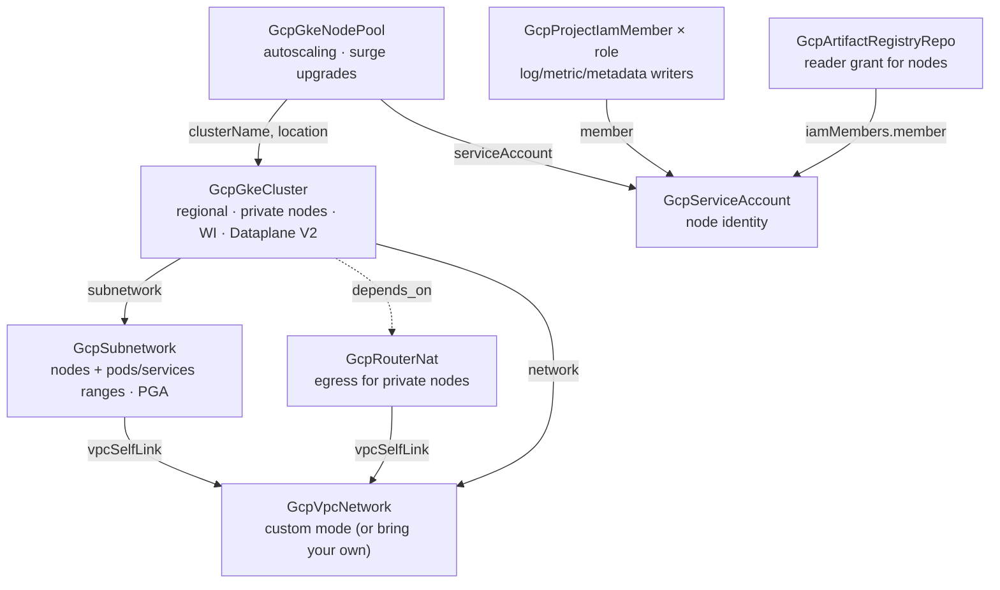

# GCP GKE Environment

A GKE cluster is never just a cluster. Before the first pod schedules, someone
has to plan three address ranges that can never shrink, decide whether nodes
are reachable from the internet, give private nodes a way to pull images,
choose the node identity (and resist the over-privileged default), and stand
up the registry those images come from. Each decision is invisible when right
and expensive when wrong — an undersized pod range or a cluster on the default
compute service account is a rebuild, not a patch. This chart deploys the
environment with those decisions already made: a custom-mode VPC and a
GKE-tailored subnet with planned pod/service ranges, Cloud NAT egress, a
regional private-nodes cluster with Workload Identity and Dataplane V2, a
least-privilege node service account with exactly the roles nodes need, an
autoscaling node pool with surge upgrades, and an Artifact Registry repository
the nodes can already pull from. One toggle flips the environment to
Autopilot; another drops it onto a landing-zone VPC you already run.

## What it deploys

| Resource | Kind | Purpose | Condition |
|----------|------|---------|-----------|
| VPC network | `GcpVpcNetwork` | Custom-mode network — you own the address plan | unless `useExistingNetwork` |
| GKE subnet | `GcpSubnetwork` | Node addresses + named `pods`/`services` secondary ranges, Private Google Access | always |
| Cloud NAT + router | `GcpRouterNat` | Egress for private nodes (pulls beyond Google, third-party APIs) | `natEnabled` |
| Cluster | `GcpGkeCluster` | Regional, private nodes, Workload Identity, Dataplane V2 | always |
| Node service account | `GcpServiceAccount` | Dedicated node identity — never the default compute account | unless `autopilotEnabled` |
| Node role grants | `GcpProjectIamMember` (one per role) | Log/metric/metadata writers — node-level needs only | unless `autopilotEnabled` |
| Node pool | `GcpGkeNodePool` | Autoscaling general-purpose workhorse with surge upgrades | unless `autopilotEnabled` |
| Image repository | `GcpArtifactRegistryRepo` | Docker registry with a repo-scoped reader grant for the nodes | `registryEnabled` |

## Architecture

Deployment order falls out of the references: the VPC first, then the subnet,
NAT, and node service account in parallel, then the cluster (after its subnet
— and after the NAT via an explicit relationship, so nodes never boot without
egress), then the node pool and the repository.

## Parameters

| Parameter | Description | Default |
|-----------|-------------|---------|
| `gcp_project_id` | Project every resource lands in | `my-gcp-project` |
| `region` | Region for subnet, NAT, cluster, and registry | `us-central1` |
| `cluster_name` | Cluster name and the prefix for derived names | `app-cluster` |
| `useExistingNetwork` | Use a landing-zone VPC instead of creating one | `false` |
| `network_name` | VPC to create — or the existing `GcpVpcNetwork` resource name | `gke-network` |
| `subnet_ip_cidr_range` | Node addresses (expandable, never shrinkable) | `10.20.0.0/20` |
| `pods_ip_cidr_range` | Pod range — the big one; immutable | `10.24.0.0/14` |
| `services_ip_cidr_range` | ClusterIP range; immutable | `10.28.0.0/20` |
| `natEnabled` | Deploy Cloud NAT (off when the landing zone's NAT covers the region) | `true` |
| `master_ipv4_cidr_block` | Control-plane /28, non-overlapping, per cluster | `172.16.0.16/28` |
| `master_authorized_cidr` | Optional CIDR allowlist for the API endpoint | empty (no restriction) |
| `autopilotEnabled` | Autopilot mode — node pool, node SA, and grants drop out | `false` |
| `deletionProtectionEnabled` | Destroy plans fail while true | `true` |
| `node_machine_type` | Node pool machine type | `n2-standard-4` |
| `node_min_nodes` / `node_max_nodes` | Autoscaler bounds PER ZONE (×3 in a region) | `1` / `3` |
| `node_sa_roles` | Roles granted to the node account, one grant each | log/metric/metadata writers |
| `registryEnabled` | Create the Docker repository + node reader grant | `true` |
| `registry_repository_id` | Repository ID (pull path segment) | `app-images` |

The deploying identity needs the usual container/compute/networking admin
roles plus `roles/iam.serviceAccountAdmin` (node identity),
`roles/resourcemanager.projectIamAdmin` (the role grants), and
`roles/artifactregistry.admin` when the registry toggle is on.

## After deployment

- **Connect**: `gcloud container clusters get-credentials <cluster_name>
  --region <region> --project <gcp_project_id>`. The control plane's public
  endpoint accepts IAM-authenticated connections (from
  `master_authorized_cidr` only, if you set it).
- **Push the first image**: authenticate Docker with
  `gcloud auth configure-docker <region>-docker.pkg.dev`, then push to
  `<region>-docker.pkg.dev/<project>/<registry_repository_id>/<image>:<tag>`.
  Nodes already hold read access.
- **Give a workload GCP access (Workload Identity — the keyless recipe).**
  The cluster's identity pool is on; each workload that calls GCP APIs gets
  its own identity in four steps, all first-class resources:
  1. A `GcpServiceAccount` for the workload (the GSA).
  2. Additive `GcpProjectIamMember` grants giving the GSA exactly what the
     workload needs (say, `roles/storage.objectViewer`).
  3. A `GcpGkeWorkloadIdentityBinding` — grants the Kubernetes
     ServiceAccount (namespace + name) `roles/iam.workloadIdentityUser` on
     the GSA, constructing the principal from its parts so a typo is
     impossible.
  4. The `iam.gke.io/gcp-service-account: <gsa-email>` annotation on the
     KSA, in the workload's own manifests.
  No keys are created or exported anywhere in this flow.
- **Install cluster addons and workloads.** Kubernetes-level components
  (ingress controllers, cert-manager, external-dns, operators, your apps)
  are their own resources under the Kubernetes provider, deployed against
  this cluster by naming it in their `targetCluster` selector
  (`clusterKind: GcpGkeCluster`, `clusterName: <cluster_name>` in the same
  environment). They are deliberately not bundled here: this chart owns the
  GCP environment; what runs on the cluster is a separate, composable
  decision. Note GKE covers much of the classic addon list natively —
  Gateway API for ingress, the Secret Manager CSI add-on, managed
  Prometheus — all reachable through the cluster resource's own spec.

## Day-2 notes

- **Safe to change in place**: node pool autoscaling bounds, machine type
  (GKE replaces nodes through the surge policy — one extra node at a time,
  zero unavailable), `node_sa_roles` (each role is its own grant),
  `master_authorized_cidr`, maintenance window.
- **Immutable — plan, don't patch**: the pod and services secondary ranges,
  the control-plane /28, the cluster's network/subnetwork, its location,
  and the Autopilot/Standard mode. Outgrowing the pod range means adding
  ranges (`additional_pod_range_names` on the cluster resource), not
  resizing.
- **The primary subnet range CAN grow** (`subnet_ip_cidr_range` expands in
  place, never shrinks).
- **More capacity, different shapes**: add further `GcpGkeNodePool`
  resources (Spot for batch, GPU pools) beside the workhorse rather than
  resizing it; each references the cluster the same way.
- **A second region is a second environment**: subnets, NAT, and clusters
  are all regional — deploy this chart again with its own address plan.
- **Teardown**: flip `deletionProtectionEnabled` to false as its own change
  first, then destroy. GKE deletes its node pools with the cluster; the
  network deletes last.
- **Cost levers**: `node_max_nodes` is the ceiling (per zone — ×3 in a
  region); a regional control plane bills the standard cluster fee; NAT
  bills hourly + per-GiB processed; Autopilot swaps node billing for
  per-pod billing.

---

© Planton. Licensed under [Apache-2.0](https://github.com/plantonhq/planton/blob/main/LICENSE).
