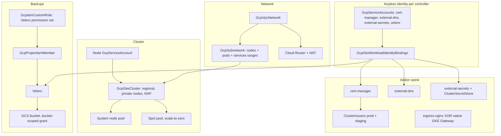

# GCP GKE Baseline

A production GKE cluster that provisions its own machines through node
auto-provisioning, consolidates them when idle, and backs itself up on a
schedule — with TLS, DNS, ingress, and secrets syncing already wired,
keylessly. One apply creates the network, the regional control plane, the
least-privilege identities, and every in-cluster addon a production platform
needs; when it finishes, deploying an application gets you a running
workload with a DNS name and a browser-trusted certificate, on nodes that
appeared because your pods needed them.

This is a ONE-RUN composition: the cluster and the workloads that run on it
deploy in the same apply. The cluster publishes its Kubernetes connection
under a chart-controlled name and every Kubernetes resource consumes it —
one values parameter (`cluster_connection_name`) drives both sides. Deploy
this chart at most once per environment: it owns cluster-wide singletons
(cert-manager, external-secrets, the default IngressClass).

**What GKE provides that this chart deliberately does NOT install** — the
composition is leaner than a comparable cluster on clouds without these
built-ins, and knowing why prevents double-installs:

- **Capacity management**: node auto-provisioning (NAP) is GKE's native
  provision-on-demand/consolidate-when-idle machinery — no third-party
  autoscaler controller to run, patch, or grant credentials to.
- **metrics-server**: GKE ships it; `kubectl top` and CPU/memory HPAs work
  on a fresh cluster. Installing another would collide with the built-in.
- **CSI storage**: the Persistent Disk CSI driver, a default StorageClass,
  and the snapshot controller are cluster components. The one gap is the
  `VolumeSnapshotClass`, which the backup arm ships (see below).
- **Gateway API**: when the gateway arm is on, Google installs the CRDs,
  runs the gateway controller, and provides the `gke-l7-*` GatewayClasses —
  the arm creates only the shared Gateway itself.
- **Managed Prometheus**: system metrics collection is on by default
  (Google Cloud Managed Service for Prometheus); pair the cluster with the
  `observability-stack` chart when you want your own Grafana stack instead.

## What it deploys

| Resource | Kind | Purpose | Conditional on |
|---|---|---|---|
| `<env>-gke-vpc` | GcpVpcNetwork | Custom-mode VPC (the cluster spec requires an explicit network) | — |
| `<env>-gke-subnet` | GcpSubnetwork | One regional subnet: node range + NAMED pod/service secondary ranges | — |
| `<env>-gke-nat` | GcpRouterNat | Cloud Router + NAT — the private nodes' internet egress | — |
| `<env>-gke-nodes` | GcpServiceAccount | ONE least-privilege node identity (system pool + every NAP pool) | — |
| `<env>-gke` | GcpGkeCluster | Regional control plane, Dataplane V2, private nodes, NAP; publishes the Kubernetes connection | — |
| `<env>-gke-system` | GcpGkeNodePool | Always-on floor for cluster-critical pods, autoscaled per zone | — |
| `<env>-gke-spot` | GcpGkeNodePool | Scale-to-zero Spot pool, tainted (opt-in capacity) | `spot_pool_enabled` |
| `<env>-gke-cert-manager` + `-wi` + `<env>-cert-manager` | GcpServiceAccount + GcpGkeWorkloadIdentityBinding + KubernetesCertManager | Certificate machinery with keyless Cloud DNS DNS-01 | — |
| `<env>-letsencrypt-prod` / `-staging` | KubernetesClusterIssuer ×2 | Let's Encrypt issuers (staging first — see After deployment) | — |
| `<env>-gke-external-dns` + `-wi` + `<env>-external-dns` | GcpServiceAccount + GcpGkeWorkloadIdentityBinding + KubernetesExternalDns | Kubernetes exposure → real Cloud DNS records | — |
| `<env>-ingress-nginx` | KubernetesIngressNginx | Default IngressClass + one cloud LB (the default exposure arm) | `use_gateway_api` = false |
| `<env>-gateway-namespace` + `<env>-gateway` | KubernetesNamespace + KubernetesGateway | Shared Gateway on GKE's native class (CRDs/controller/classes are Google's) | `use_gateway_api` = true |
| `<env>-gke-external-secrets` + `-wi`, `<env>-external-secrets`, `<env>-secret-store` | GcpServiceAccount + GcpGkeWorkloadIdentityBinding + 2 kinds | GCP Secret Manager → native Kubernetes Secrets, keylessly | `external_secrets_enabled` |
| Bucket, custom role, GSA, grant, WI binding, VolumeSnapshotClass, `<env>-velero` | 7 resources | Scheduled cluster backups to GCS with CSI volume snapshots | `velero_enabled` |

## Architecture

Deployment layers the platform's dependency graph derives from the
references: network → node identity → cluster → node pools, with the
controller identities (service account → workload-identity binding) in
parallel — none of them needs a cluster output, because every GCP project
carries its implicit Workload Identity pool. Every Kubernetes resource
carries a `runs_on` relationship to the cluster, consumes its published
connection, and declares a `depends_on` edge to its identity binding so the
keyless handshake is effective before the controller's first cloud call.

## Parameters

| Parameter | Default | When to change |
|---|---|---|
| `cluster_connection_name` | `gke-baseline` | Always review: the name the cluster's connection publishes under — unique per cluster |
| `gcp_project_id` | `my-project-id` | **Must change.** The project everything lives in; also the Workload Identity pool |
| `region` | `us-central1` | Your region; the cluster is regional in it |
| `subnet_cidr` | `10.10.0.0/20` | Only if it overlaps networks you will peer with (expandable later, never shrinkable) |
| `pods_cidr` | `10.16.0.0/14` | Keep big — immutable, and every pod consumes an address; undersizing is un-fixable |
| `services_cidr` | `10.20.0.0/20` | Rarely — services are few |
| `master_authorized_cidrs` | open (IAM-authed) | Scope to office/VPN ranges — the cheapest hardening step |
| `system_node_machine_type` | `e2-standard-4` | Bigger clusters may want larger system nodes |
| `system_nodes_min/max_per_zone` | 1 / 2 | Per ZONE (×3 for a regional cluster) — the pool holds only cluster-critical pods |
| `system_node_disk_size_gb` | `100` | Rarely |
| `nap_cpu_max` / `nap_memory_max_gib` | 100 / 400 | The cluster-wide spend cap — raise as the platform grows |
| `spot_pool_enabled` | `false` | On for fault-tolerant batch workloads; costs nothing while idle |
| `spot_machine_type` / `spot_nodes_max_per_zone` | `e2-standard-4` / 3 | Match your batch workloads' shape (Spot arm only) |
| `use_gateway_api` | `false` | `true` swaps ingress-nginx for GKE's native Gateway API |
| `ingress_replicas` | `2` | The entry-point HA floor (ingress arm only) |
| `gateway_class` | `gke-l7-global-external-managed` | Regional external or internal ALB variants (gateway arm only) |
| `dns_zone_names` | `my-dns-zone` | **Must change**: your GcpDnsZone resource names |
| `dns_domains` | `example.com` | **Must change**: the domain suffixes external-dns may manage |
| `dns_txt_owner_id` | `gke-baseline` | Distinct per cluster sharing a zone |
| `acme_email` | placeholder | **Must change**: Let's Encrypt rejects example.com addresses |
| `acme_http01_enabled` | `false` | Add the opt-in HTTP-01 solver for zones outside Cloud DNS |
| `external_secrets_enabled` | `true` | Off if secrets sync lives elsewhere |
| `velero_enabled` | `true` | Off only if disaster recovery lives elsewhere |
| `velero_schedule` / `velero_backup_ttl` | daily 01:00 UTC / 30 days | Align with your low-traffic window and retention policy |

Naming budgets: GCP service-account IDs cap at 30 characters and GKE
cluster/pool names at 40. The longest composed IDs here are
`<env>-external-secrets` (17 + env) and `<env>-cert-manager` (13 + env) —
keep `env` at 13 characters or fewer.

## After deployment

1. **Verify the self-provisioning loop** — deploy any workload requesting
   more CPU than the system pool has free and watch NAP create a pool for
   it: `kubectl get nodes -w` (new nodes carry a `nap-` pool prefix). Scale
   it down and watch the pool drain and disappear.
2. **Issue the first certificate** — create a `Certificate` referencing
   `<env>-letsencrypt-staging`, confirm it reaches `Ready`, then switch the
   `issuerRef` name to `<env>-letsencrypt-prod`. Staging first protects the
   production rate limit.
3. **Expose the first service** — with the default arm, create an Ingress
   (no class needed — nginx is the cluster default); external-dns publishes
   the record for its host into your Cloud DNS zone within a minute. With
   the gateway arm, attach an HTTPRoute to `<env>-gateway` — the Google
   load balancer behind it may take a few minutes to program on first use.
4. **Sync the first secret** — create an `ExternalSecret` referencing the
   `<env>-secret-store` ClusterSecretStore and a Secret Manager secret; a
   native Kubernetes Secret appears.
5. **Prove restore before you need it** — take a manual backup
   (`velero backup create drill`), delete a test namespace, and
   `velero restore create --from-backup drill`. A backup you have never
   restored is a hope, not a strategy.

## Day-2 notes

- **Safe in place**: NAP resource ceilings, system/Spot pool scaling
  bounds, `master_authorized_cidrs`, backup schedule/TTL, adding zones to
  `dns_zone_names`, growing the subnet's PRIMARY range (expand-only).
- **Rolls or replaces**: system machine type (node pool replacement);
  Kubernetes versions are Google's job here — the cluster rides the
  REGULAR release channel and upgrades itself within the maintenance
  windows GKE chooses (pin versions only by taking the cluster off its
  channel, which makes upgrades yours forever).
- **One-way doors**: the pod/service secondary ranges and the cluster name
  are immutable; Dataplane V2 is chosen at creation; deleting the cluster
  requires first setting `deletion_protection` to false on the cluster
  resource — the guard is the point.
- **Cost levers**: the Spot pool is the biggest saving for tolerant
  workloads; NAP's `OPTIMIZE_UTILIZATION` profile packs harder if churn is
  acceptable; one auto-allocated Cloud NAT is already the cost-conscious
  posture (per-IP reservation is only needed for egress allowlisting —
  reserve `GcpAddress` resources and reference them in the NAT's `nat_ips`
  for stable IPs, an in-place update).
- **Second node pool**: GPU or Arm workloads get their own
  `GcpGkeNodePool` (taint them) — or let NAP provision accelerator shapes
  by adding an accelerator resource limit to the cluster's autoscaling
  block.
- **Tighten the project-scoped grants**: Cloud DNS offers no zone-scoped
  IAM, so cert-manager and external-dns carry `roles/dns.admin` at project
  scope — their own zone and domain filters are the operative guardrails.
  external-secrets' `secretAccessor` can be narrowed to per-secret grants
  once your naming convention exists. Velero's bucket grant is already
  bucket-scoped; its snapshot permissions are the plugin's documented
  custom role.

---

© Planton. Licensed under [Apache-2.0](https://github.com/plantonhq/planton/blob/main/LICENSE).
