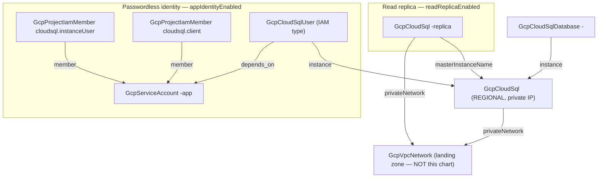

# GCP Postgres Production

The distance between "a Cloud SQL instance" and "a production database"
is a checklist that rarely survives hand-wiring intact: high availability
that requires backups to be on, private IP that requires a peering someone
else owns, IAM database authentication that requires a flag, a user, and
two grants to line up, and delete protection that only helps if someone
remembered it. This chart deploys the whole checklist as one unit — a
REGIONAL Postgres instance with automatic failover, reachable only on a
private IP inside your existing VPC, backed up daily with point-in-time
recovery, observable through Query Insights, and accessed passwordlessly
by a service-account database user. Optional arms add a read replica for
scale-out or cross-region DR.

## What it deploys

| Resource | Kind | Purpose | Condition |
|----------|------|---------|-----------|
| Primary instance | `GcpCloudSql` | REGIONAL HA Postgres, private IP only, PITR backups, Query Insights | always |
| Application database | `GcpCloudSqlDatabase` | The database the application owns | always |
| Application identity | `GcpServiceAccount` | The account the application connects as | `appIdentityEnabled` |
| IAM database user | `GcpCloudSqlUser` | The account AS a database user — no password exists | `appIdentityEnabled` |
| Connection + login grants | `GcpProjectIamMember` × 2 | `cloudsql.client` + `cloudsql.instanceUser` | `appIdentityEnabled` |
| Read replica | `GcpCloudSql` | Read scale-out, or a promotable cross-region DR seed | `readReplicaEnabled` |

## Architecture

The network is consumed by reference, never created: the instance points
at the landing zone's VPC by its Planton resource name, and that network
must already carry private services access (project-foundation deploys
the reserved range and peering by default). The IAM user carries an
explicit `depends_on` edge to the service account because Cloud SQL
validates the principal exists at creation but nothing flows between
them; every other ordering falls out of the references.

## Parameters

| Parameter | Default | When to change |
|-----------|---------|----------------|
| `gcp_project_id` | `my-gcp-project` | Always — the project everything lives in. |
| `region` | `us-central1` | Where the primary (and its in-region standby) runs. |
| `instance_name` | `app-postgres` | Always — immutable, and GCP reserves deleted names for ~a week. |
| `network_resource_name` | `app-network` | The landing zone's VPC resource name (must already carry PSA). |
| `db_version` | `POSTGRES_16` | Start on the newest version your extensions support. |
| `db_tier` | `db-custom-2-7680` | Resize in place on evidence from Query Insights. |
| `disk_size_gb` | `100` | A starting point — the disk auto-resizes, and only ever grows. |
| `availability_type` | `REGIONAL` | ZONAL only for the staging copy of this chart. |
| `database_name` | `app` | The application database. |
| `appIdentityEnabled` | `true` | Off only when the app identity is managed outside this chart. |
| `readReplicaEnabled` | `false` | On for read scale-out or a promotable DR seed. |
| `replica_region` | `us-central1` | Set a different region to make the replica cross-region DR. |

## After deployment

1. **Connect through the Cloud SQL connector.** With the identity arm on,
   run your application as `<instance>-app@<project>.iam.gserviceaccount.com`
   and connect via the Cloud SQL Go/Java/Python connector (or Auth Proxy)
   with automatic IAM authentication — no password anywhere. The Postgres
   username is the email truncated before `.gserviceaccount.com`.
2. **Grant the user its schema privileges.** IAM authenticates the login;
   Postgres still owns authorization. As the `postgres` user (set a root
   password out of band or use another admin path), run
   `GRANT ALL ON DATABASE app TO "<instance>-app@<project>.iam";` and the
   schema-level grants your application expects.
3. **Verify failover posture** (REGIONAL): the console shows the standby
   zone; `gcloud sql instances describe <instance>` reports
   `availabilityType: REGIONAL` and the backup + PITR configuration this
   chart set.
4. **Point read traffic at the replica** (when the arm is on): it has its
   own private IP and connection name — the application addresses it
   explicitly; nothing load-balances automatically.

## Day-2 notes

- **Safe in place:** tier, disk size (grow only), maintenance window,
  insights settings, backup retention, adding the identity or replica
  arms later (the IAM flag is already on).
- **Immutable by GCP:** instance name, region, and the private-network
  attachment (private IP can be added to a public instance, but never
  removed in place).
- **Three locks guard the data:** the IaC-side deletion guard, the
  API-side deletion guard, and retained final backups. Tearing down is a
  deliberate act: lift both flags, destroy, and the backups still outlive
  the instance.
- **PITR vs backups:** point-in-time recovery replays the transaction log
  to any second in the last 7 days; the 30 retained daily backups cover
  everything older. Restores create a NEW instance — plan the cutover.
- **The replica is derived state** — it carries no backups and no delete
  guards on purpose, so it never holds teardown hostage. Promoting it
  (for DR) detaches it from the primary; after promotion, re-point the
  application and rebuild replication in the other direction.
- **REGIONAL requires backups by GCP's own contract** — this chart keeps
  backups on unconditionally, so flipping `availability_type` between
  ZONAL and REGIONAL is always valid.

---

© Planton. Licensed under [Apache-2.0](https://github.com/plantonhq/planton/blob/main/LICENSE).
