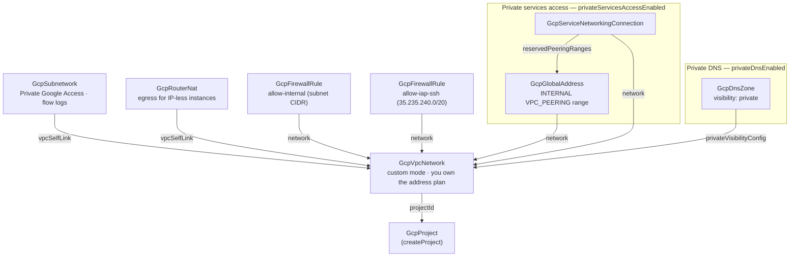

# GCP Project Foundation

Every GCP architecture stands on the same first layer: a project, a network
with a deliberate address plan, a way for private instances to reach the
internet, a firewall posture that denies by default, and the
private-services peering that managed databases require. Getting that layer
right is mostly invisible work — and getting it wrong (an auto-mode VPC, an
SSH rule open to the internet, PSA retrofitted into a crowded address plan)
is expensive to undo once workloads land on it. This chart deploys the
foundation with those decisions already made: a custom-mode VPC, one
right-sized regional subnet with Private Google Access and flow logs, Cloud
NAT egress so workloads never need public IPs, internal-plus-IAP-only
ingress, and a generously sized private-services-access reservation.
Optionally it creates the project itself — the "project vending machine"
mode — and a private DNS zone for internal service names.

## What it deploys

| Resource | Kind | Purpose | Condition |
|----------|------|---------|-----------|
| Project | `GcpProject` | The IAM/billing/quota container everything else lands in | `createProject` |
| VPC network | `GcpVpcNetwork` | Custom-mode network — you own the address plan | always |
| Workload subnet | `GcpSubnetwork` | Regional address space with Private Google Access; flow logs per toggle | always |
| Cloud NAT + router | `GcpRouterNat` | Internet egress for instances with no public IPs, covering all subnets in the region | always |
| Internal firewall rule | `GcpFirewallRule` | Instances in the subnet talk freely to each other | always |
| IAP SSH firewall rule | `GcpFirewallRule` | SSH only through Identity-Aware Proxy — port 22 unreachable from the internet | `iapSshEnabled` |
| PSA reserved range | `GcpGlobalAddress` | Internal range Google's producers carve service subnets from | `privateServicesAccessEnabled` |
| PSA connection | `GcpServiceNetworkingConnection` | The peering that makes Cloud SQL/AlloyDB/Memorystore private IP possible | `privateServicesAccessEnabled` |
| Private DNS zone | `GcpDnsZone` | VPC-only namespace for internal service names | `privateDnsEnabled` |

## Architecture

Deployment order is derived from the references: the project (when created)
deploys first, then the VPC, then everything that references the VPC in
parallel — the subnet, the NAT, the firewall rules, the PSA range, and the
DNS zone — with the PSA connection last, once its reserved range exists.

## Parameters

| Parameter | Description | Default |
|-----------|-------------|---------|
| `gcp_project_id` | Existing project ID — or the ID to create with `createProject` | `my-gcp-project` |
| `createProject` | Also create the project (vending-machine mode) | `false` |
| `parent_type` | `organization` or `folder` (with `createProject`) | `organization` |
| `parent_id` | Numeric org/folder ID; empty for a standalone project | `123456789012` |
| `billing_account_id` | Billing account (`XXXXXX-XXXXXX-XXXXXX`) linked to the new project | example — replace |
| `region` | Region for the subnet and the NAT | `us-central1` |
| `network_name` | VPC name and the prefix for every derived name | `app-network` |
| `subnet_ip_cidr_range` | Primary subnet range — expandable, never shrinkable | `10.10.0.0/20` |
| `flowLogsEnabled` | VPC Flow Logs on the subnet (cost follows traffic) | `true` |
| `iapSshEnabled` | SSH via Identity-Aware Proxy only | `true` |
| `privateServicesAccessEnabled` | Reserve + peer the PSA range | `true` |
| `psa_prefix_length` | Size of the PSA reservation (16 = /16) | `16` |
| `privateDnsEnabled` | Private Cloud DNS zone for internal names | `false` |
| `private_dns_domain` | Zone domain, trailing dot required (e.g. `internal.example.com.`) | example — replace |

With `createProject`, the deploying identity needs
`roles/resourcemanager.projectCreator` on the parent organization or folder
and `roles/billing.user` on the billing account. Without it, the identity
only needs the usual compute/networking roles inside the existing project.

## After deployment

The foundation is deliberately workload-free. What composes on top of it:

- **Managed databases with private IP** — Cloud SQL, AlloyDB, and
  Memorystore resources deployed into this VPC can now use private
  connectivity: the PSA connection they require already exists. Reference
  the VPC by its `network_self_link` / `network_id` outputs.
- **Compute** — instances land in the workload subnet with no external IP:
  egress works through NAT immediately, and
  `gcloud compute ssh --tunnel-through-iap <instance>` is the access path
  (the operator needs `roles/iap.tunnelResourceAccessor`).
- **GKE** — a cluster needs secondary ranges for pods and services; add
  them to this subnet (or a dedicated cluster subnet) when you get there.
- **Internal names** — with the DNS zone enabled, workloads own their
  records as `GcpDnsRecord` resources referencing the zone by name; the
  foundation owns only the namespace.

## Day-2 notes

- **Safe to change in place**: expanding `subnet_ip_cidr_range` (never
  shrinking), flow-log tuning, firewall rules, NAT logging, appending PSA
  ranges.
- **Growing PSA capacity**: when producers exhaust the range, reserve
  another `GcpGlobalAddress` and APPEND it to the connection's
  `reservedPeeringRanges` — never create a second connection for the same
  network/service pair (GCP rejects it).
- **Adding a region**: add a `GcpSubnetwork` and a `GcpRouterNat` for the
  new region — NAT is regional and does not stretch.
- **Stable egress IPs**: NAT IPs are auto-allocated and can change; when a
  partner needs an IP to allowlist, reserve `GcpAddress` resources and list
  them under the NAT's `natIps` (switching allocation mode briefly disrupts
  existing NAT flows — schedule it).
- **Destroy ordering**: managed-service instances using private IP must be
  destroyed before the PSA connection; GCP refuses to remove the peering
  while producers hold subnets in the range. A created project is shut down
  with a 30-day restore window; for long-lived shared foundations set the
  project's `deletion_policy` to `PREVENT`.
- **Cost**: the reservation, VPC, subnet, and firewall rules are free. The
  NAT gateway bills per-hour plus per-GiB processed; flow logs bill by
  Logging ingest, which follows traffic volume — tune `flow_sampling` down
  on busy subnets.

---

© Planton. Licensed under [Apache-2.0](https://github.com/plantonhq/planton/blob/main/LICENSE).
