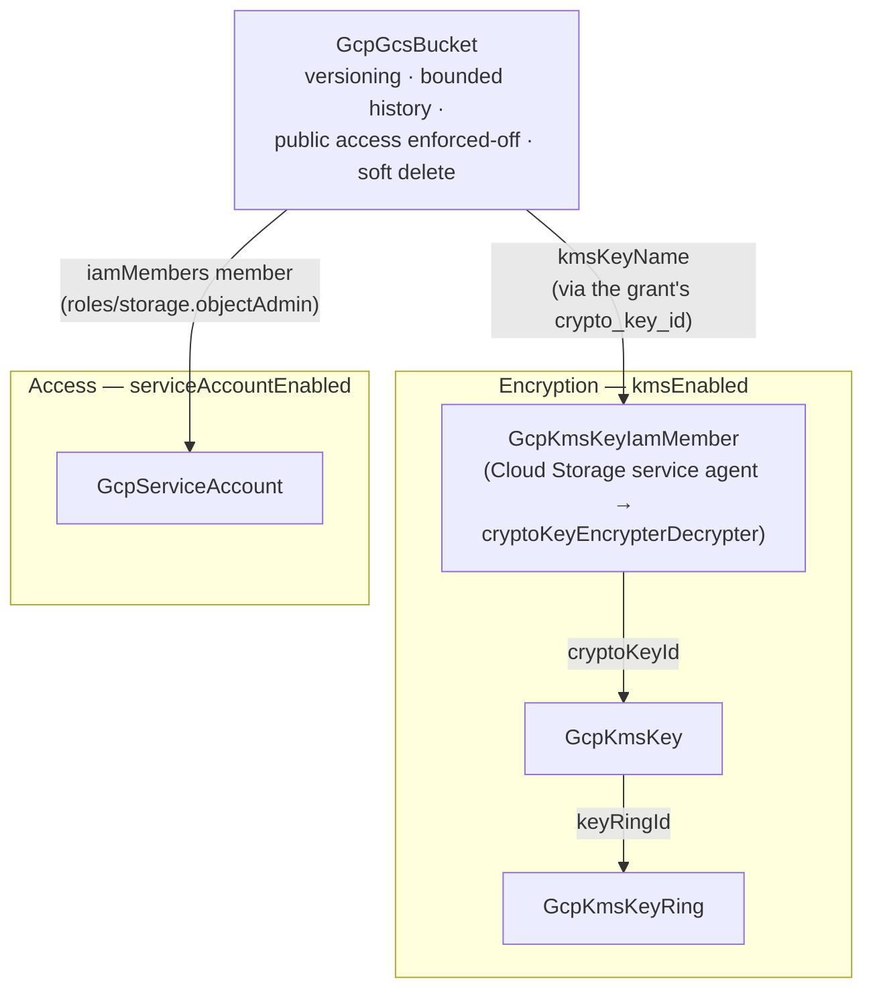

# GCP Pulumi State Backend

Running Pulumi without Pulumi Cloud means bringing your own state backend —
and doing it properly means more than "a bucket". This chart deploys a GCS
state backend with the postures that matter already decided: object
versioning with bounded history (so a corrupted checkpoint is a rollback,
not an incident), uniform IAM-only access with public access permanently
blocked, a 7-day soft-delete safety net, an optional customer-managed
encryption key for organizations with key-custody requirements, and an
optional single-purpose service account so state access stays independently
auditable and revocable.

Pulumi's DIY GCS backend stores checkpoints, stack history, and locks as
objects under `.pulumi/` in the bucket — one bucket is the entire backend.

## What it deploys

| Resource | Kind | Purpose | Condition |
|----------|------|---------|-----------|
| State bucket | `GcpGcsBucket` | Versioned, never-public home for checkpoints, history, and locks | always |
| Key ring | `GcpKmsKeyRing` | Permanent container and IAM boundary for the state key | `kmsEnabled` |
| State key | `GcpKmsKey` | Customer-managed encryption key, 90-day rotation | `kmsEnabled` |
| Storage-agent KMS grant | `GcpKmsKeyIamMember` | Lets the Cloud Storage service agent encrypt/decrypt with exactly this key | `kmsEnabled` |
| State-access identity | `GcpServiceAccount` | Single-purpose account whose only power is object access on this bucket | `serviceAccountEnabled` |

## Architecture



Deployment order is derived from the references: the key ring deploys first,
then the key, then the storage-agent grant on it, then the bucket. The
bucket takes its key path from the grant's `crypto_key_id` output rather
than from the key directly — the grant is key-scoped (the agent can use
this key and nothing else in the project), and referencing it makes the
permission a real dependency, so the bucket is never created before the
agent can encrypt with the key. The service account has no inbound
references and deploys in the first layer. With both toggles off, the chart
is exactly one resource.

## Parameters

| Parameter | Description | Default |
|-----------|-------------|---------|
| `gcp_project_id` | Project that owns the backend (typically a small, tightly-controlled ops/seed project) | `my-gcp-project` |
| `bucket_name` | Globally unique bucket name; immutable; also the `pulumi login` URL | `my-org-pulumi-state` |
| `location` | Multi-region (`US`, `EU`, `ASIA`) or region (`us-central1`); immutable; also places the KMS ring | `US` |
| `noncurrent_versions_to_keep` | Previous versions of each state object retained for recovery | `30` |
| `kmsEnabled` | Encrypt state under a customer-managed key (adds ring + key + agent grant) | `false` |
| `gcp_project_number` | Numeric project number — required only with `kmsEnabled` (identifies the Cloud Storage service agent) | — |
| `serviceAccountEnabled` | Create the dedicated state-access service account | `true` |
| `service_account_id` | Account ID for that identity | `pulumi-state` |
| `serviceAccountKeyEnabled` | Also export a JSON key (long-lived credential — prefer keyless) | `false` |

## After deployment

### Log Pulumi into the bucket

```bash
pulumi login gs://my-org-pulumi-state
```

The identity running Pulumi needs object access on the bucket — with
`serviceAccountEnabled` that is the chart's service account (impersonate it,
federate to it, or use its exported key via
`GOOGLE_APPLICATION_CREDENTIALS`).

### Set a secrets passphrase — and treat it as permanent

A DIY backend has no hosted key service, so Pulumi encrypts the secret
values inside your state with a passphrase you provide:

```bash
export PULUMI_CONFIG_PASSPHRASE="<a strong passphrase from your secret manager>"
pulumi stack init my-stack
```

Two things teams learn the hard way, offered here for free:

- **The passphrase is not the bucket's encryption.** The optional CMEK
  toggle protects state objects at rest in GCS; the passphrase encrypts
  secret values *inside* the state document. You want both stories straight:
  losing the passphrase means the SECRETS in existing stacks are
  undecryptable — even though the state files themselves open fine.
- **Never change the passphrase out of band.** Rotating it is a managed
  operation (`pulumi stack change-secrets-provider`, or Planton's passphrase
  rotation, which re-encrypts every stack under the new passphrase). Simply
  changing the environment variable breaks decryption of everything already
  encrypted.

### Register it as a Planton StateBackend

To use this bucket as the state home for deployments run through Planton,
register it as a **StateBackend** (Pulumi → GCS type) from the Planton
desktop app or console: enter the bucket name, the secrets passphrase (it is
stored as a secret reference and resolved just-in-time, never inline), and —
for inline auth — the state-access service account's JSON key (set
`serviceAccountKeyEnabled: true` to have the chart export one; its
`key_base64` stack output is the value to paste). With runner auth mode the
runner's own ambient credentials are used instead and no key is needed. Mark
the backend as the org default and every new Pulumi-provisioned cloud
resource pins to it automatically.

## Day-2 notes

- **Safe to change in place**: `noncurrent_versions_to_keep` (lifecycle
  rules), IAM grants, the key's rotation period.
- **Recreates the bucket**: `bucket_name`, `location`. Treat both as
  permanent; moving state is a deliberate migration, never a rename.
- **Enabling CMEK later** (`kmsEnabled: true`) re-encrypts nothing
  retroactively: existing objects keep Google-managed encryption until the
  next update rewrites them.
- **Key ring and key names are permanent** in GCP: they survive destroy
  (versions are destroyed; the names can never be reused in that ring or
  location). Choose names you can live with.
- **Costs**: versioned noncurrent objects and soft-deleted objects are
  billed at normal storage rates; the lifecycle cap and the 7-day
  soft-delete window keep both bounded.

---

© Planton. Licensed under [Apache-2.0](https://github.com/plantonhq/planton/blob/main/LICENSE).
