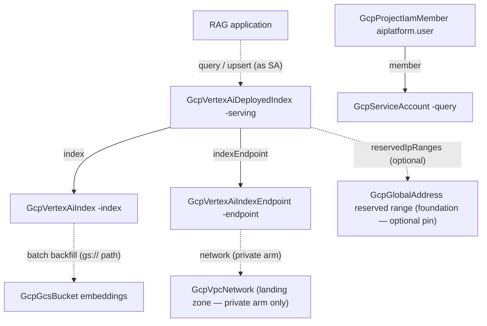

# GCP RAG Vector Search

Vertex AI Vector Search is three resources pretending to be one product:
an index that stores vectors, an endpoint that terminates queries, and a
deployed index that gives the two of them serving compute — and the
sharp edges live in the joints (IDs that forbid hyphens, connectivity
that is immutable, private serving that requires a peering someone else
owns). This chart deploys the retrieval layer of a RAG stack with those
joints already right: a streaming index that upserts embeddings within
seconds, automatic-scaling serving, an embeddings bucket as the corpus
of record, and a dedicated query identity. One toggle moves serving from
the public endpoint onto your VPC's private peering, with optional
reserved-range pinning and JWT auth.

## What it deploys

| Resource | Kind | Purpose | Condition |
|----------|------|---------|-----------|
| Embeddings bucket | `GcpGcsBucket` | Batch embedding files — initial backfill and the rebuildable corpus | always |
| Vector index | `GcpVertexAiIndex` | The vector store (STREAM_UPDATE, tree-AH, cosine-style ranking) | always |
| Index endpoint | `GcpVertexAiIndexEndpoint` | The query surface — public by default, VPC-peered on the toggle | always |
| Deployed index | `GcpVertexAiDeployedIndex` | The placement: serving compute with autoscaling replica bounds | always |
| Query identity | `GcpServiceAccount` | The account the RAG application queries as | always |
| Query grant | `GcpProjectIamMember` | `roles/aiplatform.user` for the query identity | always |

## Architecture

Ordering falls out of the references: the deployed index waits for both
the index and the endpoint (their full resource paths are outputs). The
network and the reserved range are consumed from the landing zone by
reference, never created here — Vertex can only serve from ranges
already registered on the network's service-networking peering, and GCP
allows exactly one peering per network, so an application chart owning
either would collide with everything else on the network. The
embeddings bucket connects by convention (`gs://` path), not by
reference — an index's contents URI is a plain string in GCP's API.

## Parameters

| Parameter | Default | When to change |
|-----------|---------|----------------|
| `gcp_project_id` | `my-gcp-project` | Always — the project everything lives in. |
| `region` | `us-central1` | Where the application that queries runs (latency-sensitive). |
| `corpus_name` | `rag-corpus` | Names everything; the deployed-index ID derives from it. |
| `embeddings_bucket_name` | `my-rag-embeddings` | Always — bucket names are globally unique. |
| `dimensions` | `1536` | Your embedding model's output size, exactly. Immutable. |
| `approximate_neighbors_count` | `150` | Raise for recall, lower for latency. |
| `min_replicas` | `1` | 2+ when a cold replica set is unacceptable. |
| `max_replicas` | `2` | The serving cost ceiling under load. |
| `privateEndpointEnabled` | `false` | On for VPC-only serving (regulated data, internal RAG). Immutable choice. |
| `network_resource_name` | `app-network` | The landing zone's VPC (must already carry PSA). Private arm only. |
| `reserved_range_name` | (empty) | Pin serving IPs to one of the foundation's registered peering ranges. |
| `jwtAuthEnabled` | `false` | Require SA-issued JWTs on private queries. Private arm only. |

## After deployment

1. **Backfill or start streaming.** For an existing corpus, write batch
   embedding files to `gs://<embeddings_bucket>/embeddings/` and update
   the index's contents from that path; for a fresh start, stream
   upserts directly (`IndexServiceClient.upsert_datapoints`) — they are
   queryable within seconds on a STREAM_UPDATE index.
2. **Query as the identity.** Run the RAG application as
   `<corpus>-query@<project>.iam.gserviceaccount.com` — it already holds
   `aiplatform.user`. Public endpoint: call the endpoint's
   `public_endpoint_domain_name` over HTTPS. Private: call the deployed
   index's private gRPC address from inside the VPC.
3. **Verify recall before tuning.** The tree-AH defaults are the right
   starting point; measure recall against a brute-force sample of your
   real queries before touching leaf counts.
4. **Wire the write path.** Whatever ingests documents (a Cloud Run
   service, a Pub/Sub consumer, a batch job) embeds and upserts as part
   of its pipeline — grant that workload `aiplatform.user` the same way
   this chart grants the query identity.

## Day-2 notes

- **Safe in place:** replica bounds (min/max), display names, the index's
  vector contents (that is the point of STREAM_UPDATE).
- **Immutable by GCP:** the index geometry (dimensions, algorithm,
  distance measure) and update method; the endpoint's connectivity
  (public vs peered vs PSC); the deployed index's ID, sizing arm, range
  pinning, and auth config. Changing any of these replaces the resource
  — for the geometry that means a re-embed or re-index.
- **The deployed-index ID is held project-wide** by GCP until a
  deployment fully undeploys — even if the endpoint is deleted first.
  The ID here derives deterministically from `corpus_name`, so redeploys
  reuse it cleanly; if a teardown wedges mid-undeploy, wait for the
  undeploy to finish before recreating.
- **Serving is billed while deployed** — the deployed index runs
  `min_replicas` around the clock regardless of query volume. Tearing
  down the deployment (not the index) is the way to pause serving cost;
  the vectors stay in the index.
- **The private arm's prerequisites are the landing zone's:** private
  services access on the network, and (optionally) the named reserved
  range registered on that peering. If a private deploy fails with a
  range or peering error, the foundation is missing — fix it there, not
  here.
- **JWT auth is defense in depth,** not a substitute for IAM: with it
  on, private queries need both network reachability and a token issued
  by the query identity with the `<corpus_name>` audience.

---

© Planton. Licensed under [Apache-2.0](https://github.com/plantonhq/planton/blob/main/LICENSE).
