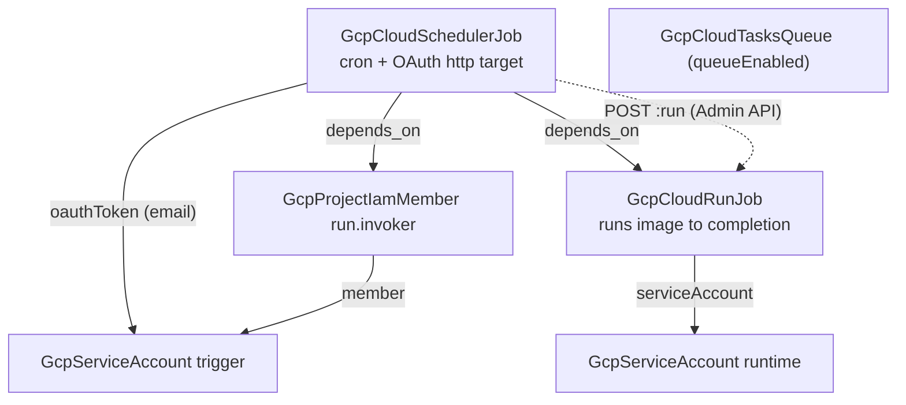

# GCP Scheduled Workloads

The batch layer that used to mean a cron VM — always on, hand-patched,
running everything as one over-privileged identity — is three managed
resources on GCP: a Cloud Run Job that runs a container to completion, a
Cloud Scheduler trigger that executes it on a cron expression, and the
IAM handshake between them. The handshake is the part everyone gets wrong
by hand: executing a job is an authenticated call to the Cloud Run Admin
API, which takes an OAUTH token (not the OIDC token you would use for a
service), signed as an identity that holds `run.invoker`. This chart
wires all of it, with separate least-privilege identities for the trigger
and the runtime, retry posture on both layers, and nothing running — or
billing — between executions.

An optional Cloud Tasks queue adds the asynchronous half of the batch
layer: work your services enqueue at request time and drain out-of-band
with managed rate limits and retries.

## What it deploys

| Resource | Kind | Purpose | Condition |
|----------|------|---------|-----------|
| The job | `GcpCloudRunJob` | The containerized batch workload | always |
| Runtime identity | `GcpServiceAccount` | Account the batch code executes as | always |
| Trigger identity | `GcpServiceAccount` | Account Cloud Scheduler calls as | always |
| Invoker grant | `GcpProjectIamMember` | `run.invoker` for the trigger identity | always |
| The schedule | `GcpCloudSchedulerJob` | Cron trigger executing the job via the Admin API | always |
| Dispatch queue | `GcpCloudTasksQueue` | Rate-controlled async work dispatch | `queueEnabled` |

## Architecture

The two identities deploy first; the job waits for its runtime account;
the schedule deploys last, behind two explicit `depends_on` edges — the
job (its invocation URI embeds the job's name, but no output flows, so
the edge is declared) and the invoker grant (the permission must be
effective before the first trigger fires). The invocation URI is
assembled from parameters: region, project, and job name are all
parameters of this chart, and the job's cloud-side name is set explicitly
from the same value.

## Parameters

| Parameter | Default | When to change |
|-----------|---------|----------------|
| `gcp_project_id` | `my-gcp-project` | Always. |
| `region` | `us-central1` | Where the job (and its data) lives. |
| `workload_name` | `nightly-etl` | Always — names the job and everything beside it. |
| `image` | Google's public hello image | Replace with your batch image; exit 0 is success. |
| `cpu` / `memory` | `1` / `512Mi` | Size for the work; OOM kills count as failed attempts. |
| `task_timeout_seconds` | `3600` | Above the honest worst case, up to 86400. |
| `task_max_retries` | `0` | Raise only for idempotent work. |
| `schedule` | `0 3 * * *` | Unix cron, evaluated in `time_zone`. |
| `time_zone` | `Etc/UTC` | IANA zone; DST zones shift with the season. |
| `queueEnabled` | `false` | On when request-time work should move out of the request path. |
| `queue_name` | `background-jobs` | Permanent by design (7-day ID reservation on delete). |

## After deployment

1. **Ship the batch image.** Replace `image` with your container — the
   job runs its entrypoint to completion; a non-zero exit marks the
   attempt failed and consumes a retry.
2. **Grant the runtime what the work touches.** The runtime identity
   starts with nothing. Add additive `GcpProjectIamMember` grants (or
   resource-scoped grants where kinds exist) for the data the batch reads
   and writes.
3. **Run it once by hand** before trusting the cron:
   `gcloud run jobs execute <workload_name> --region <region>` — the same
   execution path the scheduler uses, minus the wait for 03:00.
4. **Enqueue against the queue** (when on) from your services with
   per-task HTTP targets and your app's identity; the queue applies
   managed dispatch and retry defaults until you tune them on the
   resource.

## Day-2 notes

- **Safe in place:** the cron expression, time zone, retry posture,
  image, cpu/memory, timeout — all update without recreating anything.
- **Scaling out:** raise `taskCount` and add `parallelism` on the job
  when the work shards by task index (each task sees its index in
  `CLOUD_RUN_TASK_INDEX`).
- **Two retry layers, two meanings:** the scheduler's `retryConfig`
  retries the *trigger call*; the job's `maxRetries` retries *tasks
  inside an execution*. A failed execution is not re-triggered until the
  next cron tick.
- **Pause the schedule** by editing the scheduler resource rather than
  deleting it — deletion and recreation is invisible to the job but loses
  the trigger's execution history.
- **The queue's name is deliberately permanent:** deleting the queue
  reserves its ID for up to 7 days, so treat `queue_name` as a decision,
  not a label.
