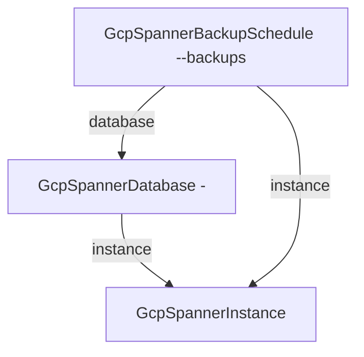

# GCP Spanner Application

Spanner removes the two failure classes relational teams plan around —
lost commits and maintenance windows — but only if the pieces around the
database are actually set up: capacity that matches the topology, a
point-in-time-recovery window wide enough to notice a mistake, and a
backup policy that exists somewhere a reviewer can see it. This chart
deploys that whole posture as one unit: a provisioned instance (fixed
processing units or managed autoscaling), a drop-protected database with
PITR, and an explicit cron-driven backup schedule — with GCP's invisible
instance-level default schedule deliberately turned off so the one in
your manifests is the only backup policy in force.

## What it deploys

| Resource | Kind | Purpose | Condition |
|----------|------|---------|-----------|
| Spanner instance | `GcpSpannerInstance` | The compute-and-replication envelope (regional or multi-region) | always |
| Application database | `GcpSpannerDatabase` | Drop-protected database with point-in-time recovery | always |
| Backup schedule | `GcpSpannerBackupSchedule` | Daily FULL backups with 31-day retention (both tunable) | always |

## Architecture

Ordering falls out of the references: the database deploys after the
instance, and the backup schedule after both. Capacity is the chart's
one structural toggle — `autoscalingEnabled` swaps the instance's fixed
`processingUnits` for Spanner's managed autoscaler bounded by the node
limits (the two are mutually exclusive by GCP's own contract).

## Parameters

| Parameter | Default | When to change |
|-----------|---------|----------------|
| `gcp_project_id` | `my-gcp-project` | Always — the project everything lives in. |
| `instance_name` | `app-spanner` | Always — immutable, and the prefix every resource name builds on. |
| `spanner_config` | `regional-us-central1` | The topology decision: regional (99.99%) vs multi-region (99.999%). Immutable. |
| `edition` | `ENTERPRISE` | STANDARD for cost-sensitive regional workloads; upgrades apply in place. |
| `processing_units` | `100` | Scale with load (1000 = 1 node; below 1000 in steps of 100). Ignored under autoscaling. |
| `autoscalingEnabled` | `false` | On when load is spiky enough that hand-tuning capacity becomes a chore. |
| `autoscaling_min_nodes` | `1` | The guaranteed capacity floor under autoscaling. |
| `autoscaling_max_nodes` | `3` | The cost ceiling under autoscaling. |
| `database_name` | `app` | The application database. Immutable. |
| `database_dialect` | `GOOGLE_STANDARD_SQL` | POSTGRESQL for teams porting Postgres apps/drivers. Immutable. |
| `version_retention_period` | `3d` | The PITR window (1h–7d). Widen before you need it. |
| `backup_cron` | `0 2 * * *` | Daily at 02:00 UTC; Spanner also accepts 12-hourly, weekly, monthly. |
| `backup_retention` | `2678400s` (31d) | Up to 366 days (`31622400s`). |

## After deployment

1. **Apply your schema through migrations.** Spanner DDL is append-only
   after creation, and this chart deliberately does not template DDL —
   run your migration tool (or `gcloud spanner databases ddl update`)
   against `<instance>/<database>` as the first deploy step of your
   application.
2. **Point the application at the database** using the standard client
   libraries with database path
   `projects/<project>/instances/<instance>/databases/<database>` —
   Spanner clients authenticate with IAM, so grant your workload identity
   `roles/spanner.databaseUser` on the project (or tighter, per database).
3. **Verify the backup schedule took effect** after the first cron fire:
   `gcloud spanner backups list --instance=<instance>` — the first backup
   appears within one cadence of deploy.
4. **Watch CPU utilization** (console or Cloud Monitoring
   `spanner.googleapis.com/instance/cpu/utilization`): scale
   `processing_units` (or switch to autoscaling) when high-priority CPU
   sustains above 65% regional / 45% multi-region.

## Day-2 notes

- **Safe in place:** `processing_units`, the autoscaling bounds, edition
  upgrades, `version_retention_period`, backup cron and retention,
  drop/deletion protection flags.
- **Immutable by GCP:** the instance name and config (topology), the
  database name and dialect. These are the decisions to review before
  the first deploy, not after.
- **Two delete locks are on by design.** The database carries both GCP's
  drop protection and the IaC-side deletion guard; the instance refuses
  destroy while backups exist (`force_destroy` stays false). Tearing the
  stack down is a deliberate three-step: lift the flags, delete backups,
  destroy.
- **PITR and backups cover different windows.** The retention period
  rewinds the live database seconds-precisely inside its window (up to
  7 days); the backup schedule covers everything older, up to 366 days.
  Sizing one never substitutes for the other.
- **INCREMENTAL backups** halve the storage cost of frequent backups on
  ENTERPRISE and ENTERPRISE_PLUS editions, but each restore replays a
  chain; this chart ships FULL because a standalone restorable artifact
  is the safer default. Change `backupType` in the template if backup
  windows dominate your costs.
- **Multi-region configs change the autoscaling math** — the instance
  template pins the CPU target at 65% (regional guidance); lower it to
  45% when `spanner_config` is a multi-region config.

---

© Planton. Licensed under [Apache-2.0](https://github.com/plantonhq/planton/blob/main/LICENSE).
