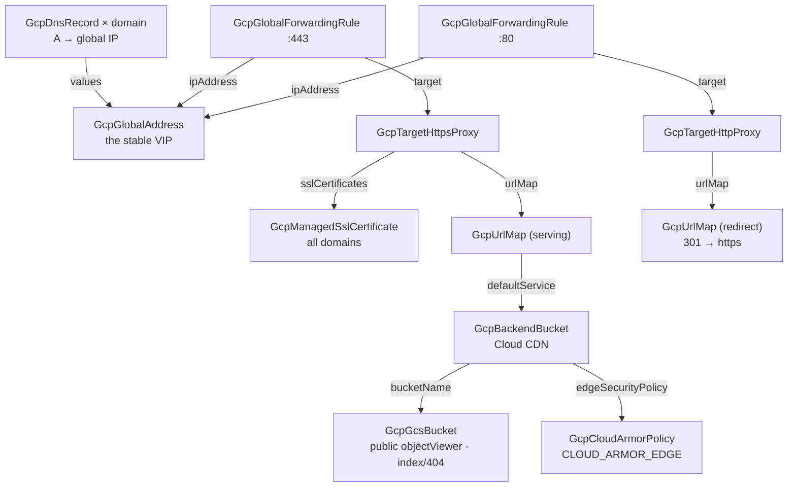

# GCP Static Website with CDN

Serving a folder of HTML properly on GCP takes nine resources most teams
discover one error message at a time: a bucket the public can read (but not
list or administer), a CDN-enabled backend in front of it, a managed
certificate that only activates once DNS already points at an IP that only
exists after the load balancer deploys, two URL maps (because a map carries
exactly one default target, the HTTPS-redirect needs its own), two proxies,
two forwarding rules sharing one address, and the A records that tie it
together. This chart deploys the whole chain with the ordering and reference
plumbing already right: upload your build output and the site is on the air —
cached at Google's edge, compressed, TLS-renewed forever, HTTP bounced to
HTTPS, and optionally shielded by Cloud Armor.

## What it deploys

| Resource | Kind | Purpose | Condition |
|----------|------|---------|-----------|
| Origin bucket | `GcpGcsBucket` | Public-read object store with index/404 config | always |
| CDN backend | `GcpBackendBucket` | Cloud CDN in front of the origin — caching, compression, stale-serving | always |
| Edge policy | `GcpCloudArmorPolicy` | `CLOUD_ARMOR_EDGE` IP/geo filter before the cache | `cloudArmorEnabled` |
| Serving URL map | `GcpUrlMap` | Every host and path to the CDN backend | always |
| Redirect URL map | `GcpUrlMap` | 301 from HTTP to HTTPS | always |
| Managed certificate | `GcpManagedSslCertificate` | TLS for every domain, renewed by Google | always |
| HTTPS proxy | `GcpTargetHttpsProxy` | Port-443 frontend | always |
| HTTP proxy | `GcpTargetHttpProxy` | Port-80 frontend serving the redirect | always |
| Global address | `GcpGlobalAddress` | The one stable IP DNS points at | always |
| Forwarding rules | `GcpGlobalForwardingRule` × 2 | :443 and :80 VIPs on the shared address | always |
| A records | `GcpDnsRecord` (one per domain) | Points each domain at the IP; activates the certificate | `dnsEnabled` |

## Architecture

Deployment order falls out of the references: the origin bucket, certificate,
redirect map, and address deploy in parallel first; then the backend, the
serving map, the proxies, the forwarding rules, and finally the DNS records —
which is exactly the order certificate activation needs.

## Parameters

| Parameter | Description | Default |
|-----------|-------------|---------|
| `gcp_project_id` | Project every resource lands in | `my-gcp-project` |
| `site_name` | Prefix for every serving resource's name | `static-site` |
| `bucket_name` | Origin bucket — globally unique across GCP | example — replace |
| `bucket_location` | Multi-region or region for the origin's bytes | `US` |
| `index_page` | Object served for directory paths | `index.html` |
| `not_found_page` | Object served on 404 (see SPA note below) | `404.html` |
| `forceDestroyEnabled` | Allow destroy while objects remain | `false` |
| `domains` | Every domain on the certificate + DNS (no wildcards) | `www.example.com` |
| `cloudArmorEnabled` | Edge IP/geo policy in front of the cache | `false` |
| `dnsEnabled` | Create the A records in the zone below | `true` |
| `dns_zone_name` | Existing Cloud DNS managed zone (resource name) | example — replace |

The deploying identity needs storage, compute load-balancer, and (with
`dnsEnabled`) DNS admin roles in the project. The org policy must permit
public buckets — this chart's origin is deliberately public-read.

## After deployment

1. **Upload the site.** Sync your build output to the origin:
   `gsutil -m rsync -r -d ./dist gs://<bucket_name>` (`-d` deletes remote
   files that no longer exist locally — the "deploy" semantics you want).
2. **Wait for the certificate.** With `dnsEnabled` on, the A records exist
   the moment the deploy finishes, and the managed certificate typically
   turns ACTIVE within 15–60 minutes of DNS propagating. With it off,
   create an A record per domain pointing at the deployed IP (visible on
   the `GcpGlobalAddress` resource's outputs) — the certificate stays
   PROVISIONING until every listed domain resolves to it. Until it is
   ACTIVE, HTTPS serves an error; HTTP already redirects.
3. **Verify**: `curl -I https://<domain>` — look for `200`, and request a
   cacheable asset twice to see `Age:` appear on the second response
   (proof the edge cache is serving it).
4. **Ship changes**: rsync again. Content propagates as cache entries
   expire (an hour by default); for an instant cutover invalidate the
   cache: `gcloud compute url-maps invalidate-cdn-cache
   <site_name>-url-map --path "/*"`.

## Day-2 notes

- **Safe to change in place**: CDN TTLs and cache mode, Cloud Armor rules,
  index/404 pages, uploading content (that is the point).
- **Changing `domains` replaces the certificate** — managed certificates
  are immutable. The old certificate serves until the replacement is
  ACTIVE, but plan domain changes as a deliberate rollout, not a casual
  edit. No wildcards: list each host.
- **Single-page apps**: set `not_found_page` to the same file as
  `index_page` so client-routed deep links load the app. The trade-off is
  honest 404s disappear (every miss returns the app with status 404 —
  fine for SPAs, wrong for document sites).
- **Cache behavior**: `CACHE_ALL_STATIC` honors `Cache-Control` headers
  your build pipeline sets and caches recognized static types otherwise.
  Fingerprinted assets (`app.3f9c2b.js`) can carry year-long max-age at
  build time; the chart's TTLs govern everything else.
- **Tightening the edge**: with `cloudArmorEnabled`, add deny/geo rules
  above the default-allow in the policy resource. Edge policies filter by
  client IP and geography only — they run before the cache, where nothing
  deeper exists yet.
- **Teardown**: the bucket refuses to destroy while it holds objects
  unless `forceDestroyEnabled` is on — empty it or flip the toggle
  deliberately. Everything else tears down cleanly in reverse reference
  order.
- **Cost**: the origin and serving pieces are cents; real cost follows
  egress, and the CDN makes that cheaper — cache hits bill at CDN egress
  rates (lower than bucket egress) and compression shrinks both.

---

© Planton. Licensed under [Apache-2.0](https://github.com/plantonhq/planton/blob/main/LICENSE).
