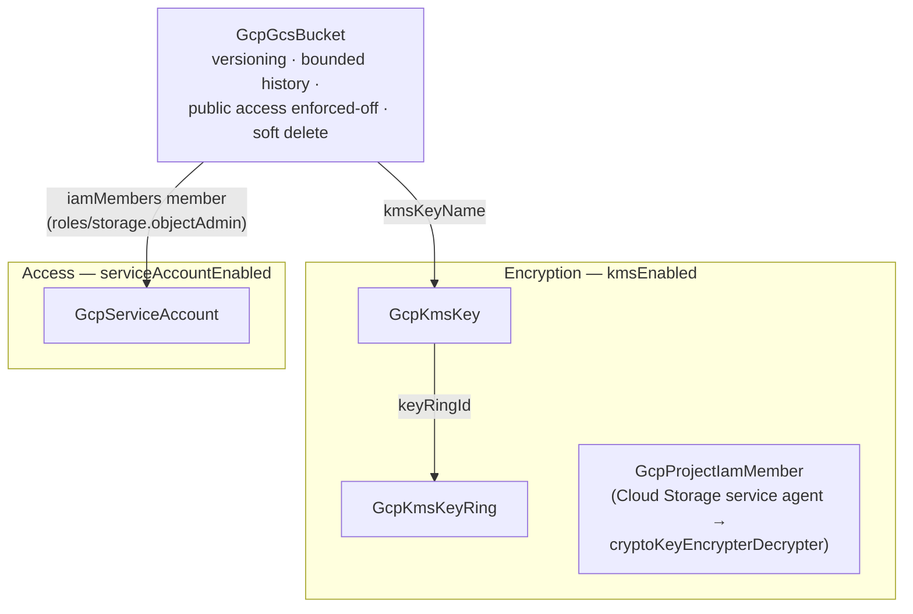

# GCP Terraform State Backend

Remote state is the first piece of infrastructure every Terraform/OpenTofu
team needs — and the one whose loss hurts the most. This chart deploys a GCS
state backend with the postures that matter already decided: object
versioning with bounded history (so corrupted or mis-migrated state is a
rollback, not an incident), uniform IAM-only access with public access
permanently blocked, a 7-day soft-delete safety net, an optional
customer-managed encryption key for organizations with key-custody
requirements, and an optional single-purpose service account so state access
stays independently auditable and revocable.

GCS needs no lock table: the backend takes an exclusive lock via a `.tflock`
object in the same bucket, so one bucket is the entire state backend.

## What it deploys

| Resource | Kind | Purpose | Condition |
|----------|------|---------|-----------|
| State bucket | `GcpGcsBucket` | Versioned, never-public home for state objects and backend locks | always |
| Key ring | `GcpKmsKeyRing` | Permanent container and IAM boundary for the state key | `kmsEnabled` |
| State key | `GcpKmsKey` | Customer-managed encryption key, 90-day rotation | `kmsEnabled` |
| Storage-agent KMS grant | `GcpProjectIamMember` | Lets the Cloud Storage service agent encrypt/decrypt with the key | `kmsEnabled` |
| State-access identity | `GcpServiceAccount` | Single-purpose account whose only power is object access on this bucket | `serviceAccountEnabled` |

## Architecture



Deployment order is derived from the references: the key ring deploys first,
then the key, then the bucket; the service account and the storage-agent
grant have no inbound references and deploy in the first layer. With both
toggles off, the chart is exactly one resource.

## Parameters

| Parameter | Description | Default |
|-----------|-------------|---------|
| `gcp_project_id` | Project that owns the backend (typically a small, tightly-controlled ops/seed project) | `my-gcp-project` |
| `bucket_name` | Globally unique bucket name; immutable | `my-org-terraform-state` |
| `location` | Multi-region (`US`, `EU`, `ASIA`) or region (`us-central1`); immutable; also places the KMS ring | `US` |
| `noncurrent_versions_to_keep` | Previous versions of each state file retained for recovery | `30` |
| `kmsEnabled` | Encrypt state under a customer-managed key (adds ring + key + agent grant) | `false` |
| `gcp_project_number` | Numeric project number — required only with `kmsEnabled` (identifies the Cloud Storage service agent) | — |
| `serviceAccountEnabled` | Create the dedicated state-access service account | `true` |
| `service_account_id` | Account ID for that identity | `terraform-state` |
| `serviceAccountKeyEnabled` | Also export a JSON key (long-lived credential — prefer keyless) | `false` |

## After deployment

### Point Terraform/OpenTofu at the bucket

```hcl
terraform {
  backend "gcs" {
    bucket = "my-org-terraform-state"
    prefix = "live/networking"   # one prefix per stack keeps states separated
  }
}
```

The identity running `init`/`plan`/`apply` needs object access on the bucket
— with `serviceAccountEnabled` that is the chart's service account
(impersonate it, federate to it, or use its exported key).

### Register it as a Planton StateBackend

To use this bucket as the state home for deployments run through Planton,
register it as a **StateBackend** (Terraform/OpenTofu → GCS type) from the
Planton desktop app or console: enter the bucket name and, for inline auth,
the state-access service account's JSON key (set
`serviceAccountKeyEnabled: true` to have the chart export one — its
`key_base64` stack output is the value to paste). With runner auth mode the
runner's own ambient credentials are used instead and no key is needed. Mark
the backend as the org default and every new cloud resource pins to it
automatically.

## Day-2 notes

- **Safe to change in place**: `noncurrent_versions_to_keep` (lifecycle
  rules), IAM grants, the key's rotation period.
- **Recreates the bucket**: `bucket_name`, `location`. Treat both as
  permanent; moving state is a deliberate migration, never a rename.
- **Enabling CMEK later** (`kmsEnabled: true`) re-encrypts nothing
  retroactively: existing state objects keep Google-managed encryption until
  the next apply rewrites them. IAM propagation for the storage-agent grant
  can take up to a minute — if the first CMEK-enabled deploy fails with a
  KMS permission error, re-run it.
- **Key ring and key names are permanent** in GCP: they survive destroy
  (versions are destroyed; the names can never be reused in that ring or
  location). Choose names you can live with.
- **Never delete a version manually to "fix" state.** Roll back by copying
  the desired noncurrent version over the live object, then run
  `terraform refresh`.
- **Costs**: versioned noncurrent state and soft-deleted objects are billed
  at normal storage rates; the lifecycle cap and the 7-day soft-delete
  window keep both bounded.
