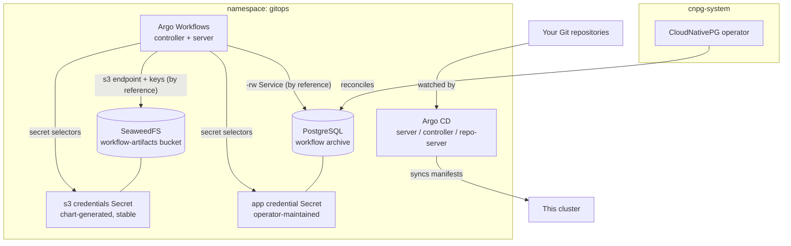

# Kubernetes GitOps Delivery Platform

Git as the deployment truth, from day one. Argo CD watches your
repositories and continuously reconciles the cluster to what they declare
— every change reviewed, merged, and then deployed by the platform rather
than a person with kubectl. Beside it, Argo Workflows runs the pipelines
that GitOps alone does not cover: container-native DAGs for builds, batch
jobs, and automation. The part teams usually get wrong is durability, and
this chart encodes it: workflow artifacts and archived step logs land on
an in-cluster S3 store whose generated credentials the controller consumes
by reference, and completed runs are archived to a CloudNativePG-managed
PostgreSQL so history outlives the workflow objects themselves. SSO is one
toggle away; the generated admin credential gets you in before that.

| Resource | Kind | Purpose | Conditional on |
|---|---|---|---|
| `<env>-gitops-ns` | KubernetesNamespace | The platform's shared home — owned once, joined by every tenant | always |
| `<env>-cnpg-operator` | KubernetesCloudNativePgOperator | The PostgreSQL engine (one per cluster) in `cnpg-system` | `archive_enabled` AND `install_cnpg_operator` |
| `<env>-gitops-db` | KubernetesPostgres | The workflow archive, bootstrapped with `workflows` under its owner role | `archive_enabled` |
| `<env>-gitops-artifacts` | KubernetesSeaweedFs | The S3 artifact store with the `workflow-artifacts` bucket declared | `artifact_store_enabled` |
| `<env>-argocd` | KubernetesArgocd | The GitOps control plane — API/UI server, controller, repo server | always |
| `<env>-argo-workflows` | KubernetesArgoWorkflows | The pipeline engine — controller + Argo server, wired to both stores | always |

**Prerequisite when `install_cnpg_operator` is false:** the cluster must
already run the CloudNativePG operator (any cluster provisioned by a
full-stack platform chart does).

## Architecture



Deployment layers: the namespace and (when installed) the operator deploy
first; the database waits for the operator (an explicit dependency edge)
and the namespace (by reference); the artifact store waits for the
namespace; Argo Workflows waits for both stores — its endpoint, bucket
credentials, archive host, and archive credentials references are the
ordering; Argo CD waits only for the namespace and deploys in parallel
with the stores.

## Parameters

| Param | Meaning | Default | Change when |
|---|---|---|---|
| `connection` | Kubernetes connection slug selecting the target cluster | `""` | The environment default is not the cluster you mean |
| `namespace` | Shared home of the whole platform | `gitops` | Running a second independent delivery platform on one cluster |
| `artifact_store_enabled` | In-cluster S3 store for artifacts + archived logs | `true` | Off only when artifacts belong in an external bucket you wire yourself |
| `archive_enabled` | PostgreSQL archive for completed runs (+ CR pruning) | `true` | Off keeps history in Workflow objects only — no pruning happens then |
| `install_cnpg_operator` | Bring the CloudNativePG operator | `true` | **Set false** on operator-ready clusters — a second install fights the resident one |
| `postgres_instances` | Archive PostgreSQL instances | `2` | `1` tolerable for history-only data — if losing history is tolerable |
| `postgres_disk_size` | Volume per database instance | `10Gi` | Completed-workflow volume ramps |
| `artifacts_disk_size` | Artifact store object-data volume | `20Gi` | Build outputs and logs accumulate until pruned |
| `argocd_domain` | Public Argo CD hostname (no scheme) for redirects/links | `""` | Set together with composed exposure |
| `sso_enabled` | OIDC single sign-on for Argo CD | `false` | Before the platform has real users |
| `sso_oidc_issuer` | The OIDC issuer to delegate login to | placeholder | **MUST change** when SSO is on — Keycloak realm URL from the identity platform chart |
| `sso_oidc_client_id` | The registered OAuth client ID | `argocd` | Matching your IdP registration |
| `sso_oidc_client_secret_secret_name` | Pre-created Secret carrying the client secret (key `clientSecret`, label `app.kubernetes.io/part-of: argocd`) | `""` | Confidential clients; empty = PKCE public client |

## After deployment

1. **Log in to Argo CD.** The application generated the admin password at
   first start:

   ```bash
   kubectl -n gitops get secret argocd-initial-admin-secret \
     -o jsonpath='{.data.password}' | base64 -d
   ```

   Reach the UI with the resource's exported port-forward command
   (https://localhost:8080, user `admin`), or through the exposure you
   compose over the exported server Service.

2. **Declare your first Application** — from here on, Git drives:

   ```yaml
   apiVersion: argoproj.io/v1alpha1
   kind: Application
   metadata:
     name: guestbook
     namespace: gitops
   spec:
     project: default
     source:
       repoURL: https://github.com/argoproj/argocd-example-apps
       path: guestbook
       targetRevision: HEAD
     destination:
       server: https://kubernetes.default.svc
       namespace: guestbook
     syncPolicy:
       automated: {}
       syncOptions: [CreateNamespace=true]
   ```

   Apply it like any manifest (KubernetesManifest, kubectl, or a repo
   Argo CD already watches). Private repositories register through
   Secrets labeled `argocd.argoproj.io/secret-type: repository` — never
   through this chart.

3. **Run your first workflow** and watch both durability seams work:

   ```bash
   kubectl -n gitops create -f https://raw.githubusercontent.com/argoproj/argo-workflows/main/examples/hello-world.yaml
   ```

   The step's log lands in the artifact store; when the run completes,
   its record lands in the archive. The Argo Workflows UI (port-forward
   the exported server Service, http://localhost:2746) shows history even
   after the CR is pruned.

4. **Turn on SSO** once your identity provider is up (the Kubernetes
   Identity and Access Platform chart pairs naturally): register an
   `argocd` client in Keycloak, pre-create the client-secret Secret
   (key `clientSecret`, label `app.kubernetes.io/part-of: argocd`), set
   the three `sso_*` parameters and `argocd_domain`, redeploy — then
   verify SSO login works BEFORE disabling the local admin user on the
   deployed resource.

## Day-2 notes

- **Safe to change in place:** `postgres_disk_size` /
  `artifacts_disk_size` (grows only), `postgres_instances`, the SSO
  parameters, `argocd_domain`.
- **Flipping `archive_enabled` off later** stops archiving AND pruning —
  existing database history stays until you delete the resource; workflow
  objects then accumulate in etcd unless you configure TTLs.
- **Argo CD's Redis is a disposable cache** (bundled single pod). If a
  cache outage during node loss ever matters operationally, move the
  deployed resource to the `ha` arm (three nodes required) or the
  external-Valkey arm — a values change, no data migration involved.
- **CRDs are kept on uninstall, by design, on both products** — removing
  Argo CD's would delete every Application in the cluster; removing Argo
  Workflows' would delete every Workflow. Leave the keep defaults alone.
- **Workflow CRD install reaches the internet** (a hook Job downloads the
  full-schema CRDs from the chart's GitHub release). Air-gapped clusters
  set `crds.fullSchema: false` or mirror via `crds.baseUrl` on the
  deployed resource.
- **Pipeline cloud access** rides the runner ServiceAccount (exported as
  `workflow_service_account`) — annotate it for IRSA/workload identity;
  never widen the controller's identity.
- **Backups:** the archive database deploys without object-store backups
  (the Barman Cloud plugin requires cert-manager). Once cert-manager is
  present, enable `barman_cloud_plugin` on the operator and declare a
  `backup` block on the KubernetesPostgres resource.

---

© Planton. Licensed under [Apache-2.0](https://github.com/plantonhq/planton/blob/main/LICENSE).
