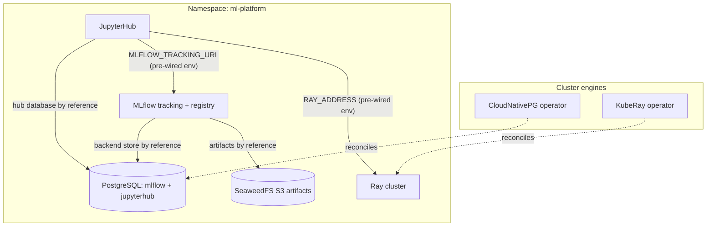

# Kubernetes ML Platform

Declare an ML platform in one manifest, on a cluster you already have:
JupyterHub gives every team member their own notebook server with a
persistent home, MLflow tracks every experiment and registers every model
with artifacts in durable S3 storage, and a Ray cluster provides the
distributed compute that training and tuning actually need. Underneath,
one CloudNativePG-managed PostgreSQL is bootstrapped with both backing
databases, and everything is secured by default — generated sign-in
credentials, token-guarded Ray APIs, no open doors. Notebooks open
pre-wired: the MLflow tracking URI and the Ray client address are already
in every user's environment.

| Resource | Kind | Purpose | Conditional on |
|---|---|---|---|
| `<env>-ml-ns` | KubernetesNamespace | The platform's shared home — owns the namespace every tenant joins | — |
| `<env>-cnpg-operator` | KubernetesCloudNativePgOperator | The PostgreSQL engine (cluster singleton, in `cnpg-system`) | `install_cnpg_operator` |
| `<env>-kuberay-operator` | KubernetesKubeRayOperator | Turns the Ray cluster declaration into running pods | `install_kuberay_operator` |
| `<env>-ml-db` | KubernetesPostgres | One HA PostgreSQL, two databases: `mlflow`, `jupyterhub` | — |
| `<env>-ml-artifacts` | KubernetesSeaweedFs | S3 artifact store — authenticated, `mlflow-artifacts` bucket pre-created | — |
| `<env>-mlflow` | KubernetesMlflow | Tracking server + model registry, basic auth on, artifacts proxied | — |
| `<env>-ray` | KubernetesRayCluster | Distributed compute — token-authenticated head + CPU worker group | — |
| `<env>-jupyterhub` | KubernetesJupyterHub | Per-user notebooks, hub state in PostgreSQL, pre-wired client env | — |

**Prerequisite when `install_cnpg_operator: false`:** the cluster must
already run the CloudNativePG operator (any cluster provisioned by a
full-stack platform chart does). Likewise, with
`install_kuberay_operator: false`, a resident KubeRay operator must watch
this chart's namespace or the Ray cluster declaration is silently never
reconciled.

## Architecture



Deployment layers: the namespace and the operators deploy first (the
database and the Ray cluster declare explicit dependencies on their
operators when this chart installs them); the database and the artifact
store deploy next, in parallel; MLflow, the Ray cluster and JupyterHub
deploy last — MLflow's and the hub's Secret references onto the database
and the store are the ordering edges, so every credential exists before
its consumer starts.

## Parameters

| Param | Meaning | Default | Change when |
|---|---|---|---|
| `connection` | Kubernetes connection slug selecting the target cluster | `""` (environment default) | The environment hosts multiple clusters |
| `namespace` | The one namespace the whole platform lives in | `ml-platform` | Running a second platform on the same cluster |
| `install_cnpg_operator` | Install the PostgreSQL operator (cluster singleton) | `true` | The cluster already runs CloudNativePG |
| `install_kuberay_operator` | Install the KubeRay operator (cluster-wide watch) | `true` | The cluster already runs KubeRay |
| `postgres_instances` | Database instances (1 primary + replicas) | `"2"` | `3` for production; `1` for evaluation only |
| `postgres_disk_size` | Disk per database instance | `10Gi` | Tracking metadata outgrows it (grows apply in place) |
| `artifacts_disk_size` | Disk for artifact object data | `30Gi` | Models/datasets outgrow it (grows apply in place) |
| `ray_version` | Ray version (drives the node image; ≥ 2.52.0) | `"2.52.0"` | Pin to the Ray your code uses — client and cluster must match |
| `ray_worker_replicas` | Ray CPU worker pods | `"1"` | Training/tuning load grows |
| `ray_worker_cpu` | CPUs per Ray worker (requests = limits) | `"2"` | Per-task parallelism needs |
| `ray_worker_memory` | Memory per Ray worker (requests = limits) | `4Gi` | Object spilling / OOM-killed tasks appear |
| `notebook_memory_limit` | Per-user notebook OOM ceiling | `2G` | Interactive workloads genuinely need more |

The tightest name budget: the Ray cluster derives `<env>-ray-head-svc`
and per-group worker pod names — environment names up to ~30 characters
clear every derived-name budget in this chart comfortably.

## After deployment

1. **Sign in to JupyterHub** — any username plus the generated shared
   password becomes that user's identity (home volume included):

```bash
kubectl get secret <env>-jupyterhub-auth -n ml-platform -o jsonpath='{.data.password}' | base64 -d
kubectl port-forward svc/proxy-public -n ml-platform 8080:80
```

2. **Log your first experiment** — `MLFLOW_TRACKING_URI` is already in
   the notebook environment; pair it with the MLflow admin credential
   (then create per-user accounts from it):

```bash
kubectl get secret <env>-mlflow-admin-auth -n ml-platform -o jsonpath='{.data.password}' | base64 -d
```

```python
import os, mlflow
os.environ["MLFLOW_TRACKING_USERNAME"] = "admin"
os.environ["MLFLOW_TRACKING_PASSWORD"] = "<from the secret>"
mlflow.set_experiment("first")
with mlflow.start_run():
    mlflow.log_metric("hello", 1.0)
```

3. **Connect to Ray** — `RAY_ADDRESS` is pre-wired; the API wants the
   bearer token from the Secret named after the Ray cluster:

```bash
kubectl get secret <env>-ray -n ml-platform -o jsonpath='{.data.auth_token}' | base64 -d
```

```python
import ray
ray.init(_metadata=[("authorization", "Bearer <token>")])
print(ray.cluster_resources())
```

4. **Watch the Ray dashboard** (token-guarded):

```bash
kubectl port-forward svc/<env>-ray-head-svc -n ml-platform 8265:8265
```

## Day-2 notes

- **Safe in place:** `postgres_instances`, disk sizes (grows only), Ray
  worker count and sizing, `notebook_memory_limit`.
- **User homes are data:** each user's `claim-<username>` PVC survives
  platform destroys but dies with the namespace — back homes up before
  deleting either.
- **Real notebook images:** the hub ships the evaluation sample image;
  point the deployed resource's single-user image at a
  jupyter/docker-stacks image (or your own, carrying matching Ray) for
  real work — spawn-menu profiles give teams a size/image menu.
- **A GPU worker group** is a values change on the deployed Ray cluster:
  a second group with accelerator limits, node selectors and
  tolerations. Pair it with `ray_version`'s `-gpu` image variant.
- **Durable Ray state:** losing the head pod loses running jobs by
  design here (results live in MLflow). If jobs themselves must survive
  head loss, enable the component's GCS fault-tolerance arm against a
  Redis-protocol store on the deployed resource.
- **Real identity for notebooks:** swap the shared password for
  GitHub/Google/OIDC on the deployed hub (a Keycloak composes
  naturally); admin users and allow-lists ride the same block.
- **Scaling MLflow** past one replica is a values change — both external
  seams (PostgreSQL + S3) are already in place, and the component
  enforces exactly that pairing.
- **Backups:** enable the CNPG operator's Barman Cloud plugin and
  declare a `backup` block on the database once cert-manager runs on the
  cluster; the artifact store's S3 endpoint is a natural target.
- **Irreversible:** the database bootstrap (two databases, the `ml`
  owner role) is fixed at first install.

---
© Planton. Licensed under [Apache-2.0](https://github.com/plantonhq/planton/blob/main/LICENSE).
