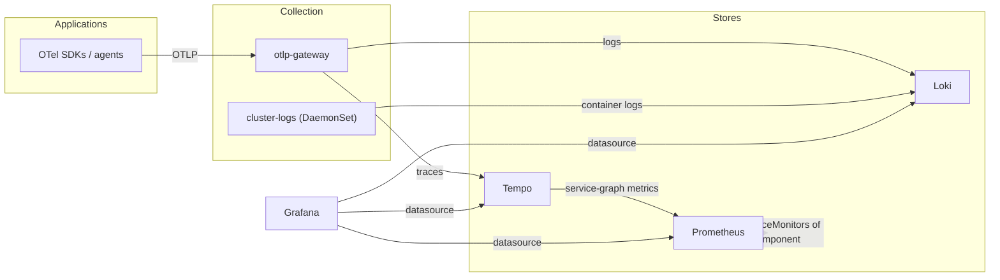

# Kubernetes Observability Stack

Metrics, logs, traces, and dashboards — yours, on your own cluster, in one
deploy. This chart composes the complete self-hosted observability platform
teams otherwise assemble over weeks (or rent at per-GB prices): Prometheus
with the community's curated Kubernetes alerts, Loki for logs, Tempo for
traces with service graphs derived from them, Grafana wired to all three at
deploy time, and an OpenTelemetry collection layer — a per-node log collector
and a stable OTLP endpoint applications push telemetry to. Every seam between
the pieces (datasource URLs, remote-write contracts, ingest endpoints) is
wired by the chart; nothing is left to connect by hand.

| Resource | Kind | Purpose | Conditional on |
|---|---|---|---|
| `<env>-observability-ns` | KubernetesNamespace | Owns the shared `observability` namespace | always |
| `<env>-metrics` | KubernetesKubePrometheusStack | Prometheus, operator, exporters, curated alerts | always |
| `<env>-grafana` | KubernetesGrafana | Dashboards over all three backends; sidecar-discovered dashboards | always |
| `<env>-loki` | KubernetesLoki | Log store (monolithic, persistent volume) | always |
| `<env>-tempo` | KubernetesTempo | Trace store; optional service-graph metrics | always |
| `<env>-otel-operator` | KubernetesOtelOperator | Reconciles the collectors below | always |
| `<env>-otlp-gateway` | KubernetesOtelCollector | The OTLP endpoint apps push logs/traces to | always |
| `<env>-cluster-logs-sa` + `-rbac` | KubernetesServiceAccount, KubernetesRbac | Identity + read-only grant for log enrichment | `cluster_logs_enabled` |
| `<env>-cluster-logs` | KubernetesOtelCollector | Per-node log collection into Loki | `cluster_logs_enabled` |

**Prerequisite**: cert-manager must run on the cluster — the OpenTelemetry
operator's admission webhooks are served with a cert-manager certificate.
The `production-cluster-baseline` chart provides it; deploy that first (or
any existing cert-manager installation satisfies this). Deploy one stack per
cluster.

## Architecture

Deployment layers: the namespace deploys first (everything references it);
the metrics stack next (Loki, Tempo, Grafana, and the operator all depend on
it — for CRDs, datasources, or remote-write); the collectors last (reconciled
by the operator, shipping into Loki and Tempo). The chart's references and
relationship edges make this ordering structural.

## Parameters

| Param | Meaning | Default | Change when |
|---|---|---|---|
| `connection` | Kubernetes connection slug selecting the target cluster | `""` (environment default) | The environment holds several clusters |
| `cluster_name` | "cluster" label stamped on every metric | `""` | **Recommended always** — multi-cluster telemetry is unlabelable retroactively |
| `metrics_retention` | Prometheus on-disk retention | `15d` | Longer lookback needed (grow disk too) |
| `metrics_disk_size` | Prometheus volume size | `50Gi` | More series / longer retention |
| `alertmanager_enabled` | Deploy Alertmanager | `true` | Alerts delivered by an external system |
| `managed_control_plane` | EKS/GKE/AKS posture: skip unreachable control-plane scrapers + their alert groups | `true` | **Set false on self-managed clusters** |
| `grafana_root_url` | Grafana's public URL | `""` | The moment Grafana is exposed |
| `loki_retention` | Log retention window | `30d` | Compliance or cost dictates otherwise |
| `loki_chunks_cache_memory_mb` | Loki chunks cache (MB) | `"1024"` | Query volume grows and nodes allow (upstream default 8192 needs ~10Gi nodes) |
| `loki_results_cache_memory_mb` | Loki results cache (MB) | `"256"` | Together with chunks cache |
| `tempo_retention` | Trace retention (h/m only) | `168h` | Longer trace lookback |
| `tempo_metrics_generator_enabled` | Service graphs + RED metrics from traces | `true` | Trace volume makes generation too costly |
| `cluster_logs_enabled` | Per-node log collection DaemonSet | `true` | Another agent already ships this cluster's logs |
| `otlp_gateway_replicas` | OTLP gateway replicas | `"2"` | Application telemetry volume grows |

## After deployment

1. **Open Grafana.** The component generates the admin credential into a
   Kubernetes Secret (see the Grafana resource's `admin_secret_name` output;
   `kubectl get secret -n observability` shows it). Reach the UI with the
   `port_forward_command` output, or expose it properly through the
   baseline's ingress/gateway — then set `grafana_root_url` to match. The
   Prometheus, Loki, and Tempo datasources are already there; the community
   Kubernetes dashboards ship with the metrics stack.
2. **Point one application at the gateway.** Configure its OTel SDK or agent
   with `OTEL_EXPORTER_OTLP_ENDPOINT=http://<env>-otlp-gateway.observability.svc.cluster.local:4318`
   (HTTP) or `:4317` (gRPC). Traces appear in Tempo; with the metrics
   generator on, the service graph builds itself from them.
3. **Watch logs arrive.** With `cluster_logs_enabled`, every container's
   logs are already flowing — query `{k8s_namespace_name="observability"}`
   in Grafana's Explore view against the Loki datasource to see the stack's
   own logs as the first proof.
4. **Route the first alert.** Alertmanager starts with its default (null)
   route — deliver somewhere real by adding a receiver configuration
   (Slack/PagerDuty/webhook) to the metrics stack's `alertmanager.configYaml`
   field. The curated rules are already evaluating.
5. **Ship a team dashboard.** Create a ConfigMap labeled
   `grafana_dashboard: "1"` containing a dashboard JSON anywhere in the
   cluster — the sidecar loads it within a minute. Teams own their
   dashboards next to their workloads; nobody edits this chart for them.

## Day-2 notes

- **Safe to change in place**: retentions, cache sizes, disk sizes (growable
  on expanding storage classes), replicas, `grafana_root_url`,
  `cluster_name` (relabels new data only), all toggles.
- **Grafana state persists** on its volume; dashboards shipped as ConfigMaps
  are re-discovered on any restart regardless.
- **Scaling Loki beyond one node**: the monolithic single-replica shape is
  deliberate for a per-cluster stack. Higher log volume means moving to
  object storage (S3/GCS/Azure) — the Loki component's storage arms carry
  it; expect a data migration, not an in-place flip.
- **Cost levers**: Prometheus disk (retention x series), Loki caches
  (memory), trace retention. The collectors are the cheap part.
- **The `observability` namespace is long-lived**: the metrics stack's CRDs
  (kept on uninstall, upstream-conventional) and the operator's retained
  collector CRDs anchor to cluster scope; treat the stack as infrastructure,
  not an app to reinstall casually.
- **Extend by composition**: more collectors (e.g. a dedicated pipeline per
  team, kubelet/cluster metrics via OTel) are additional
  KubernetesOtelCollector resources against the same operator; SigNoz-style
  all-in-one is a different philosophy served by its own components.

---

© Planton. Licensed under [Apache-2.0](https://github.com/plantonhq/planton/blob/main/LICENSE).
