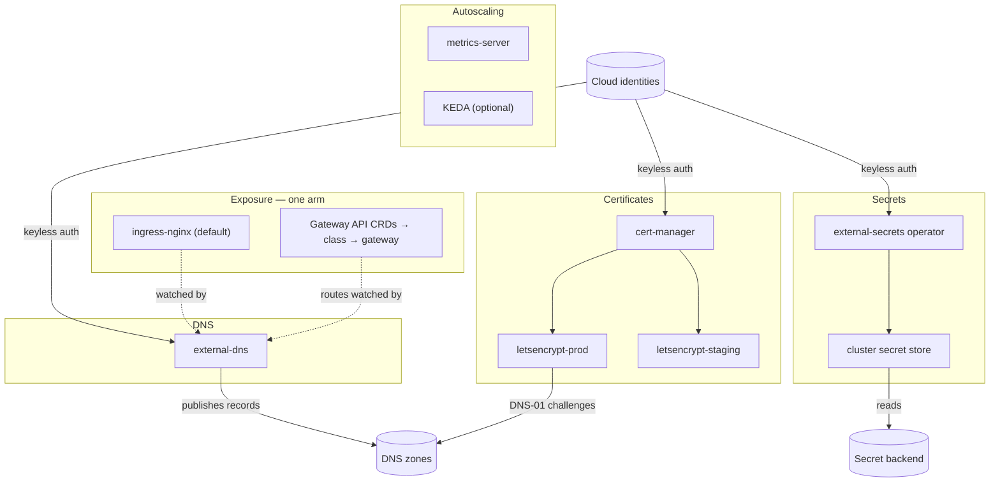

# Kubernetes Production Cluster Baseline

Turn an existing Kubernetes cluster into a production platform in one deploy.
This chart installs the layer every team otherwise wires by hand over days —
and wires it together: automatic TLS certificates from Let's Encrypt, DNS
records published for every exposed service, a single traffic entry point
(ingress-nginx or Gateway API), cloud secrets synced into the cluster as
native Secrets, the metrics API that autoscaling depends on, and optional
event-driven autoscaling — with keyless cloud authentication throughout and
every cross-cloud combination (an EKS cluster publishing DNS to Cloudflare, a
GKE cluster reading AWS Secrets Manager) expressed as a values choice.

| Resource | Kind | Purpose | Conditional on |
|---|---|---|---|
| `<env>-cert-manager` | KubernetesCertManager | Certificate machinery; owns the `cert-manager` namespace | always |
| `<env>-letsencrypt-prod` | KubernetesClusterIssuer | Real, browser-trusted certificates (rate-limited) | always |
| `<env>-letsencrypt-staging` | KubernetesClusterIssuer | Unlimited practice issuer — prove issuance here first | always |
| `<env>-external-dns` | KubernetesExternalDns | Publishes DNS records for exposed services and routes | always |
| `<env>-ingress-nginx` | KubernetesIngressNginx | The cluster's default IngressClass + cloud LoadBalancer | `use_gateway_api: false` |
| `<env>-gateway-api-crds` | KubernetesGatewayApiCrds | Gateway API standard-channel CRDs | `use_gateway_api: true` |
| `<env>-gateway-class` | KubernetesGatewayClass | Binds Gateways to your implementation | `use_gateway_api: true` |
| `<env>-gateway-namespace` | KubernetesNamespace | Home for the shared Gateway | `use_gateway_api: true` |
| `<env>-gateway` | KubernetesGateway | The shared HTTP entry point routes attach to | `use_gateway_api: true` |
| `<env>-external-secrets` | KubernetesExternalSecretsOperator | Syncs cloud secrets into Kubernetes Secrets | `external_secrets_enabled` |
| `<env>-secret-store` | KubernetesClusterSecretStore | Cluster-wide store: AWS SM, GCP SM, Azure KV, or Vault | `external_secrets_enabled` |
| `<env>-metrics-server` | KubernetesMetricsServer | The resource-metrics API for `kubectl top` and HPA | `metrics_server_enabled` |
| `<env>-keda` | KubernetesKeda | Event-driven autoscaling incl. scale-to-zero | `keda_enabled` |

This chart installs cluster-wide singletons (cert-manager, external-secrets,
metrics-server, KEDA all fix their release names and cluster-global surfaces
upstream). Deploy it **once per cluster**.

## Architecture

Deployment layers (the platform's dependency graph derives this from the
references and relationship edges in the templates): cert-manager, external-dns,
the exposure arm, the external-secrets operator, and metrics-server deploy in
parallel; the ClusterIssuers wait for cert-manager; the ClusterSecretStore
waits for the operator; the Gateway waits for its class, CRDs, and namespace.

## Parameters

| Param | Meaning | Default | Change when |
|---|---|---|---|
| `connection` | Kubernetes connection slug selecting the target cluster | `""` (environment default) | The environment holds several clusters |
| `dns_provider` | Where DNS records and DNS-01 challenges go | `route53` | Zones live in Cloud DNS / Azure DNS / Cloudflare |
| `dns_zone_names` | Planton resource names of the managed zones | `[my-dns-zone]` | **Always** — set your zone resources |
| `dns_domains` | Domain suffixes external-dns may manage | `[example.com]` | **Always** — set your real domains |
| `dns_txt_owner_id` | Record-ownership ID; unique per cluster per zone | `platform` | More than one cluster shares a zone |
| `acme_email` | Let's Encrypt account email | placeholder | **Always** — use a team alias |
| `acme_http01_enabled` | Adds an opt-in HTTP-01 solver (label `acme-solver: http01`) | `false` | Certificates for domains outside your zones |
| `use_gateway_api` | Gateway API arm instead of ingress-nginx | `false` | Your platform standardizes on Gateway API |
| `ingress_replicas` | ingress-nginx controller replicas | `"2"` | Higher traffic / larger clusters |
| `gateway_controller_name` | controllerName of your Gateway API implementation | NGINX Gateway Fabric's | Gateway arm with a different implementation |
| `workload_identity_provider` | Keyless auth flavor: `eks`, `gke`, `aks`, `none` | `none` | **Always on EKS/GKE/AKS** |
| `cert_manager_identity_name` | Identity resource for DNS-01 challenges | `""` | With workload identity |
| `external_dns_identity_name` | Identity resource for record management | `""` | With workload identity |
| `external_secrets_identity_name` | Identity resource for secret reads | `""` | With workload identity |
| `aws_region` | Region for Route 53 client + AWS SM reads | `us-east-1` | AWS arms in another region |
| `gcp_project_id` | Project for Cloud DNS / GCP SM | placeholder | Either GCP arm selected |
| `azure_subscription_id` / `azure_resource_group` | Azure DNS zone coordinates | placeholders | `azure_dns` arm |
| `azure_tenant_id` | Entra tenant for Azure workload identity / Key Vault | `""` | Azure arms |
| `cloudflare_api_token` | Zone-scoped API token | `""` | `dns_provider: cloudflare` |
| `external_secrets_enabled` | Install ESO + the cluster store | `true` | Another secrets mechanism owns the cluster |
| `secret_store_backend` | AWS SM / GCP SM / Azure KV / Vault | `aws_secrets_manager` | Secrets live elsewhere |
| `azure_key_vault_url`, `vault_server`, `vault_auth_role` | Backend coordinates | placeholders | Matching backend selected |
| `metrics_server_enabled` | Install metrics-server | `true` | **Turn off on GKE** (built in) |
| `metrics_server_kubelet_insecure_tls` | Skip kubelet TLS verification | `false` | kind / k3s / kubeadm without cert rotation |
| `keda_enabled` | Install KEDA | `false` | First event-scaled workload arrives |

## After deployment

1. **Prove certificate issuance against staging first.** Create a Certificate
   selecting `<env>-letsencrypt-staging`, watch it become Ready, then switch
   the issuer name to `<env>-letsencrypt-prod`. Staging has no meaningful rate
   limits; production does — this order protects your domain's quota.
2. **Expose the first service.** With the default arm, create an Ingress (no
   class annotation needed — nginx is the cluster default) with a hostname
   under `dns_domains`; external-dns publishes the record and the
   `cert-manager.io/cluster-issuer: <env>-letsencrypt-prod` annotation gets it
   a certificate. With the Gateway arm, attach an HTTPRoute to
   `<env>-gateway` from any namespace.
3. **Gateway arm only: install your Gateway API implementation** (NGINX
   Gateway Fabric, Istio, Envoy Gateway) and confirm its controllerName
   matches `gateway_controller_name` — the Gateway stays unprogrammed until
   an implementation claims its class. Add HTTPS listeners as applications
   need them: create a Certificate from the in-chart issuers, then add a
   listener referencing its secret.
4. **Sync the first secret.** Create an ExternalSecret referencing
   `<env>-secret-store` and a key that exists in the backend; a native
   Kubernetes Secret appears alongside it.
   For the `vault` backend, bind the role first:
   `vault write auth/kubernetes/role/<vault_auth_role>
   bound_service_account_names=<operator SA>
   bound_service_account_namespaces=external-secrets policies=<read policy>`.
5. **Grant the identities** (workload-identity mode): the cert-manager
   identity needs TXT write on the zones (for challenges), external-dns needs
   record write on the zones, external-secrets needs read on the store.
   Narrow grants per controller — that is why the chart takes three identity
   names instead of one.

## Day-2 notes

- **Safe to change in place**: `dns_domains`, `dns_txt_owner_id`, replica
  counts, all toggles, identity bindings, `acme_email` (re-registers the
  ACME account).
- **Immutable / destructive**: `gateway_controller_name` recreates the
  GatewayClass. The `cert-manager`, `external-secrets`, and `keda` namespaces
  are effectively permanent — their kept CRDs pin release ownership, so
  moving namespaces means deleting kept CRDs (and every CR built on them).
- **Switching exposure arms** (`use_gateway_api`) replaces the entry point:
  the cloud LoadBalancer changes and published DNS records move with the
  watched sources. Plan a traffic migration, not a flip.
- **DNS deletion posture**: external-dns runs `upsert-only` — records for
  deleted services are left behind by design (safe for shared zones). Clean
  up manually, or take over the zone fully with a dedicated instance in
  `sync` policy.
- **Cost levers**: the ingress LoadBalancer is the only cloud spend this
  chart creates directly; everything else is cluster compute.
- **Extend by composition**: additional DNS providers on one cluster =
  deploy a second KubernetesExternalDns with a distinct `txt_owner_id`;
  team-scoped secret stores = add KubernetesSecretStore resources next to
  the cluster-wide one.

---

© Planton. Licensed under [Apache-2.0](https://github.com/plantonhq/planton/blob/main/LICENSE).
