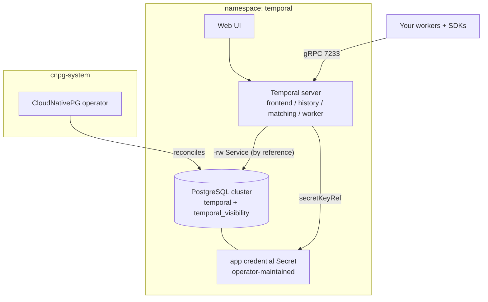

# Kubernetes Self-Hosted Temporal

Your own Temporal — the durable workflow engine behind long-running business
logic, saga orchestration, human-in-the-loop flows, and AI-agent pipelines —
deployed on your cluster with the database wiring already right. Temporal
famously needs two databases prepared before its server starts, a credential
the server must read at runtime, and a schema setup that wants ownership
rights without server-wide privileges; this chart encodes that exact
composition: a CloudNativePG-managed PostgreSQL cluster bootstrapped with
both stores under one least-privilege owner role, the credential flowing by
reference through the operator-maintained Secret, and the server co-located
with its database because that is what Kubernetes secret access requires.
The Web UI is on, and your first Temporal namespace is created declaratively
— a worker can connect the moment the deploy finishes.

| Resource | Kind | Purpose | Conditional on |
|---|---|---|---|
| `<env>-temporal-ns` | KubernetesNamespace | The stack's shared home — owned once, joined by both tenants | always |
| `<env>-cnpg-operator` | KubernetesCloudNativePgOperator | The PostgreSQL engine (one per cluster) in `cnpg-system` | `install_cnpg_operator` |
| `<env>-temporal-db` | KubernetesPostgres | HA PostgreSQL bootstrapped with `temporal` + `temporal_visibility` | always |
| `<env>-temporal` | KubernetesTemporal | The four server services, schema Jobs, Web UI, admin tools | always |

**Prerequisite when `install_cnpg_operator` is false:** the cluster must
already run the CloudNativePG operator (any cluster provisioned by a
full-stack platform chart does). With the toggle on — the default — this
chart brings its own.

## Architecture



Deployment layers: the namespace and (when installed) the operator deploy
first; the database waits for the operator (an explicit dependency edge)
and the namespace (by reference); Temporal waits for the database — its
host and password-Secret references are the ordering. The schema Jobs run
before the server starts, and the namespace-create Jobs after.

## Parameters

| Param | Meaning | Default | Change when |
|---|---|---|---|
| `connection` | Kubernetes connection slug selecting the target cluster | `""` | The environment default is not the cluster you mean |
| `namespace` | Shared home of the database and server | `temporal` | Running a second independent stack on one cluster |
| `install_cnpg_operator` | Bring the CloudNativePG operator | `true` | **Set false** on operator-ready clusters — a second install fights the resident one |
| `postgres_instances` | PostgreSQL instances (primary + replicas) | `2` | `3` for the production convention; `1` only for evaluation |
| `postgres_disk_size` | Volume size per instance | `10Gi` | Growth is in-place; shrinks are rejected |
| `history_shards` | Temporal history shards | `512` | **IMMUTABLE** — pick for the load you will grow into, before first deploy |
| `temporal_namespaces` | Temporal namespaces created declaratively | `default` | Add one per team/domain that needs isolation |
| `namespace_retention` | Closed-workflow retention per namespace | `3d` | Auditability needs outweigh database growth |
| `web_ui_enabled` | Deploy the Web UI | `true` | Headless, SDK/CLI-driven installations |
| `service_monitor_enabled` | Prometheus ServiceMonitors per service | `false` | **Only** when the Prometheus Operator CRDs exist — the deploy fails without them |

## After deployment

1. **Open the Web UI.** It stays ClusterIP by design; reach it with the
   Temporal resource's exported port-forward command, or:

   ```bash
   kubectl -n temporal port-forward svc/<env>-temporal-web 8080:8080
   ```

   Browse to http://localhost:8080 — the `default` namespace is already
   there.

2. **Connect your first worker.** In-cluster workers dial the frontend
   Service directly (the resource's `frontend_endpoint` output):

   ```
   <env>-temporal-frontend.temporal.svc.cluster.local:7233
   ```

3. **Drive it from the CLI.** The admin-tools pod ships with `temporal`
   pre-installed and pre-wired:

   ```bash
   kubectl -n temporal exec -it deploy/<env>-temporal-admintools -- \
     temporal workflow list --namespace default
   ```

4. **Expose the UI properly (optional).** Keep it internal, or route it
   through your cluster's ingress/Gateway API entry point over the
   `web_ui_service` output — this chart deliberately creates no exposure
   of its own.

## Day-2 notes

- **`history_shards` is a one-way door.** It is baked into the database
  schema at first install; every other parameter here can evolve, this one
  cannot. Size it before the first deploy.
- **Safe to change in place:** `postgres_disk_size` (grows only),
  `postgres_instances`, `temporal_namespaces` (additions run as idempotent
  Jobs), `namespace_retention`, `web_ui_enabled`,
  `service_monitor_enabled`.
- **Scaling the server:** the four services scale independently — history
  is the stateful heavy-lifter. Set per-service replicas and resources on
  the deployed KubernetesTemporal resource as load grows.
- **Backups:** the database deploys without object-store backups because
  the backup path (CloudNativePG's Barman Cloud plugin) requires
  cert-manager on the cluster. Once cert-manager is present, enable
  `barman_cloud_plugin` on the operator and declare a `backup` block on
  the KubernetesPostgres resource — WAL archiving starts immediately.
- **Long-term history:** retention deletes closed workflows from the
  database. When you need them beyond retention, configure Temporal
  archival (S3/GCS) on the deployed resource rather than stretching
  retention — the database is the wrong place for cold history.
- **Failover drills:** the -rw Service re-points automatically when the
  primary is lost; Temporal reconnects through it. With
  `postgres_instances: 1` there is nothing to fail over to.

---

© Planton. Licensed under [Apache-2.0](https://github.com/plantonhq/planton/blob/main/LICENSE).
