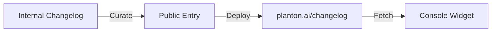

Keeping up with a fast-moving platform shouldn't require reading release notes buried in a repository. Starting today, every meaningful change to the Planton platform — new cloud resources, console improvements, API enhancements, and bug fixes — is published here as a human-readable changelog entry.

## Why a Public Changelog?

Planton ships improvements continuously. Until now, that progress was only visible in internal engineering changelogs and commit histories. A public changelog bridges that gap:

- **Transparency** — See exactly what changed and when
- **Planning** — Know when a feature you've been waiting for lands
- **Trust** — Understand our pace and priorities

## How It Works

Every changelog entry goes through a curation step. Internal engineering changelogs capture implementation details; the public changelog distills those into what matters to you as a user.

## What to Expect

Each entry includes:

- A **category** badge — feature, improvement, fix, or breaking change
- **Tags** indicating which part of the platform is affected
- A concise description of the change and why it matters

You can filter by category, search by keyword, or expand any entry to read the full details right here on this page.

## Stay Updated

The changelog is accessible from the top navigation under **Resources**. The console dashboard will also surface the most recent entries so you never miss an update.
