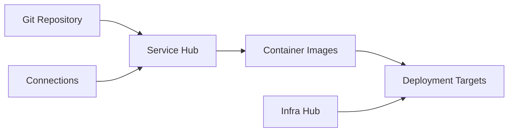

# Service Hub

Service Hub is Planton's application delivery half — Vercel for Backend, In Your Own Cloud. It handles the full journey from Git push to production deployment — connecting repositories, building container images, and deploying to Kubernetes, AWS ECS, Google Cloud Run, or Cloudflare Workers.

Pipelines are powered by Tekton and triggered automatically by Git commits. Builds use Cloud Native Buildpacks for zero-config language detection or custom Dockerfiles for full control.

<!-- SCREENSHOT: Service Hub services list
  Page: /orgs/{org}/services
  Action: Show the services list with at least 2-3 services and their pipeline status
  Focus: The service list showing names, repositories, and latest pipeline status
  Alt: Service Hub landing page showing deployed services with Git repository links and pipeline status indicators
-->

## Core Concepts

### Services

A Service is the configuration bridge between a Git repository and a deployment target. It defines what to build, how to build it, and where to deploy it. Services support monorepo configurations with per-service trigger paths and project roots.

[Learn about Services](/docs/ci-cd/what-is-a-service)

### Pipelines

Automated CI/CD workflows triggered by Git commits. Each pipeline clones the code, builds a container image, pushes it to a registry, and deploys the service. Pipelines are managed by the platform or self-managed using custom Tekton definitions.

[Learn about Pipelines](/docs/ci-cd/pipelines)

### Build Methods

How your code gets built into a container image. Options include Cloud Native Buildpacks (auto-detect language and framework), Dockerfiles, and custom Tekton pipelines.

[Learn about Build Methods](/docs/ci-cd/build-methods)

### Deployment Targets

Where your services run. Service Hub deploys to Kubernetes (EKS, GKE, AKS), AWS ECS, Google Cloud Run, and Cloudflare Workers.

[Learn about Deployment Targets](/docs/ci-cd/deployment-targets)

### Deployment Environments

Multi-environment support for deploying services across dev, staging, and production. Each environment has its own configuration, secrets, and deployment history.

[Learn about Deployment Environments](/docs/ci-cd/deployment-environments)

### Self-Managed Pipelines

Bring your own Tekton pipeline while retaining platform deployment orchestration, status tracking, and manual approval gates.

[Learn about Self-Managed Pipelines](/docs/ci-cd/self-managed-pipelines)

### Secrets and Variables

Runtime configuration management through organization-scoped and environment-scoped secrets and variables. Secrets are encrypted with envelope encryption and decrypted just-in-time in the Runner. Variables support literal values or dynamic references to infrastructure outputs.

[Learn about Secrets](/docs/secrets)

### Ingress

DNS, domain routing, and load balancer configuration for exposing services to traffic.

[Learn about Ingress](/docs/ci-cd/ingress)

### Monorepo Support

Configure multiple services from a single repository with smart triggers, sparse checkout, and per-service project roots.

[Learn about Monorepo Support](/docs/ci-cd/monorepo-support)

## How Service Hub Fits in the Platform

- **Infra Hub** provisions the infrastructure where services run (Kubernetes clusters, ECS clusters, etc.)
- **Service Hub** builds and deploys applications to that infrastructure
- **Connections** provide Git provider and container registry credentials

## Getting Started

- [Getting Started Guide](/docs/ci-cd/getting-started) — Deploy your first service
- [What is a Service?](/docs/ci-cd/what-is-a-service) — Understand the core concept
- [Pipelines](/docs/ci-cd/pipelines) — Learn the CI/CD workflow
- [Deployment Stage](/docs/ci-cd/deployment-stage) — Understand deployment execution
- [Kubernetes Dashboard](/docs/ci-cd/kubernetes-dashboard) — Monitor and debug running services
