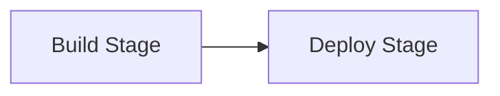

# Pipelines

Every time you push code to a connected repository, Planton runs a pipeline — an automated workflow that builds your code into a deployable artifact and rolls it out to your configured environments. Pipelines are the engine behind Service Hub: they take a Git commit and turn it into a running deployment, handling image building, artifact storage, and multi-environment rollout without manual intervention.

## Why Pipelines Exist

Without pipelines, deploying a service means manually building a container image, pushing it to a registry, updating deployment manifests, and applying them to each environment — repeating the process for every commit and every target. Pipelines automate this entire path. You push code, and your service is built using your configured method, and deployed to the environments you specified — in order, with approval gates where you need them.

## How a Pipeline Works

A pipeline progresses through two stages:



### Build Stage

The build stage transforms your source code into a deployable artifact. For platform-managed pipelines, this includes:

1. **Clone** — Fetch the repository (with sparse checkout for monorepos).
2. **Build** — Create the artifact using your configured build method — Cloud Native Buildpacks or Dockerfile for container images, or bundling for Cloudflare Workers.
3. **Push** — Store the artifact in your configured container registry or R2 bucket.

Build logs stream in real time through the web console and CLI. If the build fails, diagnostic information is available in the pipeline detail view.

For self-managed pipelines, the build stage runs your custom Tekton pipeline instead. See [Self-Managed Pipelines](/docs/ci-cd/self-managed-pipelines).

### Deploy Stage

The deploy stage rolls out the built artifact to each configured environment. Environments are deployed sequentially, following your organization's promotion policy (for example: dev, then staging, then production).

For each environment, the deploy stage creates a Stack Job — an atomic infrastructure operation that provisions the cloud resource for that deployment target. The pipeline waits for each environment to complete before proceeding to the next. If a deployment fails, subsequent environments are skipped.

This sequential model exists for a reason: each environment can depend on the previous one succeeding (you do not want a broken build reaching production), and failure at any stage stops the rollout cleanly rather than leaving partial deployments across environments.

<!-- SCREENSHOT: Pipeline detail view
  Page: /orgs/{org}/service/{serviceId} (Pipelines tab, specific pipeline)
  Action: Show a pipeline in progress with build stage completed and deploy stage running
  Focus: The pipeline detail view showing build and deploy stages with task status
  Alt: Pipeline detail view showing completed build stage and in-progress deploy stage with per-environment deployment tasks
-->

## Pipeline Triggers

### Branch Pushes

By default, pushes to the service's default branch trigger a pipeline. You can configure additional branches in the pipeline settings — only pushes to configured branches will trigger builds.

### Pull Requests

Pull request pipelines can be configured independently for two levels:

- **Build only** — The pipeline builds the artifact but does not deploy it. Useful for validating that the code compiles and the image builds successfully before merging.
- **Build and deploy** — Every pull request gets its own **preview environment**: a real, short-lived environment named `{service}-pr-{number}`, born from the environment the PR's target branch deploys to. The changed service deploys into it alone — configuration references resolve against the base environment's stable instances — and rollout verification stamps a working URL that you, or the agent that authored the pull request, can check before review. Closing the PR destroys the preview's cloud resources first and its records after; an untouched preview expires on its own (72 hours by default, tunable per service with `previewTtlHours`), so an abandoned pull request never leaks cloud spend.

For kustomize-maintained services, preview deploys open when the repository authors a `previews/<env>` directory in its `_kustomize` tree declaring what previews change. Without one, PR pipelines build and skip the deploy, naming the exact path to author. Check any pull request's preview with one call:

```bash
planton service previews my-service --pr 123
```

The answer carries the preview's phase in plain words (building, live, torn down, …), the verified URL, and the rollout verdict.

PR pipelines trigger when the pull request targets a configured branch.

### Tag Pushes

Tag-triggered pipelines follow the same two levels — build only, or build and deploy. When tag pipelines are enabled, you can filter which tags trigger them using glob patterns (for example, `v*` or `release-*`). If no patterns are specified, all tags trigger.

For tag-triggered builds, the container image is tagged with the Git tag name (for example, `v1.0.0`) instead of the commit SHA.

### Manual Triggers

You can trigger a pipeline at any time from the CLI or web console, regardless of whether a new commit exists:

```bash
# Trigger a pipeline for a specific branch
planton service run-pipeline --service my-service --branch main

# Trigger for a specific commit
planton service run-pipeline --service my-service --branch main --commit a3f4c2b
```

In the web console, the **Trigger Pipeline** button on the Pipelines tab opens a dialog where you select the branch.

## Controlling Pipeline Behavior

Two settings give you fine-grained control over pipeline execution:

- **Disable pipelines entirely** — Prevents all pipeline execution, including both webhook-triggered and manual pipelines. Useful for temporarily pausing automation during maintenance windows or incident response.
- **Disable deployments only** — Pipelines still run the build stage (your artifact is built and pushed), but the deploy stage is skipped. Useful for validating builds without affecting running environments.

Both settings are available in the service's **Settings** tab in the web console.

## Manual Approval Gates

Deployment targets can require manual approval before the pipeline deploys to that environment. A gate is enforced when you enable manual approval on a deployment target, or when your organization's promotion policy mandates approval for that environment.

When a pipeline reaches a gated environment:

1. The pipeline pauses and shows the environment as awaiting approval.
2. A team member approves or rejects through the web console or CLI.
3. On approval, the deployment proceeds. On rejection, the deployment and all subsequent environments are skipped.

```bash
# Approve a manual gate
planton service pipeline resolve-manual-gate <pipeline-id> <deployment-task-name> yes

# Reject a manual gate
planton service pipeline resolve-manual-gate <pipeline-id> <deployment-task-name> no
```

## Cancelling a Pipeline

Running pipelines can be cancelled at any point. The behavior depends on which stage is active:

- **During the build stage** — Running build processes are terminated immediately. The deploy stage is skipped entirely.
- **During the deploy stage** — The currently executing deployment completes its in-flight infrastructure operation, then remaining environments are cancelled.

```bash
planton service pipeline cancel <pipeline-id>
```

Cancellation is asynchronous — the command sends the signal and returns immediately.

## Monitoring Pipelines

### Web Console

The **Pipelines** tab on the service detail page shows a table of pipeline runs with:

- Commit SHA and message
- Pipeline type (Preview for pull requests, Production for branch/tag pushes)
- Status (running, succeeded, failed, cancelled)
- Duration and relative time
- Branch and author

Click any pipeline run to see the detail view with build and deploy stage logs. Active pipelines auto-refresh every few seconds.

<!-- SCREENSHOT: Pipeline list in web console
  Page: /orgs/{org}/service/{serviceId} (Pipelines tab)
  Action: Show the pipeline runs table with at least 3 pipelines in different states
  Focus: The pipeline runs table with status indicators, branch, and commit columns
  Alt: Pipeline runs table showing recent pipelines with status badges, branch names, commit SHAs, and trigger pipeline button
-->

### CLI

```bash
# List pipelines for a service
planton service pipelines --service my-service

# Filter by environment
planton service pipelines --service my-service --filter-envs dev,staging

# Stream real-time status updates
planton service pipeline stream-status <pipeline-id>

# Stream build and deployment logs
planton service pipeline stream-logs <pipeline-id>

# Get the last pipeline for a service
planton service last-pipeline --service my-service

# Re-run a pipeline with the same commit
planton service rerun-pipeline <pipeline-id>
```

### GitHub Integration

The integration is rich in both directions. Inbound: if your repository runs its own GitHub Actions workflows, those runs are mirrored into Planton automatically — they render beside Planton-managed pipeline runs in one chronology (`planton service runs`, the service's Runs tab in the console), each with its jobs, steps, GitHub's own status words, and job logs on view, no setup beyond connecting the repository. You can act on them from Planton too, at GitHub's own granularities: re-run all jobs, re-run only the failed jobs, re-run one job, or cancel an in-flight run (`planton service rerun` / `planton service cancel`, the run page's controls, or the agent tools), each optionally with GitHub's debug logging for the new attempt.

Outbound, Planton's facts land on GitHub's own surfaces. Every pipeline run writes a live check on its commit — named by the service, visible from the moment a push triggers work, concluding with the run's verdict and the whole delivery story (build outcome, each environment's outcome with its reason) in the check's output, with "Details" opening the run in Planton. Every successful deploy advances a GitHub Deployment, so the repository's environments panel shows what is running where and "View deployment" opens the live address; a pull request's preview additionally gets a "Preview" check carrying the preview's phase and URL, and its deployment goes inactive when the preview is torn down. Even a broken `service.yaml` pushed to the default branch gets failed-CI ergonomics: a red X on that exact commit naming the exact error — including files so broken they name no service at all — with the error pinned to its line in the diff when the parser reports one. Status checks land on PRs with no configuration; the GitHub App's Checks and Deployments write permissions are the only requirement.

GitHub Actions can also be the deploy platform itself: the published Deploy Action runs connected through your backend or entirely offline with no backend anywhere — see [Deploy from GitHub Actions](/docs/ci-cd/deploy-from-github-actions).

## Related Documentation

- [What is a Service?](/docs/ci-cd/what-is-a-service) — Service configuration including pipeline settings
- [Deploy from GitHub Actions](/docs/ci-cd/deploy-from-github-actions) — The published Deploy Action, offline and connected
- [Build Methods](/docs/ci-cd/build-methods) — How artifacts are built during the build stage
- [Self-Managed Pipelines](/docs/ci-cd/self-managed-pipelines) — Custom Tekton pipeline definitions
- [Deployment Targets](/docs/ci-cd/deployment-targets) — Where the deploy stage provisions resources
- [Monorepo Support](/docs/ci-cd/monorepo-support) — How trigger paths and sparse checkout affect pipelines
