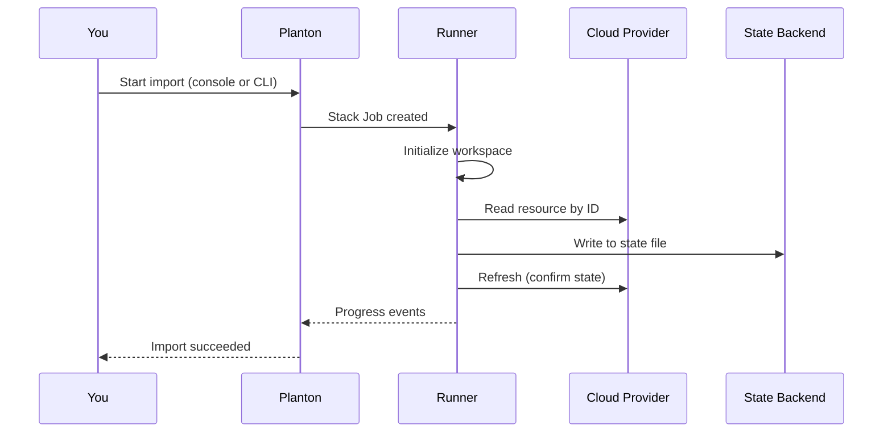

# Importing Resources

Importing a Cloud Resource brings an existing piece of cloud infrastructure — a DNS zone, a database, a VPC — under Planton management without recreating it. The import operation reads the resource from the cloud provider and writes it into the IaC state file. The actual infrastructure is never modified. No resources are created, changed, or destroyed. After import, the resource is tracked through Planton's standard lifecycle — updates, drift detection, and teardown all work as if the resource had been created through the platform from the start.

## Why Import Exists

Not all infrastructure starts inside Planton. Cloud providers auto-create resources as side effects of other operations — purchase a domain and the registrar provisions a DNS zone automatically. Teams adopt Planton after years of manually provisioned infrastructure that already runs in production. And sometimes a Cloud Resource is created in Planton, but the actual cloud resource already exists — the initial Stack Job fails because it tries to create something that is already there.

In each case, the infrastructure exists on the provider but Planton's IaC state does not know about it. Without import, the only path forward is to destroy the existing resource and recreate it through the platform — a disruptive, risky operation for production infrastructure. Import eliminates that risk by adding the resource to state directly, leaving the actual infrastructure untouched.

## How Import Works

Every import operation runs as a [Stack Job](/docs/infrastructure/stack-jobs) with three stages:

1. **Initialize** — Set up the IaC module, download providers, and configure the state backend. This is the same initialization step that runs for every Stack Job.
2. **Import** — Read the resource from the cloud provider using the identifiers you provide and write it into the IaC state file. Each resource is imported individually. If any import fails, the operation stops — no partial state corruption occurs.
3. **Refresh** — Synchronize the state file with the resource's current configuration on the provider. This confirms that the imported state accurately reflects what exists in the cloud.

Import Stack Jobs do not include preview or apply steps. The operation writes to state only — it does not plan or execute infrastructure changes.



The same [preflight essentials](/docs/infrastructure/stack-jobs#what-gets-resolved-before-execution) apply — the IaC module, provider credentials, state backend, and flow control policy must all be resolvable before the Stack Job starts. If any are missing, the preflight check fails with a clear report.

## Provisioner-Specific Identifiers

Import requires different identifiers depending on which IaC provisioner manages the Cloud Resource. Planton supports three provisioners: Pulumi, Terraform, and OpenTofu. Terraform and OpenTofu both execute HCL modules — existing Terraform modules work with either provisioner without modification.

| Provisioner | Identifiers Required | Example |
|-------------|---------------------|---------|
| Pulumi | Resource type, logical name, provider ID | `cloudflare:index/zone:Zone`, `main`, `abc123` |
| Terraform | Resource address, provider ID | `cloudflare_zone.main`, `abc123` |
| OpenTofu | Resource address, provider ID | `cloudflare_zone.main`, `abc123` |

**Resource type** (Pulumi) follows the `provider:module/resource:Resource` format defined by the Pulumi provider. You can find the type for any resource in the provider's API documentation.

**Resource address** (Terraform and OpenTofu) combines the resource type and the logical name from the HCL module — for example, `cloudflare_zone.main` where `cloudflare_zone` is the resource type and `main` is the name defined in the module.

**Provider ID** is the cloud provider's unique identifier for the resource — the value you would see in the provider's console or API. For a Cloudflare DNS zone, this is the zone ID. For an AWS VPC, it is the VPC ID.

## Using the Web Console

The import wizard guides you through a three-step process from the Cloud Resource detail page.

1. **Introduction** — Explains what import does and which state backend will be written to. This transparency lets you verify the target before proceeding.
2. **Resource Form** — Provide the provisioner-specific identifiers. For Pulumi, you enter the resource type, logical name, and provider ID. For Terraform and OpenTofu, you enter the resource address and provider ID.
3. **Confirmation** — Review a command preview showing exactly what will be executed, along with a summary of the Cloud Resource and state backend context.

To start an import, click the **Import** button in the action bar on any Cloud Resource detail page. You can also reach the wizard from the **Settings** tab on the Cloud Resource.

<!-- SCREENSHOT: Import wizard introduction step
  Page: /[org]/cloud-resource/[env]/[resourceKind]/[resourceName]/import
  Action: Show the introduction step with the state backend callout visible
  Focus: The state backend indicator and the three safety points
  Alt: Import wizard introduction step showing which state backend will be written to and explaining that import only updates state
-->

<!-- SCREENSHOT: Import wizard resource form step
  Page: /[org]/cloud-resource/[env]/[resourceKind]/[resourceName]/import
  Action: Show the resource form step with provisioner-specific fields
  Focus: The input fields for resource type, name, and provider ID
  Alt: Import wizard resource form step with fields for entering the cloud provider resource identifiers
-->

## Using the CLI

Three provisioner-specific commands provide import from the terminal:

```bash
# Pulumi: specify resource type, logical name, and provider ID
planton pulumi import <cloud-resource> \
  --type cloudflare:index/zone:Zone \
  --name main \
  --id <zone-id>

# Terraform: specify resource address and provider ID
planton terraform import <cloud-resource> \
  --address cloudflare_zone.main \
  --id <zone-id>

# OpenTofu: same flags as Terraform
planton tofu import <cloud-resource> \
  --address cloudflare_zone.main \
  --id <zone-id>
```

The `<cloud-resource>` argument accepts a Cloud Resource ID, a `kind/name` pair, or a path to a YAML manifest file — the same flexibility as other `planton` commands.

### Dry Run

All three import commands support `--dry-run`. This exercises the full resolution path — context, Cloud Resource lookup, provisioner detection — and prints the equivalent native CLI command that would be executed, without creating a Stack Job. Use dry run to verify your arguments before committing.

```bash
planton pulumi import <cloud-resource> \
  --type cloudflare:index/zone:Zone \
  --name main \
  --id <zone-id> \
  --dry-run
```

### Provisioner Mismatch Warning

If you run a provisioner-specific command that does not match the Cloud Resource's actual provisioner — for example, `planton terraform import` on a Pulumi-provisioned resource — the CLI displays a warning. This is a warning, not an error. The platform determines the actual provisioner from the Cloud Resource's configuration, not the CLI command path.

## After Import

A successful import means the resource now exists in the IaC state file, but the Planton configuration (the resource spec) may not match the resource's actual settings on the provider. The next step is typically an **Update** operation, which reconciles the desired configuration with the imported state. The update preview shows any differences, letting you decide what to align before applying changes.

Import is the bridge between "this resource exists on a provider" and "Planton manages this resource." The full [Cloud Resource lifecycle](/docs/infrastructure/cloud-resources) — updates, drift detection, flow control, and teardown — applies from this point forward.

## Error Safety

Import failures do not corrupt state. Every error scenario leaves the state file unchanged:

| Scenario | What Happens |
|----------|--------------|
| Wrong resource type or address | Import fails with a clear error. State unchanged. |
| Wrong provider ID | The provider returns "not found." State unchanged. |
| Resource already in state | Import reports the resource is already managed. No change. |
| State backend inaccessible | Initialize fails before import is attempted. State unchanged. |
| Network interruption during import | Partial import does not persist. Retry is safe. |

Import failure is always safe to retry. The Stack Job records the exact error for troubleshooting.

## Related Documentation

- [Cloud Resources](/docs/infrastructure/cloud-resources) — The infrastructure lifecycle that import extends
- [Stack Jobs](/docs/infrastructure/stack-jobs) — The execution model behind every import operation
- [State Backends](/docs/connections/state-backends) — Where import writes the IaC state file
- [Connections](/docs/connections) — How provider credentials are resolved for import
