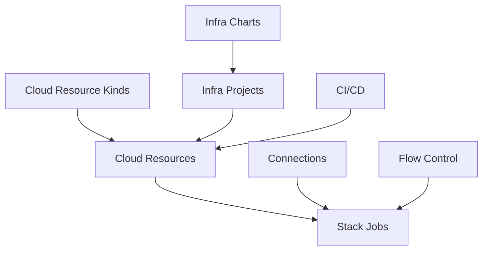

# Infra Hub

Infra Hub is Planton's infrastructure half — Cursor for Cloud Infrastructure. Describe or configure what you need, verify cost and permissions, deploy into your own account, and publish it as an Infra Chart — a template your team reuses. It handles the full lifecycle of cloud resources — from browsing a catalog of Deployment Components, to deploying them as Cloud Resources, to orchestrating multi-resource deployments through Infra Charts and Infra Pipelines.

Infrastructure is provisioned using Pulumi, Terraform, or OpenTofu modules, executed through Stack Jobs, with credentials managed automatically via Connections.

<!-- SCREENSHOT: Infra Hub Cloud Resources view
  Page: /orgs/{org}/cloud-resources
  Action: Show the Cloud Resources tab with at least 3 deployed resources visible
  Focus: The resource list showing names, kinds, environments, and status
  Alt: Infra Hub Cloud Resources tab showing deployed infrastructure with status indicators
-->

## Core Concepts

### Cloud Resources

The fundamental unit of infrastructure in Planton. A Cloud Resource is a deployed instance of a cloud component — a VPC, a database, a Kubernetes cluster. Each belongs to an environment and is tracked through its full lifecycle.

[Learn about Cloud Resources](/docs/infrastructure/cloud-resources)

### Cloud Resource Kinds

The taxonomy of available Cloud Resource types. Planton supports resource kinds across AWS, GCP, Azure, Kubernetes, Cloudflare, and other providers.

[Browse Cloud Resource Kinds](/docs/infrastructure/cloud-resource-kinds)

### Infra Charts

Composed collections of Deployment Components that deploy together as a coordinated unit. An Infra Chart handles dependency ordering, shared configuration, and multi-resource orchestration.

[Learn about Infra Charts](/docs/infrastructure/infra-charts)

### Infra Projects

Running instances of Infra Charts with your specific configuration. Infra Projects track deployment progress via DAG visualization and maintain the history of all changes.

[Learn about Infra Projects](/docs/infrastructure/infra-projects)

### Infra Pipelines

DAG-based orchestration for deploying multiple Cloud Resources and Infra Projects in dependency order. Infra Pipelines coordinate the execution of Stack Jobs across resources.

[Learn about Infra Pipelines](/docs/infrastructure/infra-pipelines)

### Stack Jobs

The atomic execution unit that provisions infrastructure. Every infrastructure change triggers a Stack Job that runs `init → refresh → plan → apply` using Pulumi, Terraform, or OpenTofu.

[Learn about Stack Jobs](/docs/infrastructure/stack-jobs)

### Flow Control

Governance policies that control how infrastructure changes are deployed — approval gates, plan-before-apply requirements, and deployment pauses.

[Learn about Flow Control](/docs/infrastructure/flow-control)

## How Infrastructure Fits in the Platform

- **Infrastructure** provisions the infrastructure where everything runs
- **CI/CD** deploys applications to infrastructure provisioned by Infrastructure
- **[Connections](/docs/connections)** provides the cloud provider credentials for Stack Job execution
- **Flow Control** policies govern the deployment workflow

## Open Source

Infrastructure is built on [Planton open source](https://planton.dev), an open-source foundation that provides the Protocol Buffer APIs, IaC modules, and CLI for multi-cloud infrastructure provisioning. Planton adds workflow orchestration, governance, and a web console on top of the open-source core.

[Learn about the open-source foundation](/docs/infrastructure/open-source)

## Getting Started

- [Getting Started Guide](/docs/infrastructure/getting-started) — Deploy your first Cloud Resource
- [Cloud Resource Kinds](/docs/infrastructure/cloud-resource-kinds) — Browse the catalog
- [Stack Jobs](/docs/infrastructure/stack-jobs) — Understand the execution model
