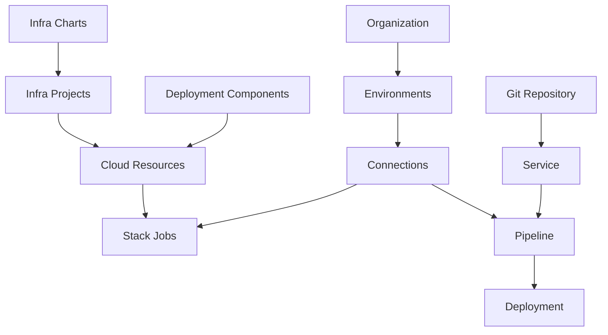

# Core Concepts

This page introduces the key concepts used across the Planton platform. Understanding these terms makes the rest of the documentation easier to navigate.

## Infrastructure Concepts

### Cloud Resources

A Cloud Resource is a deployed infrastructure instance — a VPC, a database, a Kubernetes cluster, or any other cloud component managed through Planton. Cloud Resources are the fundamental unit of infrastructure in the platform.

Each Cloud Resource:

- Belongs to an environment (dev, staging, prod)
- Has a specific Cloud Resource Kind (e.g., AWS VPC, GCP GKE Cluster)
- Is deployed and managed through Stack Jobs
- Tracks its own lifecycle, configuration, and deployment history

<!-- SCREENSHOT: Cloud Resource detail view
  Page: /orgs/{org}/cloud-resources/{id}
  Action: Show a deployed Cloud Resource with its status and configuration
  Focus: The resource detail panel showing status, kind, and environment
  Alt: Cloud Resource detail view showing a deployed AWS VPC with status and configuration
-->

### Deployment Components

A Deployment Component is a catalog entry — a template that defines how to provision a specific type of Cloud Resource. The Deployment Component catalog is the starting point for deploying infrastructure.

When you deploy a Deployment Component, it creates a Cloud Resource instance with your specific configuration.

Examples of Deployment Components:

- AWS VPC (networking)
- AWS RDS (managed database)
- GCP GKE Cluster (Kubernetes)
- AWS S3 Bucket (storage)

<!-- SCREENSHOT: Deployment Component catalog
  Page: /infra-hub/deployment-components
  Action: Show the catalog with multiple components and provider filters
  Focus: The component grid
  Alt: Deployment Component catalog showing infrastructure templates filterable by cloud provider
-->

### Infra Charts

An Infra Chart is a composed collection of Deployment Components that work together. Instead of deploying resources individually, an Infra Chart deploys an entire set of related resources in the correct dependency order.

Example: An AWS ECS Environment Infra Chart might include a VPC, ECS Cluster, ALB, Route53 Zone, Security Groups, IAM Roles, and ECR Repositories — all deployed as a coordinated unit.

Key characteristics:

- Deploy multiple resources in correct dependency order
- Handle inter-resource dependencies automatically
- Template-based with customizable values
- Show deployment progress as a DAG (directed acyclic graph)

[Learn more about Infra Charts](/docs/infrastructure/infra-charts)

### Infra Projects

An Infra Project is a running instance of an Infra Chart with your specific configuration. If an Infra Chart is the template, an Infra Project is the deployed instance.

The lifecycle:

1. Choose an Infra Chart (template)
2. Provide configuration values
3. An Infra Project is created (instance)
4. Cloud Resources are deployed in dependency order
5. Progress is tracked in real-time via DAG visualization

[Learn more about Infra Projects](/docs/infrastructure/infra-projects)

### Stack Jobs

A Stack Job is the atomic execution unit that provisions infrastructure using Pulumi, Terraform, or OpenTofu. Every infrastructure change — deploying a Cloud Resource, updating an Infra Project, or running a refresh — triggers one or more Stack Jobs.

Each Stack Job follows this sequence:

```
Init → Refresh → Plan → Apply
```

Key characteristics:

- Created automatically when you deploy or update infrastructure
- Run multiple operations in sequence (init, refresh, plan, apply)
- Stream logs in real-time
- Handle credentials securely via the Runner
- Manage IaC state files automatically

[Learn more about Stack Jobs](/docs/infrastructure/stack-jobs)

## Application Concepts

### Services

A Service is the configuration bridge between a Git repository and a deployment target. It defines what to build, how to build it, and where to deploy it.

Each Service is connected to a Git repository (GitHub or GitLab) and includes:

- **Build configuration**: Buildpacks (auto-detect) or Dockerfile
- **Trigger paths**: Which file changes trigger rebuilds
- **Project root**: For monorepo support
- **Pipeline provider**: Platform-managed or self-managed (custom Tekton)

Example:

```yaml
Name: user-api
Repository: github.com/acme/services
Project Root: /services/user-api
Build: Buildpacks (auto-detect Node.js)
Deploy To: EKS cluster in production
```

[Learn more about Services](/docs/ci-cd/what-is-a-service)

### Pipelines

A Pipeline is the automated CI/CD workflow that builds and deploys a Service. Pipelines are powered by Tekton and are triggered by Git commits.

Pipeline stages:

1. **Trigger**: Git webhook received
2. **Clone**: Fetch the source code
3. **Build**: Create a container image (Buildpacks or Dockerfile)
4. **Push**: Store the image in a container registry
5. **Deploy**: Update the running service

[Learn more about Pipelines](/docs/ci-cd/pipelines)

## Platform Concepts

### Connections

A Connection is a secure integration with an external service — cloud provider credentials, Git provider OAuth tokens, container registry access, or Kubernetes cluster credentials.

Types of Connections:

- **Cloud Providers**: AWS, GCP, Azure credentials
- **Git Providers**: GitHub, GitLab access
- **Container Registries**: Docker Hub, ECR, GCR, ACR
- **State Backends**: S3, GCS for Pulumi/Terraform/OpenTofu state
- **Kubernetes Clusters**: External cluster access

Connections are created at the organization level and authorized for specific environments. The platform automatically resolves the correct credentials for each deployment.

[Learn more about Connections](/docs/connections)

### Teams

Teams are groups of users with shared permissions. Create teams at the organization level, add members, and grant permissions to environments and resources.

[Learn more about Teams and Access](/docs/teams-and-access)

### Context

Context is your current position in the resource hierarchy (Organization / Environment). It determines:

- What resources you see
- Where new resources are created
- Which credentials are used
- Which actions are available

```
Acme Corp / production
    ↑          ↑
Organization  Environment
```

<!-- SCREENSHOT: Context selector in console header
  Page: /dashboard (header area)
  Action: Show the context selector with organization and environment displayed
  Focus: The context selector component in the top-left of the header
  Alt: Console header showing the context selector with current organization and environment
-->

### Flow Control Policies

Flow Control Policies govern how infrastructure changes are deployed. They allow you to:

- Require approval before deployment
- Skip refresh for faster deployments
- Require plan/preview before apply
- Pause between plan and apply

[Learn more about Flow Control](/docs/infrastructure/flow-control)

## How Concepts Connect



### Infrastructure Side

- **Deployment Components** are templates; deploying one creates a **Cloud Resource**
- **Infra Charts** create **Infra Projects** that orchestrate multiple **Cloud Resources**
- **Cloud Resources** are provisioned by **Stack Jobs**
- **Stack Jobs** use **Connections** for cloud provider credentials

### Application Side

- **Services** are linked to Git repositories
- **Pipelines** build and deploy **Services**
- **Services** deploy to infrastructure provisioned through **Cloud Resources**
- **Pipelines** use **Connections** for Git and registry access

### Platform Side

- **Organizations** contain **Environments**
- **Environments** contain deployed **Cloud Resources** and **Services**
- **Teams** group users for permissions
- **Context** determines your current scope

## Concept Reference

| Concept | What It Is |
|---------|------------|
| Cloud Resource | A deployed infrastructure instance (VPC, database, cluster) |
| Deployment Component | A catalog template for provisioning a specific Cloud Resource type |
| Infra Chart | A composed collection of Deployment Components deployed together |
| Infra Project | A deployed instance of an Infra Chart with specific configuration |
| Stack Job | The atomic IaC execution unit (Pulumi/Terraform/OpenTofu) |
| Service | Configuration bridge between a Git repo and a deployment target |
| Pipeline | Automated CI/CD workflow triggered by Git commits |
| Connection | Secure integration with an external service (cloud, Git, registry) |
| Context | Your current position in the Organization/Environment hierarchy |

## Related Documentation

- [Connections](/docs/connections) — Credential and integration management
- [Infrastructure](/docs/infrastructure) — Infrastructure provisioning and management
- [CI/CD](/docs/ci-cd) — Application deployment and CI/CD
- [Teams and Access](/docs/teams-and-access) — Collaboration and permissions
